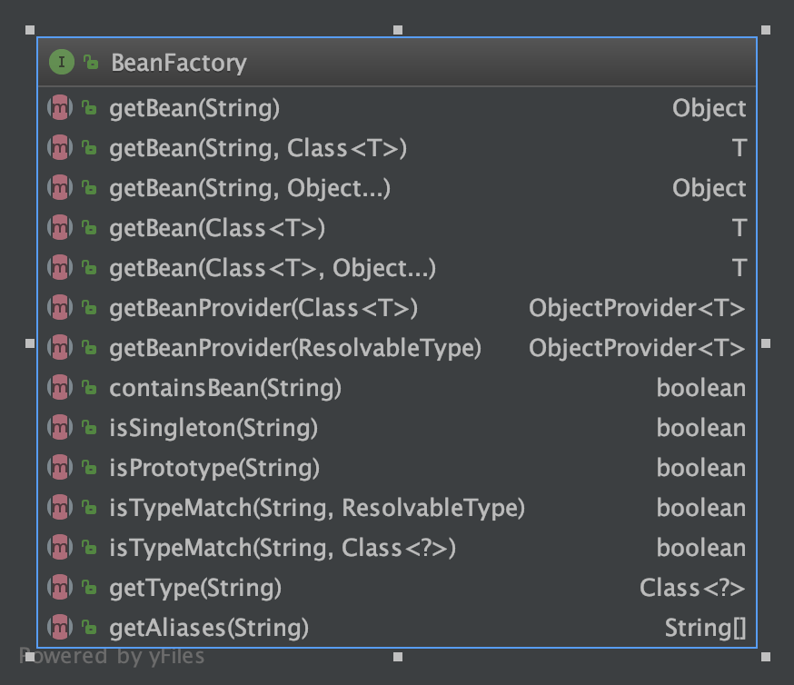

# BeanFactory

## 定义和类图

<a href='https://docs.spring.io/spring-framework/docs/current/javadoc-api/org/springframework/beans/factory/BeanFactory.html'>spring docs of BeanFactory</a>

* The root interface for accessing a Spring bean container.

BeanFactory 是 Spring bean容器的最顶层的interface

* This interface is implemented by objects that hold a number of bean definitions, each uniquely identified by a String name. Depending on the bean definition, the factory will return either an independent instance of a contained object (the Prototype design pattern), or a single shared instance (a superior alternative to the Singleton design pattern, in which the instance is a singleton in the scope of the factory). Which type of instance will be returned depends on the bean factory configuration: the API is the same. Since Spring 2.0, further scopes are available depending on the concrete application context (e.g. "request" and "session" scopes in a web environment).

BeanFactory的实现类即具体的容器，拥有一系列`bean`的定义，并实现这些基础方法，能返回`bean`的对象实例

* The point of this approach is that the BeanFactory is a central registry of application components, and centralizes configuration of application components (no more do individual objects need to read properties files, for example). See chapters 4 and 11 of "Expert One-on-One J2EE Design and Development" for a discussion of the benefits of this approach.

BeanFactory是应用程序组件的注册器，统一管理

* Normally a BeanFactory will load bean definitions stored in a configuration source (such as an XML document), and use the org.springframework.beans package to configure the beans. However, an implementation could simply return Java objects it creates as necessary directly in Java code. There are no constraints on how the definitions could be stored: LDAP, RDBMS, XML, properties file, etc. Implementations are encouraged to support references amongst beans (Dependency Injection).

BeanFactory负责加载bean,并能返回Java对象实例，并最好能支持Bean之间的引用关系

* Bean factory implementations should support the standard bean lifecycle interfaces as far as possible.

BeanFactory要尽可能的实现Bean的生命周期接口

---

Bean factory implementations should support the standard bean lifecycle interfaces as far as possible. The full set of initialization methods and their standard order is:

1. BeanNameAware's setBeanName
2. BeanClassLoaderAware's setBeanClassLoader
3. BeanFactoryAware's setBeanFactory
4. EnvironmentAware's setEnvironment
5. EmbeddedValueResolverAware's setEmbeddedValueResolver
6. ResourceLoaderAware's setResourceLoader (only applicable when running in an application context)
7. ApplicationEventPublisherAware's setApplicationEventPublisher (only applicable when running in an application context)
8. MessageSourceAware's setMessageSource (only applicable when running in an application context)
9. ApplicationContextAware's setApplicationContext (only applicable when running in an application context)
10. ServletContextAware's setServletContext (only applicable when running in a web application context)
11. postProcessBeforeInitialization methods of BeanPostProcessors
12. InitializingBean's afterPropertiesSet
13. a custom init-method definition
14. postProcessAfterInitialization methods of BeanPostProcessors

On shutdown of a bean factory, the following lifecycle methods apply:

1. postProcessBeforeDestruction methods of DestructionAwareBeanPostProcessors
2. DisposableBean's destroy
3. a custom destroy-method definition
