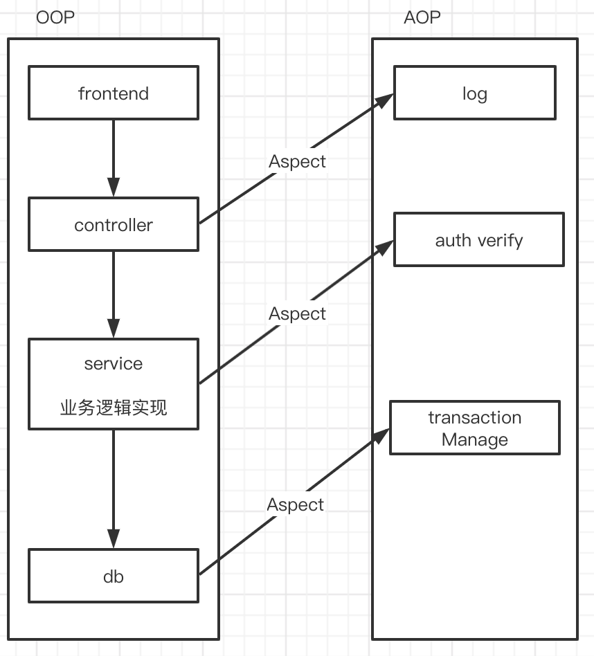
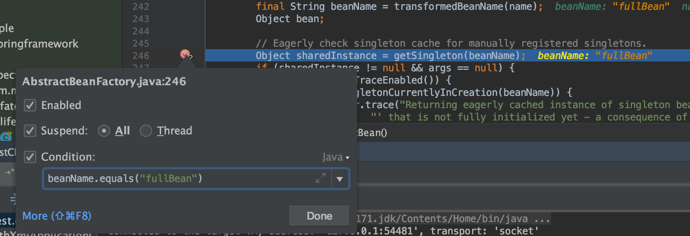
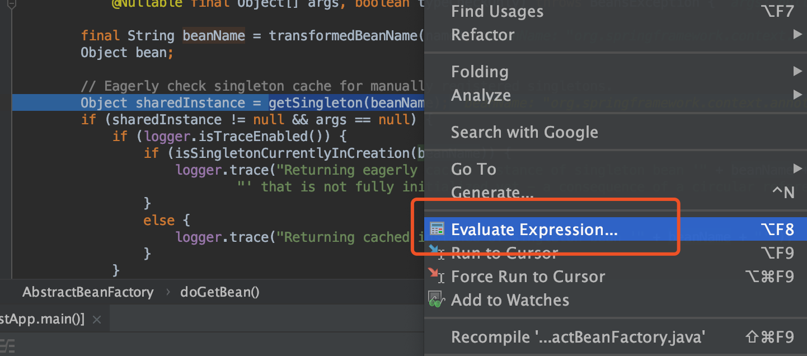
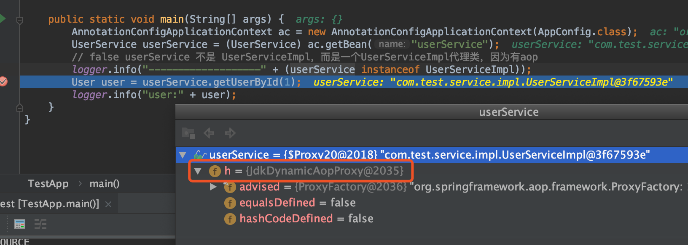
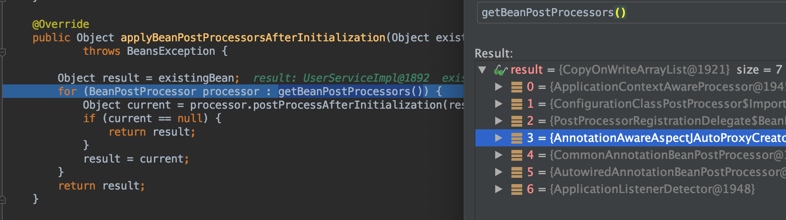
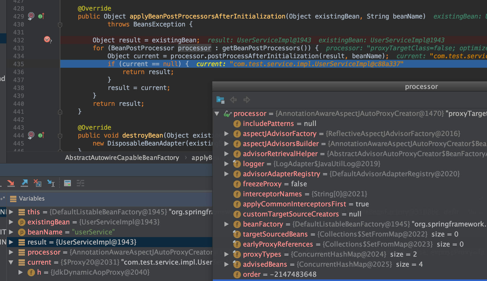
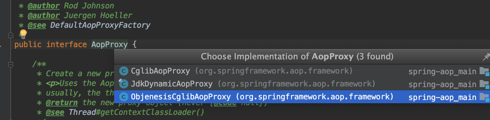

# AOP

## Spring AOP 各种概念

<a href="https://docs.spring.io/spring/docs/5.1.3.RELEASE/spring-framework-reference/core.html#aop" target="_blank">spring aop reference</a>




* Aspect

* Join point(连接点)

A point during the execution of a program, such as the execution of a method or the handling of an exception. In Spring AOP, a join point always represents a method execution.

通常就是一个执行的方法

* Advice(增强器)

Action taken by an aspect at a particular join point. Different types of advice include “around”, “before” and “after” advice. (Advice types are discussed later.) Many AOP frameworks, including Spring, model an advice as an interceptor and maintain a chain of interceptors around the join point.

在特定的join point增强
    1. Before
    2. After
    3. AfterReturn
    4. AfterThrowing
    5. Around

* Pointcut(切点)

A predicate that matches join points. Advice is associated with a pointcut expression and runs at any join point matched by the pointcut (for example, the execution of a method with a certain name). The concept of join points as matched by pointcut expressions is central to AOP, and Spring uses the AspectJ pointcut expression language by default.

简单认为是：某些特定的`join point`的集合

* Introduction

 Declaring additional methods or fields on behalf of a type. Spring AOP lets you introduce new interfaces (and a corresponding implementation) to any advised object. For example, you could use an introduction to make a bean implement an IsModified interface, to simplify caching. (An introduction is known as an inter-type declaration in the AspectJ community.)

* Target object

An object being advised by one or more aspects. Also referred to as the “advised object”. Since Spring AOP is implemented by using runtime proxies, this object is always a proxied object.

增强对象(新对象，代理对象)，被增强的那个原始对象就是`Target object`

* AOP proxy

An object created by the AOP framework in order to implement the aspect contracts (advise method executions and so on). In the Spring Framework, an AOP proxy is a JDK dynamic proxy or a CGLIB proxy.

* Weaving

linking aspects with other application types or objects to create an advised object. This can be done at compile time (using the AspectJ compiler, for example), load time, or at runtime. Spring AOP, like other pure Java AOP frameworks, performs weaving at runtime.

## 断点调试技巧

* 断点加条件



* Evaluate，断点评估运行




## 目标对象 =》代理对象



* debug 可以定位到`initializeBean`方法后，返回了代理对象

```java
// Initialize the bean instance.
Object exposedObject = bean;
try {
    // 2. 填充bean的属性:即这里要完成bean依赖处理
    populateBean(beanName, mbd, instanceWrapper);
    // 3. bean的initialize,beanPostProcessor等
    // 执行完如下一句，exposedObject 是JdkDynamicAopProxy对象
    exposedObject = initializeBean(beanName, exposedObject, mbd);
}
catch (Throwable ex) {
    if (ex instanceof BeanCreationException && beanName.equals(((BeanCreationException) ex).getBeanName())) {
        throw (BeanCreationException) ex;
    }
    else {
        throw new BeanCreationException(
                mbd.getResourceDescription(), beanName, "Initialization of bean failed", ex);
    }
}
```

* 继续debug在`applyBeanPostProcessorsAfterInitialization`方法返回了代理对象



* 在某个`PostProcessor`作用后肯定会变成代理对象




```java
/**
 * Create a proxy with the configured interceptors if the bean is
 * identified as one to proxy by the subclass.
 * @see #getAdvicesAndAdvisorsForBean
 */
@Override
public Object postProcessAfterInitialization(@Nullable Object bean, String beanName) {
    if (bean != null) {
        Object cacheKey = getCacheKey(bean.getClass(), beanName);
        if (!this.earlyProxyReferences.contains(cacheKey)) {
            return wrapIfNecessary(bean, beanName, cacheKey);
        }
    }
    return bean;
}
```


```java
Object proxy = createProxy(bean.getClass(), beanName, specificInterceptors, new SingletonTargetSource(bean));
```



附：`@EnableAspectJAutoProxy(proxyTargetClass=true)` 使用`CGLib`代理, 创建AopProxy

```java
public class DefaultAopProxyFactory implements AopProxyFactory, Serializable {

	@Override
	public AopProxy createAopProxy(AdvisedSupport config) throws AopConfigException {
		if (config.isOptimize() || config.isProxyTargetClass() || hasNoUserSuppliedProxyInterfaces(config)) {
			Class<?> targetClass = config.getTargetClass();
			if (targetClass == null) {
				throw new AopConfigException("TargetSource cannot determine target class: " +
						"Either an interface or a target is required for proxy creation.");
			}
			if (targetClass.isInterface() || Proxy.isProxyClass(targetClass)) {
				return new JdkDynamicAopProxy(config);
			}
			return new ObjenesisCglibAopProxy(config);
		}
		else {
			return new JdkDynamicAopProxy(config);
		}
	}
```
