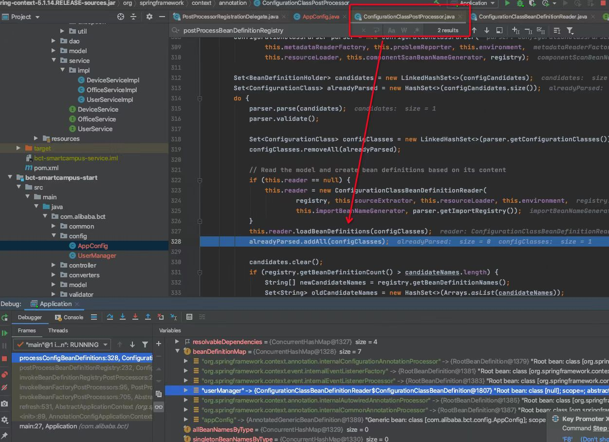
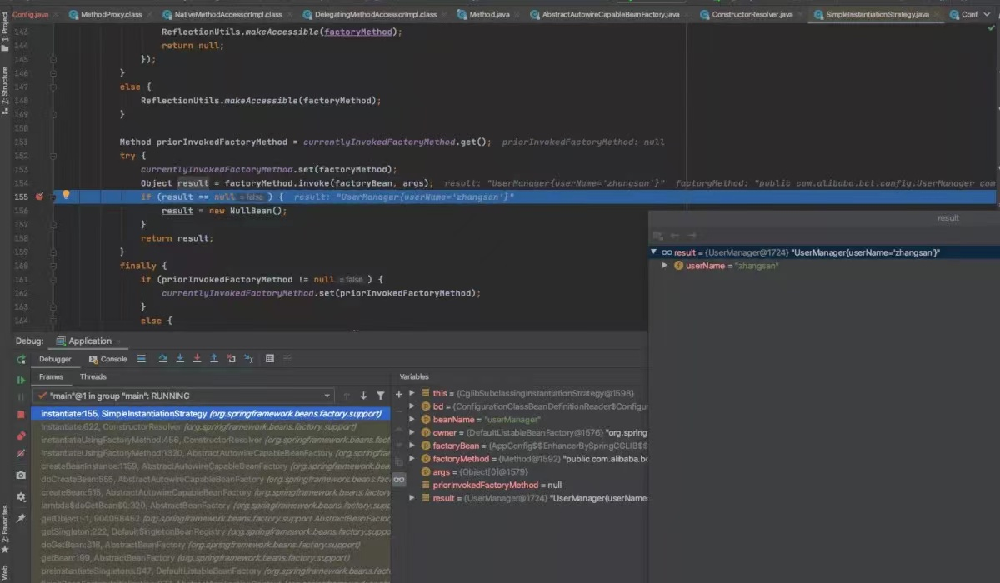
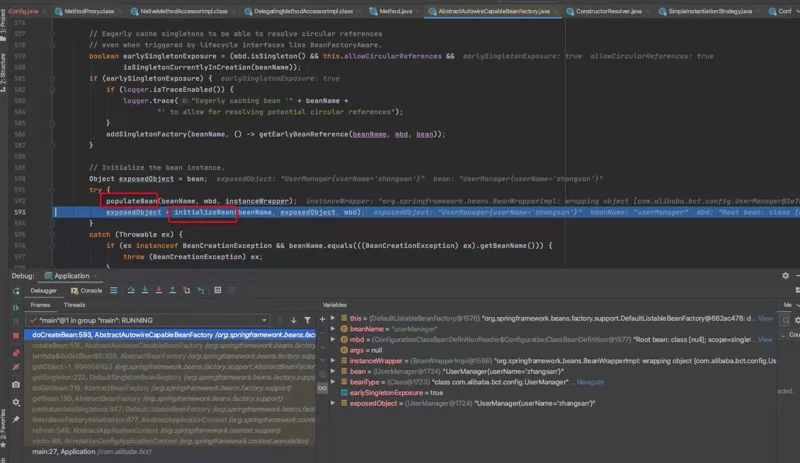

# @Bean注解

## 测试程序

```java
@Configuration
public class AppConfig {

    @Bean(initMethod = "init")
    public UserManager userManager(){
        UserManager userManager = new UserManager("wangwu");
        userManager.setUserName("zhangsan");
        return userManager;
    }
}
```

```java
public class UserManager {
    String userName;

    public UserManager() {
        System.out.println("constructor UserManager():" + userName);
    }

    public UserManager(String userName) {
        this.userName = userName;
        System.out.println("constructor UserManager(String):" + userName);
    }

    public void init() {
        System.out.println("start init UserManager:" + userName);
    }


    @Override
    public String toString() {
    return "UserManager{" +
        "userName='" + userName + '\'' +
        '}';
    }

    public void setUserName(String userName) {
        this.userName = userName;
    }
}
```

* 测试

```java
AnnotationConfigApplicationContext ac = new AnnotationConfigApplicationContext(AppConfig.class);
UserManager userManager = (UserManager) ac.getBean("userManager");
System.out.println(userManager);
```

## 源码流程

* 1 new AnnotationConfigApplicationContext的时候会初始化添加一个`ConfigurationClassPostProcessor`

* 2 当执行`ConfigurationClassPostProcessor`的`postProcessBeanDefinitionRegistry`方法时会找到全注解类，手动注册全注解类的bean，其时一个cglib代理实现，同时会执行读取器中的`@Bean`注解，完成`userManager`BeanDefinition的注册



* 3 refresh方法走到`finishBeanFactoryInitialization(beanFactory);`doCreateBean("userManager")时，会走到实例化UserManager

具体时配置类AppConfig的代理实现类的方法反射执行的@Bean注解里面的代码逻辑



* 4 最后是bean生命周期方法了


