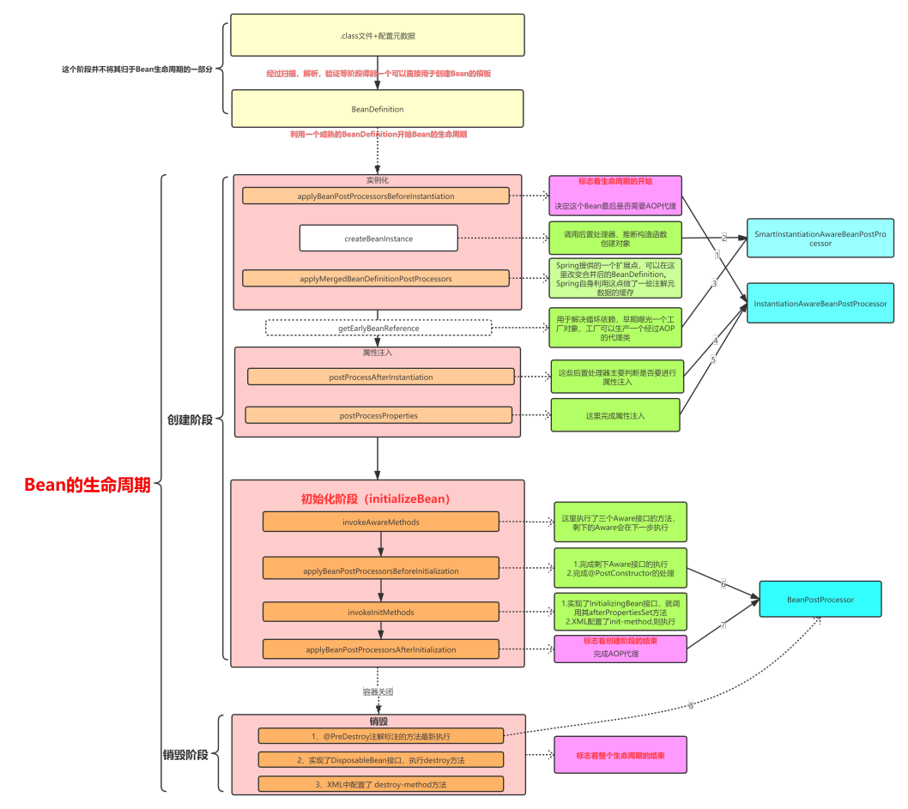

# bean的生命周期？

* 以如下测试代码为例

```java
@Test
public void testClassPathXmlApplicationContextBean() {
    ApplicationContext applicationContext =
            new ClassPathXmlApplicationContext("spring-full-life.xml");
    System.out.println("----------------applicationContext");
    FullBean fullBean = (FullBean)applicationContext.getBean("fullBean");
    System.out.println("fullBean.getName:" + fullBean.getName());
    ((ClassPathXmlApplicationContext) applicationContext).close();
}
```

其中单例`fullBean`依赖了单例`fullBeanB`且配置了相关初始化，销毁方法，和`BeanPostProcessor`

```xml
<?xml version="1.0" encoding="UTF-8"?>
<beans xmlns="http://www.springframework.org/schema/beans"
	   xmlns:xsi="http://www.w3.org/2001/XMLSchema-instance"
	   xsi:schemaLocation="http://www.springframework.org/schema/beans https://www.springframework.org/schema/beans/spring-beans-3.0.xsd">

	<bean id="fullBean" class="com.mb.fulllife.FullBean" init-method="selfInit" destroy-method="selfDestroy">
		<property name="name" value="tom"></property>
		<property name="fullBeanB" ref="fullBeanB"/>
	</bean>

	<bean id="fullBeanB" class="com.mb.fulllife.FullBeanB" init-method="selfInit" destroy-method="selfDestroy">
	</bean>

	<bean id="fullLifeInstantiationAwareBeanPostProcessor" class="com.mb.fulllife.FullLifeInstantiationAwareBeanPostProcessor">
	</bean>

	<bean id="fullLifeBeanPostProcessor" class="com.mb.fulllife.FullLifeBeanPostProcessor">
	</bean>

</beans>
```

* bean生命周期代码流程

```java
ClassPathXmlApplicationContext
    doGetBean(InstantiationAwareBeanPostProcessor
    doGetBean(BeanPostProcessor
    doGetBean(fullBean
        dependsOn
        createBean
            resolveBeforeInstantiation
                applyBeanPostProcessorsBeforeInstantiation（应用所有的InstantiationAwareBeanPostProcessor）
                    postProcessBeforeInstantiation
            doCreateBean
                createBeanInstance(推断构造方法，反射创建一个对象)
                populateBean(设置属性，其中依赖Bean 要走 依赖bean的创建逻辑)
                    InstantiationAwareBeanPostProcessor：postProcessAfterInstantiation
                    applyPropertyValues(beanName, mbd, bw, pvs);
                initializeBean
                    applyBeanPostProcessorsBeforeInitialization（应用所有的BeanPostProcessor）
                        postProcessBeforeInitialization
                    invokeInitMethods
                        InitializingBean(afterPropertiesSet)
                        InitMethod
        加入单例池

fullBean.getName ( bean的使用)

((ClassPathXmlApplicationContext) applicationContext).close()
	doClose
		Publish shutdown event.
		lifecycleProcessor.onClose();
		destroyBeans
			DisposableBean
			destroy-method
		closeBeanFactory
		onClose()
		this.active.set(false);
	Runtime.getRuntime().removeShutdownHook(this.shutdownHook);
```

## 单例Bean生命周期图解



## bean个性化定制：生命周期回调

<a href='https://docs.spring.io/spring-framework/docs/5.1.3.RELEASE/spring-framework-reference/core.html#beans-factory-lifecycle'>bean生命周期干预</a>

* Initialization Callbacks
* Destruction Callbacks
* Default Initialization and Destroy Methods
* Combining Lifecycle Mechanisms
* Startup and Shutdown Callbacks
* Shutting Down the Spring IoC Container Gracefully in Non-Web Applications

关键词：
* InitializingBean
* DisposableBean
* @PostConstruct
* @PreDestroy
* BeanPostProcessor

## bean个性化定制：ApplicationContextAware，BeanNameAware等

### ApplicationContextAware 例子

```java
@Component
public class CommandManager implements ApplicationContextAware {

	private ApplicationContext applicationContext;

	public CommandManager() {
		System.out.println("CommandManager construct");
	}

	/**
	 * CommandManager 需要一个依赖一个 `@Scope("prototype")`的 Command Bean, 但是自身又是 单例Bean
	 * 通过实现 ApplicationContextAware, 能获取到 CommandManager 所在的 ApplicationContext，然后再据此获取原型 Command Bean
	 */
	public String process(int commandState) {
		// grab a new instance of the appropriate Command
		Command command = createCommand();
		System.out.println("command:" + command);
		// set the state on the (hopefully brand new) Command instance
		command.setState(commandState);
		return command.execute();
	}

	protected Command createCommand() {
		// notice the Spring API dependency!
		return this.applicationContext.getBean("command", Command.class);
	}

	@Override
	public void setApplicationContext(ApplicationContext applicationContext) throws BeansException {
		this.applicationContext = applicationContext;
	}

}
```

### Aware接口

所有的Aware接口都是为了能让我们能拿到容器中相关的资源

回顾bean生命周期主要的三个步骤
1. createBeanInstance, 创建实例
2. populateBean, 属性注入（循环依赖完成）
3. initializeBean, 初始化

在其中initializeBean会完成Aware接口方法的执行，源码如下

```java
protected Object initializeBean(final String beanName, final Object bean, @Nullable RootBeanDefinition mbd) {
    if (System.getSecurityManager() != null) {
        AccessController.doPrivileged((PrivilegedAction<Object>) () -> {
            invokeAwareMethods(beanName, bean);
            return null;
        }, getAccessControlContext());
    }
    else {
        // 第一步：执行aware接口中的方法，需要主要的是，不是所有的Aware接口都是在这步执行了
        invokeAwareMethods(beanName, bean);
    }

    Object wrappedBean = bean;
    if (mbd == null || !mbd.isSynthetic()) {
        // 第二步：完成Aware接口方法的执行,以及@PostConstructor,@PreDestroy注解的处理
        wrappedBean = applyBeanPostProcessorsBeforeInitialization(wrappedBean, beanName);
    }

    try {
        // 第三步：完成初始化方法执行
        invokeInitMethods(beanName, wrappedBean, mbd);
    }
    catch (Throwable ex) {
        throw new BeanCreationException(
                (mbd != null ? mbd.getResourceDescription() : null),
                beanName, "Invocation of init method failed", ex);
    }
    if (mbd == null || !mbd.isSynthetic()) {
        // 第四步：完成AOP代理
        wrappedBean = applyBeanPostProcessorsAfterInitialization(wrappedBean, beanName);
    }

    return wrappedBean;
}
```

#### Aware的执行

先完成`BeanNameAware`，`BeanClassLoaderAware`，`BeanFactoryAware`的执行

* BeanNameAware：获取Bean的名字
* BeanClassLoaderAware：获取加载这个Bean的类加载器
* BeanFactoryAware：获取当前的BeanFactory

```java
private void invokeAwareMethods(final String beanName, final Object bean) {
    if (bean instanceof Aware) {
        if (bean instanceof BeanNameAware) {
            ((BeanNameAware) bean).setBeanName(beanName);
        }
        if (bean instanceof BeanClassLoaderAware) {
            ClassLoader bcl = getBeanClassLoader();
            if (bcl != null) {
                ((BeanClassLoaderAware) bean).setBeanClassLoader(bcl);
            }
        }
        if (bean instanceof BeanFactoryAware) {
            ((BeanFactoryAware) bean).setBeanFactory(AbstractAutowireCapableBeanFactory.this);
        }
    }
}
```

接着完成Aware其它接口方法的执行，以及@PostConstructor,@PreDestroy注解的处理

```java
protected void invokeInitMethods(String beanName, final Object bean, @Nullable RootBeanDefinition mbd)
    throws Throwable {
	// 是否实现了 InitializingBean接口
    boolean isInitializingBean = (bean instanceof InitializingBean);
    if (isInitializingBean && (mbd == null || 
                               // 这个判断基本恒成立，除非手动改变了BD的属性
                               !mbd.isExternallyManagedInitMethod("afterPropertiesSet"))) {
        if (logger.isTraceEnabled()) {
            logger.trace("Invoking afterPropertiesSet() on bean with name '" + beanName + "'");
        }
        if (System.getSecurityManager() != null) {
            try {
                AccessController.doPrivileged((PrivilegedExceptionAction<Object>) () -> {
                   // 调用afterPropertiesSet方法
                    ((InitializingBean) bean).afterPropertiesSet();
                    return null;
                }, getAccessControlContext());
            }
            catch (PrivilegedActionException pae) {
                throw pae.getException();
            }
        }
        else {
              // 调用afterPropertiesSet方法
            ((InitializingBean) bean).afterPropertiesSet();
        }
    }

    if (mbd != null && bean.getClass() != NullBean.class) {
        String initMethodName = mbd.getInitMethodName();
        if (StringUtils.hasLength(initMethodName) &&
            !(isInitializingBean && "afterPropertiesSet".equals(initMethodName)) &&
            !mbd.isExternallyManagedInitMethod(initMethodName)) {
            invokeCustomInitMethod(beanName, bean, mbd);
        }
    }
}
```
