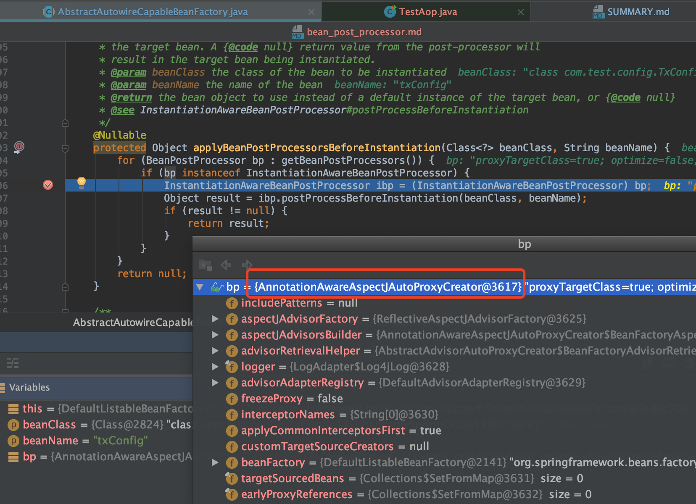
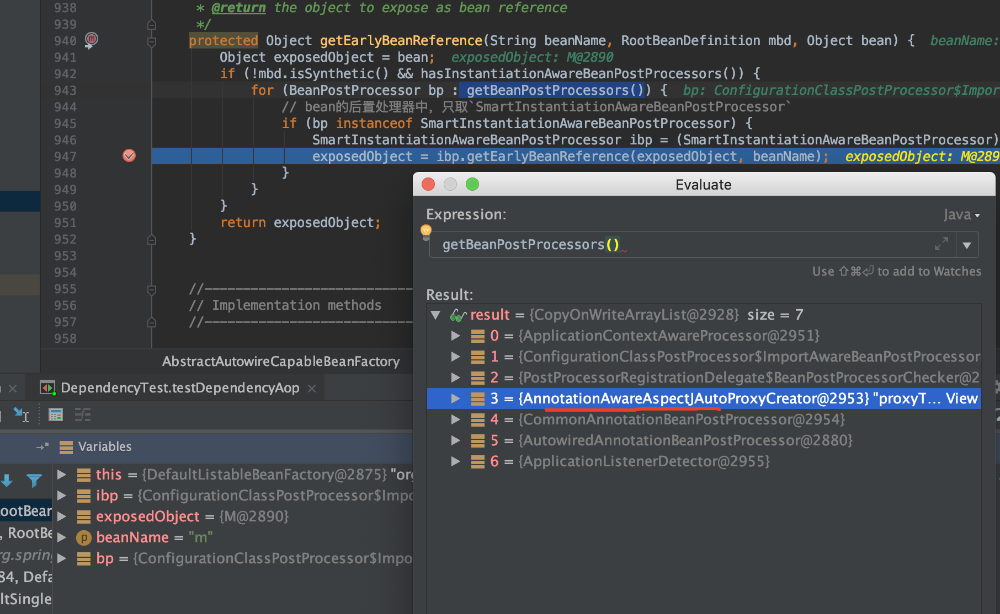
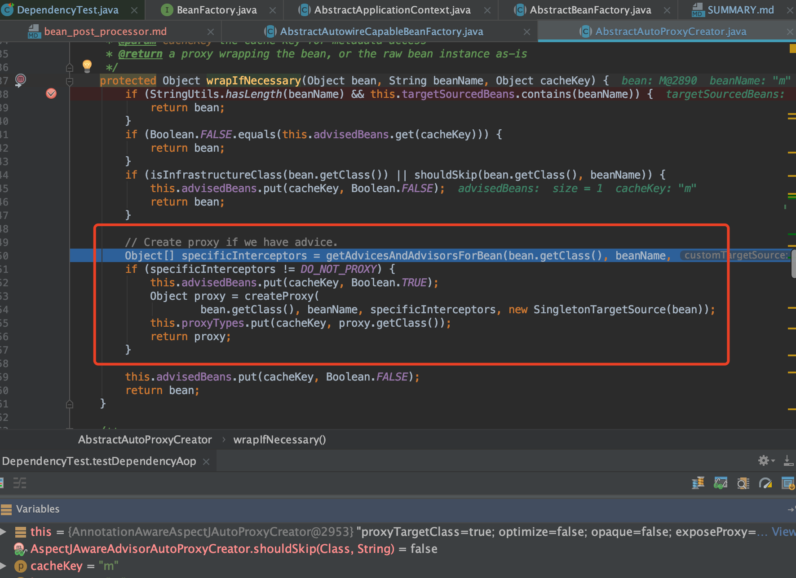
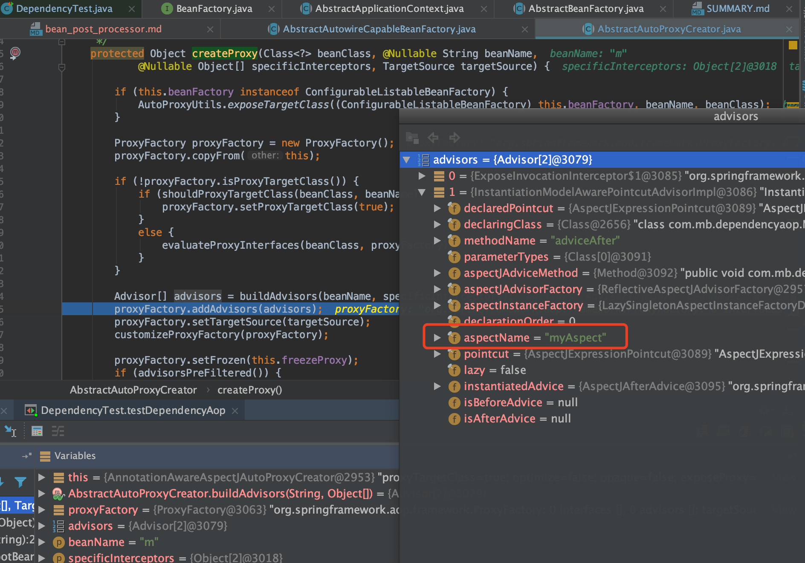
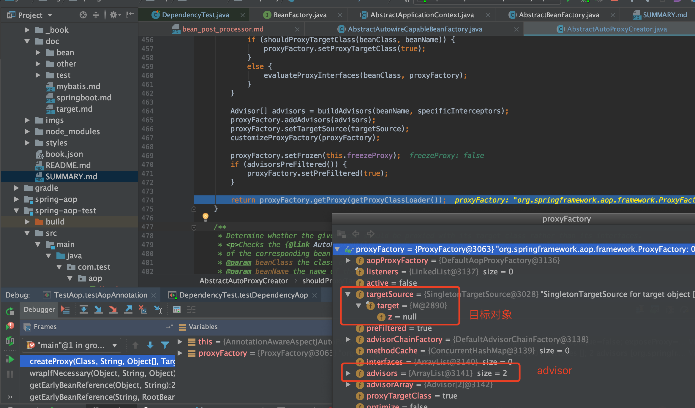

# BeanPostProcessor

<a href='https://docs.spring.io/spring-framework/docs/5.1.3.RELEASE/spring-framework-reference/core.html#beans-factory-extension-bpp'>1.8.1. Customizing Beans by Using a BeanPostProcessor
</a>

官网介绍归纳
1. BeanPostProcessor接口定义了两个回调方法，通过实现这两个方法可以提供自己的实例化以及依赖注入等逻辑。即干预Bean在Spring容器的实例化、配置、初始化逻辑
2. 可以配置多个BeanPostProcessor，如果实现Ordered接口，还可以控制这些BeanPostProcessor执行的顺序

接口定义如下

```java
public interface BeanPostProcessor {

	/**
	 * Apply this BeanPostProcessor to the given new bean instance <i>before</i> any bean
	 * initialization callbacks (like InitializingBean's {@code afterPropertiesSet}
	 * or a custom init-method). The bean will already be populated with property values.
	 * The returned bean instance may be a wrapper around the original.
	 * <p>The default implementation returns the given {@code bean} as-is.
	 * @param bean the new bean instance
	 * @param beanName the name of the bean
	 * @return the bean instance to use, either the original or a wrapped one;
	 * if {@code null}, no subsequent BeanPostProcessors will be invoked
	 * @throws org.springframework.beans.BeansException in case of errors
	 * @see org.springframework.beans.factory.InitializingBean#afterPropertiesSet
	 */
	@Nullable
	default Object postProcessBeforeInitialization(Object bean, String beanName) throws BeansException {
		return bean;
	}

	/**
	 * Apply this BeanPostProcessor to the given new bean instance <i>after</i> any bean
	 * initialization callbacks (like InitializingBean's {@code afterPropertiesSet}
	 * or a custom init-method). The bean will already be populated with property values.
	 * The returned bean instance may be a wrapper around the original.
	 * <p>In case of a FactoryBean, this callback will be invoked for both the FactoryBean
	 * instance and the objects created by the FactoryBean (as of Spring 2.0). The
	 * post-processor can decide whether to apply to either the FactoryBean or created
	 * objects or both through corresponding {@code bean instanceof FactoryBean} checks.
	 * <p>This callback will also be invoked after a short-circuiting triggered by a
	 * {@link InstantiationAwareBeanPostProcessor#postProcessBeforeInstantiation} method,
	 * in contrast to all other BeanPostProcessor callbacks.
	 * <p>The default implementation returns the given {@code bean} as-is.
	 * @param bean the new bean instance
	 * @param beanName the name of the bean
	 * @return the bean instance to use, either the original or a wrapped one;
	 * if {@code null}, no subsequent BeanPostProcessors will be invoked
	 * @throws org.springframework.beans.BeansException in case of errors
	 * @see org.springframework.beans.factory.InitializingBean#afterPropertiesSet
	 * @see org.springframework.beans.factory.FactoryBean
	 */
	@Nullable
	default Object postProcessAfterInitialization(Object bean, String beanName) throws BeansException {
		return bean;
	}

}
```

## ApplicationContextAwareProcessor 类

ApplicationContextAwareProcessor是一个Spring内部工具，它实现了接口`BeanPostProcessor`，用于向实现了如下某种`Aware接口`的bean设置ApplicationContext中相应的属性:

* EnvironmentAware
* EmbeddedValueResolverAware
* ResourceLoaderAware
* ApplicationEventPublisherAware
* MessageSourceAware
* ApplicationContextAware

如果bean实现了以上接口中的某几个，那么这些接口方法调用的先后顺序就是上面接口排列的先后顺序。

## InstantiationAwareBeanPostProcessor 接口

```java
public interface InstantiationAwareBeanPostProcessor extends BeanPostProcessor {

    // 在Bean实例化之前调用
	@Nullable
	default Object postProcessBeforeInstantiation(Class<?> beanClass, String beanName) throws BeansException {
		return null;
	}

    // 在Bean实例化之后调用
	default boolean postProcessAfterInstantiation(Object bean, String beanName) throws BeansException {
		return true;
	}

    // 采用注解时，Spring通过这个方法完成了属性注入
	@Nullable
	default PropertyValues postProcessProperties(PropertyValues pvs, Object bean, String beanName)
			throws BeansException {
		return null;
	}

	@Deprecated
	@Nullable
	default PropertyValues postProcessPropertyValues(
			PropertyValues pvs, PropertyDescriptor[] pds, Object bean, String beanName) throws BeansException {
		return pvs;
	}

}
```

## SmartInstantiationAwareBeanPostProcessor 接口

```java
public interface SmartInstantiationAwareBeanPostProcessor extends InstantiationAwareBeanPostProcessor {
	
	// 预测Bean的类型，主要是在Bean还没有创建前我们可以需要获取Bean的类型
	@Nullable
	default Class<?> predictBeanType(Class<?> beanClass, String beanName) throws BeansException {
		return null;
	}

	// 完成构造函数的推断
	@Nullable
	default Constructor<?>[] determineCandidateConstructors(Class<?> beanClass, String beanName)
			throws BeansException {

		return null;
	}

    // 主要为了解决循环依赖，Spring内部使用这个方法：能让早期曝光的"半成品"对象成为一个“成品”对象 
	default Object getEarlyBeanReference(Object bean, String beanName) throws BeansException {
		return bean;
	}

}
```

## DestructionAwareBeanPostProcessor 接口

```java
public interface DestructionAwareBeanPostProcessor extends BeanPostProcessor {
    // 在Bean被销毁前调用
	void postProcessBeforeDestruction(Object bean, String beanName) throws BeansException;

    // 判断是否需要被销毁，默认都需要
	default boolean requiresDestruction(Object bean) {
		return true;
	}

}
```

## MergedBeanDefinitionPostProcessor 接口

```java
public interface MergedBeanDefinitionPostProcessor extends BeanPostProcessor {

    // Spring内部主要使用这个方法找出了所有需要注入的字段，同时做了缓存
	void postProcessMergedBeanDefinition(RootBeanDefinition beanDefinition, Class<?> beanType, String beanName);

    // 主要用于在BeanDefinition被修改后，清除容器中的缓存
	default void resetBeanDefinition(String beanName) {
	}

}
```

### 第一次调用BeanPostProcessor判断是否要进行AOP

`org.springframework.beans.factory.support.AbstractAutowireCapableBeanFactory#createBean`

`org.springframework.beans.factory.support.AbstractAutowireCapableBeanFactory#resolveBeforeInstantiation`

```java
/**
 * Apply before-instantiation post-processors, resolving whether there is a
 * before-instantiation shortcut for the specified bean.
 * @param beanName the name of the bean
 * @param mbd the bean definition for the bean
 * @return the shortcut-determined bean instance, or {@code null} if none
 */
@Nullable
protected Object resolveBeforeInstantiation(String beanName, RootBeanDefinition mbd) {
    Object bean = null;
    if (!Boolean.FALSE.equals(mbd.beforeInstantiationResolved)) {
        // Make sure bean class is actually resolved at this point.
        if (!mbd.isSynthetic() && hasInstantiationAwareBeanPostProcessors()) {
            Class<?> targetType = determineTargetType(beanName, mbd);
            if (targetType != null) {
                bean = applyBeanPostProcessorsBeforeInstantiation(targetType, beanName);
                if (bean != null) {
                    bean = applyBeanPostProcessorsAfterInitialization(bean, beanName);
                }
            }
        }
        mbd.beforeInstantiationResolved = (bean != null);
    }
    return bean;
}
```

```java
/**
 * Apply InstantiationAwareBeanPostProcessors to the specified bean definition
 * (by class and name), invoking their {@code postProcessBeforeInstantiation} methods.
 * <p>Any returned object will be used as the bean instead of actually instantiating
 * the target bean. A {@code null} return value from the post-processor will
 * result in the target bean being instantiated.
 * @param beanClass the class of the bean to be instantiated
 * @param beanName the name of the bean
 * @return the bean object to use instead of a default instance of the target bean, or {@code null}
 * @see InstantiationAwareBeanPostProcessor#postProcessBeforeInstantiation
 */
@Nullable
protected Object applyBeanPostProcessorsBeforeInstantiation(Class<?> beanClass, String beanName) {
    for (BeanPostProcessor bp : getBeanPostProcessors()) {
        if (bp instanceof InstantiationAwareBeanPostProcessor) {
            InstantiationAwareBeanPostProcessor ibp = (InstantiationAwareBeanPostProcessor) bp;
            Object result = ibp.postProcessBeforeInstantiation(beanClass, beanName);
            if (result != null) {
                return result;
            }
        }
    }
    return null;
}
```



`org.springframework.aop.framework.autoproxy.AbstractAutoProxyCreator#postProcessBeforeInstantiation`

判断是否要代理（分阶段），此阶段不代理的类(或者已经代理过的类)存储起来到advisedBeans中，比如`Config`类

```java
@Override
public Object postProcessBeforeInstantiation(Class<?> beanClass, String beanName) {
    Object cacheKey = getCacheKey(beanClass, beanName);

    if (!StringUtils.hasLength(beanName) || !this.targetSourcedBeans.contains(beanName)) {
        if (this.advisedBeans.containsKey(cacheKey)) {
            return null;
        }
        // 判断是否需要代理
        if (isInfrastructureClass(beanClass) || shouldSkip(beanClass, beanName)) {
            this.advisedBeans.put(cacheKey, Boolean.FALSE);
            return null;
        }
    }

    // Create proxy here if we have a custom TargetSource.
    // Suppresses unnecessary default instantiation of the target bean:
    // The TargetSource will handle target instances in a custom fashion.
    TargetSource targetSource = getCustomTargetSource(beanClass, beanName);
    if (targetSource != null) {
        if (StringUtils.hasLength(beanName)) {
            this.targetSourcedBeans.add(beanName);
        }
        Object[] specificInterceptors = getAdvicesAndAdvisorsForBean(beanClass, beanName, targetSource);
        Object proxy = createProxy(beanClass, beanName, specificInterceptors, targetSource);
        this.proxyTypes.put(cacheKey, proxy.getClass());
        return proxy;
    }

    return null;
}
```

两个条件：`isInfrastructureClass(beanClass) || shouldSkip(beanClass, beanName)`

* `org.springframework.aop.framework.autoproxy.AbstractAutoProxyCreator#isInfrastructureClass`

aop自身的一些类（切面，切点等）是不需要被代理的，因为这些类就是代理逻辑（再代理就无限代理循环了）

```java
protected boolean isInfrastructureClass(Class<?> beanClass) {
    boolean retVal = Advice.class.isAssignableFrom(beanClass) ||
            Pointcut.class.isAssignableFrom(beanClass) ||
            Advisor.class.isAssignableFrom(beanClass) ||
            AopInfrastructureBean.class.isAssignableFrom(beanClass);
    if (retVal && logger.isTraceEnabled()) {
        logger.trace("Did not attempt to auto-proxy infrastructure class [" + beanClass.getName() + "]");
    }
    return retVal;
}
```

### 回顾循环依赖的lambda表达式提早实现AOP

```java
addSingletonFactory(beanName, () -> getEarlyBeanReference(beanName, mbd, bean));

/**
 * Obtain a reference for early access to the specified bean,
 * typically for the purpose of resolving a circular reference.
 * @param beanName the name of the bean (for error handling purposes)
 * @param mbd the merged bean definition for the bean
 * @param bean the raw bean instance
 * @return the object to expose as bean reference
 */
protected Object getEarlyBeanReference(String beanName, RootBeanDefinition mbd, Object bean) {
    Object exposedObject = bean;
    if (!mbd.isSynthetic() && hasInstantiationAwareBeanPostProcessors()) {
        for (BeanPostProcessor bp : getBeanPostProcessors()) {
            // bean的后置处理器中，只取`SmartInstantiationAwareBeanPostProcessor`
            if (bp instanceof SmartInstantiationAwareBeanPostProcessor) {
                SmartInstantiationAwareBeanPostProcessor ibp = (SmartInstantiationAwareBeanPostProcessor) bp;
                exposedObject = ibp.getEarlyBeanReference(exposedObject, beanName);
            }
        }
    }
    return exposedObject;
}
```



接着会执行`org.springframework.aop.framework.autoproxy.AbstractAutoProxyCreator#getEarlyBeanReference`

```java
@Override
public Object getEarlyBeanReference(Object bean, String beanName) {
    Object cacheKey = getCacheKey(bean.getClass(), beanName);
    if (!this.earlyProxyReferences.contains(cacheKey)) {
        this.earlyProxyReferences.add(cacheKey);
    }
    return wrapIfNecessary(bean, beanName, cacheKey);
}
```



`org.springframework.aop.framework.autoproxy.AbstractAutoProxyCreator#createProxy`

```java
/**
 * Create an AOP proxy for the given bean.
 * @param beanClass the class of the bean
 * @param beanName the name of the bean
 * @param specificInterceptors the set of interceptors that is
 * specific to this bean (may be empty, but not null)
 * @param targetSource the TargetSource for the proxy,
 * already pre-configured to access the bean
 * @return the AOP proxy for the bean
 * @see #buildAdvisors
 */
protected Object createProxy(Class<?> beanClass, @Nullable String beanName,
        @Nullable Object[] specificInterceptors, TargetSource targetSource) {

    if (this.beanFactory instanceof ConfigurableListableBeanFactory) {
        AutoProxyUtils.exposeTargetClass((ConfigurableListableBeanFactory) this.beanFactory, beanName, beanClass);
    }

    ProxyFactory proxyFactory = new ProxyFactory();
    proxyFactory.copyFrom(this);

    if (!proxyFactory.isProxyTargetClass()) {
        if (shouldProxyTargetClass(beanClass, beanName)) {
            proxyFactory.setProxyTargetClass(true);
        }
        else {
            evaluateProxyInterfaces(beanClass, proxyFactory);
        }
    }

    Advisor[] advisors = buildAdvisors(beanName, specificInterceptors);
    proxyFactory.addAdvisors(advisors);
    proxyFactory.setTargetSource(targetSource);
    customizeProxyFactory(proxyFactory);

    proxyFactory.setFrozen(this.freezeProxy);
    if (advisorsPreFiltered()) {
        proxyFactory.setPreFiltered(true);
    }

    return proxyFactory.getProxy(getProxyClassLoader());
}
```



最后完成AOP代理



* 关于使用JDK动态还是CGLIB动态代理

`org.springframework.aop.framework.DefaultAopProxyFactory`

```java
public class DefaultAopProxyFactory implements AopProxyFactory, Serializable {

	@Override
	public AopProxy createAopProxy(AdvisedSupport config) throws AopConfigException {
		if (config.isOptimize() || config.isProxyTargetClass() || hasNoUserSuppliedProxyInterfaces(config)) {
			Class<?> targetClass = config.getTargetClass();
			if (targetClass == null) {
				throw new AopConfigException("TargetSource cannot determine target class: " +
						"Either an interface or a target is required for proxy creation.");
			}
			if (targetClass.isInterface() || Proxy.isProxyClass(targetClass)) {
				return new JdkDynamicAopProxy(config);
			}
			return new ObjenesisCglibAopProxy(config);
		}
		else {
			return new JdkDynamicAopProxy(config);
		}
	}

	/**
	 * Determine whether the supplied {@link AdvisedSupport} has only the
	 * {@link org.springframework.aop.SpringProxy} interface specified
	 * (or no proxy interfaces specified at all).
	 */
	private boolean hasNoUserSuppliedProxyInterfaces(AdvisedSupport config) {
		Class<?>[] ifcs = config.getProxiedInterfaces();
		return (ifcs.length == 0 || (ifcs.length == 1 && SpringProxy.class.isAssignableFrom(ifcs[0])));
	}

}
```
