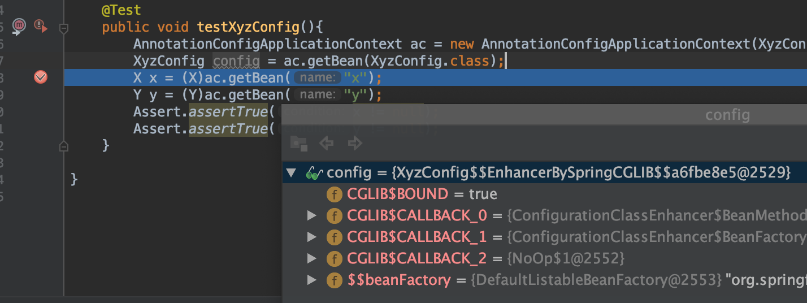
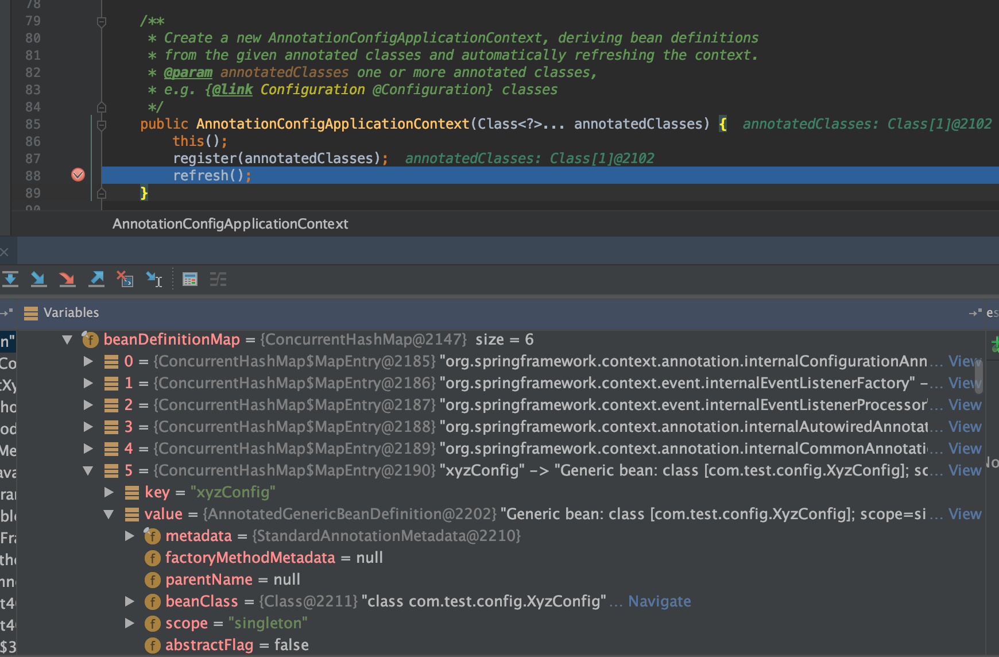
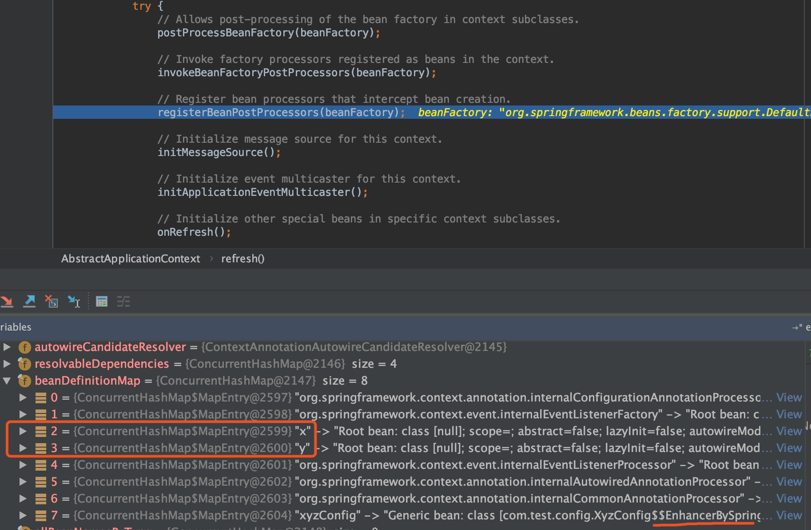
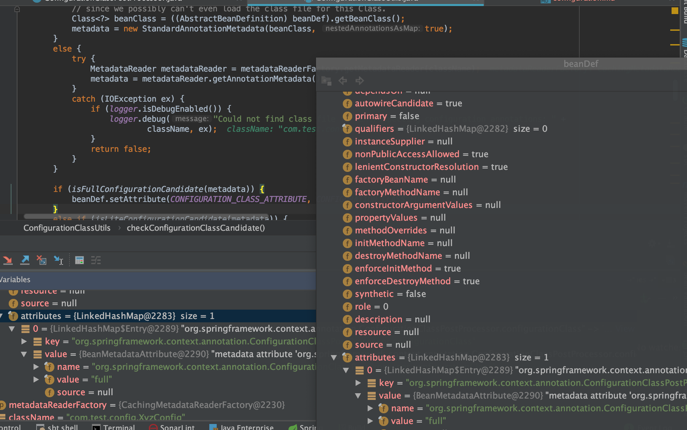
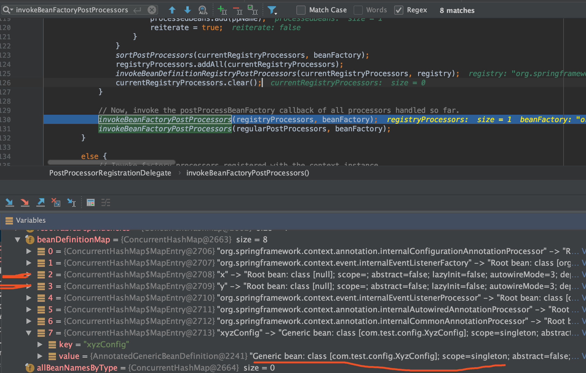
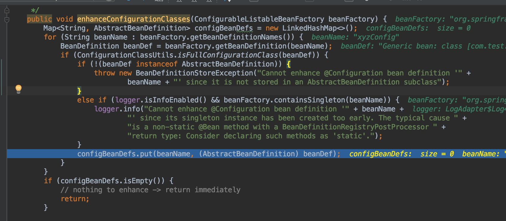
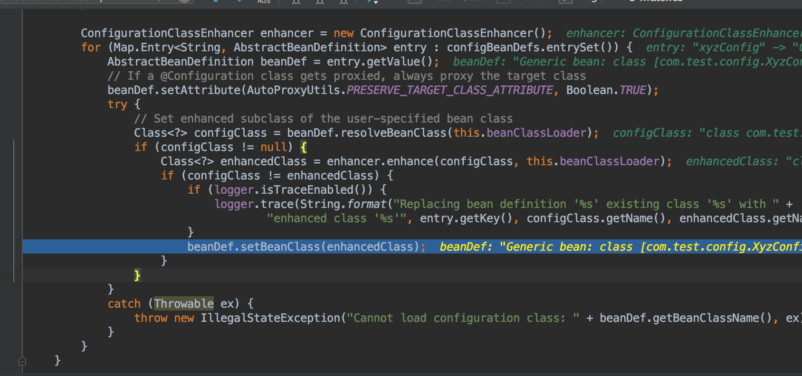
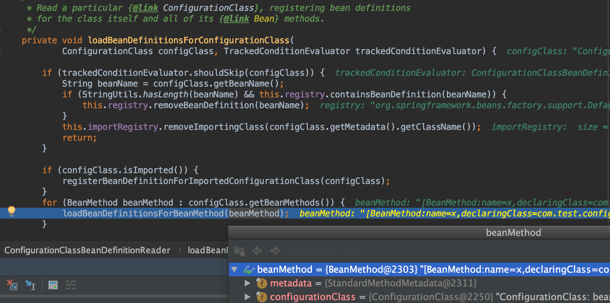
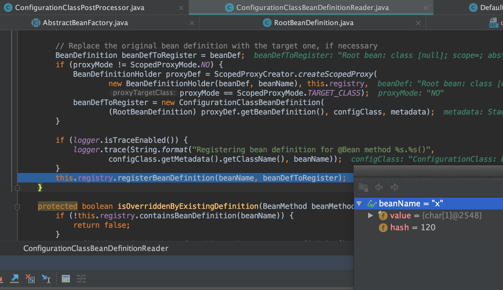
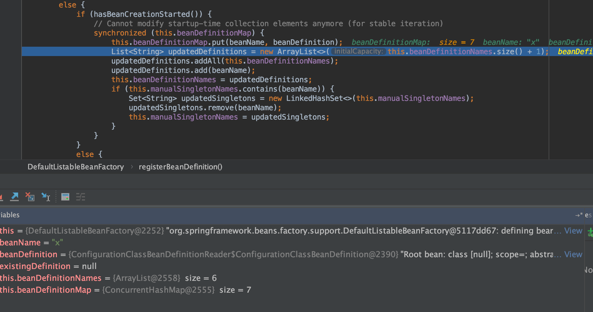

# @Configuration


## `@Configuration`注解使用与代理现象

```java
package com.test.config;

import com.test.entity.X;
import com.test.entity.Y;
import org.springframework.context.annotation.Bean;
import org.springframework.context.annotation.Configuration;

/**
 * @Author mubi
 * @Date 2020/7/8 22:38
 */
@Configuration
public class XyzConfig {

	@Bean
	public X x(){
		return new X();
	}

	@Bean
	public Y y(){
		x();
		return new Y();
	}
}
```

* 测试输出如下(`X`,`Y`两个对象都只初始化一次)

```java
init X
init Y
```

* `@Configuration` 会代理`XyzConfig`对象，确定里面的`@Bean`是单例的


* debug 查看`XyzConfig`Bean使用了Cglib代理

```java
@Test
public void testXyzConfig(){
    AnnotationConfigApplicationContext ac = new AnnotationConfigApplicationContext(XyzConfig.class);
    XyzConfig config = ac.getBean(XyzConfig.class);
    X x = (X)ac.getBean("x");
    Y y = (Y)ac.getBean("y");
    Assert.assertTrue(x != null);
    Assert.assertTrue(y != null);
}
```



## `@Configuration`到底做了什么操作

常规思路：一步一步debug源码，可能的地方，断点反复看；不过还是需要一定基础和目标

* 首先要知道：bean一定有个BeanDefinition；其次Spring是有`MapperScan`,`ComponentScan`这种扫描注解功能的

* 所以`@Configuration`是扫描出来并加载的吗？

* 显然Spring提供扫描Bean功能，这需要一个至少一个`@Configuration`类，所以`@Configuration`肯定不是扫描方式的；事实上其实手动`register`的

* 带着问题看源码，同时还有问题是：bean x,y 是什么时候生成`BeanDefinition`并写入到`BeanDefinitionMap`中的

##【*】`@Configuration`的Bean怎么加入到`beanDefinitionMap`中

在new`AnnotationConfigApplicationContext`的时候会执行`register(annotatedClasses);`方法，紧接着是`refresh`方法;

```java
AnnotationConfigApplicationContext ac = new AnnotationConfigApplicationContext(XyzConfig.class);
```

### `register(annotatedClasses);`

会执行`doRegisterBean`方法注册`BeanDefinition`；

<font color='blue'>回答：`@Configuration`的Bean是直接手动注册的，而非scan扫描方式</font>

```java
<T> void doRegisterBean(Class<T> annotatedClass, @Nullable Supplier<T> instanceSupplier, @Nullable String name,
        @Nullable Class<? extends Annotation>[] qualifiers, BeanDefinitionCustomizer... definitionCustomizers) {

    AnnotatedGenericBeanDefinition abd = new AnnotatedGenericBeanDefinition(annotatedClass);
    if (this.conditionEvaluator.shouldSkip(abd.getMetadata())) {
        return;
    }

    abd.setInstanceSupplier(instanceSupplier);
    ScopeMetadata scopeMetadata = this.scopeMetadataResolver.resolveScopeMetadata(abd);
    abd.setScope(scopeMetadata.getScopeName());
    String beanName = (name != null ? name : this.beanNameGenerator.generateBeanName(abd, this.registry));

    AnnotationConfigUtils.processCommonDefinitionAnnotations(abd);
    if (qualifiers != null) {
        for (Class<? extends Annotation> qualifier : qualifiers) {
            if (Primary.class == qualifier) {
                abd.setPrimary(true);
            }
            else if (Lazy.class == qualifier) {
                abd.setLazyInit(true);
            }
            else {
                abd.addQualifier(new AutowireCandidateQualifier(qualifier));
            }
        }
    }
    for (BeanDefinitionCustomizer customizer : definitionCustomizers) {
        customizer.customize(abd);
    }

    BeanDefinitionHolder definitionHolder = new BeanDefinitionHolder(abd, beanName);
    definitionHolder = AnnotationConfigUtils.applyScopedProxyMode(scopeMetadata, definitionHolder, this.registry);
    BeanDefinitionReaderUtils.registerBeanDefinition(definitionHolder, this.registry);
}
```

BeanDefinition首先会构造出来,并设置属性，包括如下

* scope
* lazyInit
* dependsOn
* ...


```java
@Override
public void registerBeanDefinition(String beanName, BeanDefinition beanDefinition)
        throws BeanDefinitionStoreException {

    this.beanFactory.registerBeanDefinition(beanName, beanDefinition);
}
```

* `BeanDefinition`加入到`beanFactory`的`beanDefinitionMap`中

```java
@Override
public void registerBeanDefinition(String beanName, BeanDefinition beanDefinition)
        throws BeanDefinitionStoreException {
...
    // Still in startup registration phase
    this.beanDefinitionMap.put(beanName, beanDefinition);
    this.beanDefinitionNames.add(beanName);
    this.manualSingletonNames.remove(beanName);
```

* 经过`register(annotatedClasses);`方法后，入下图

1. `xyzConfig`的`BeanDefinition`已经加入到`BeanFactory`的`beanDefinitionMap`中了
2. `Bean x, y` 还没有加入到`beanDefinitionMap`中
3. `xyzConfig`的`BeanDefinition`看起来是`XyzConfig`类自身，没有什么代理





### `refresh()`方法的`invokeBeanFactoryPostProcessors(beanFactory);`发生了`BeanDefinitionMap`的改变

当debug执行完这一行后，发现`beanFactory`的`beanDefinitionMap`有变化，如下图

1. bean x,y 加入到`beanDefinitionMap`中了
2. 同时发现`xyzConfig`被Spring增强了，可能发生了什么代理行为



#### `invokeBeanFactoryPostProcessors(beanFactory);`

```java
/**
 * Instantiate and invoke all registered BeanFactoryPostProcessor beans,
 * respecting explicit order if given.
 * <p>Must be called before singleton instantiation.
 */
protected void invokeBeanFactoryPostProcessors(ConfigurableListableBeanFactory beanFactory) {
    PostProcessorRegistrationDelegate.invokeBeanFactoryPostProcessors(beanFactory, getBeanFactoryPostProcessors());

    // Detect a LoadTimeWeaver and prepare for weaving, if found in the meantime
    // (e.g. through an @Bean method registered by ConfigurationClassPostProcessor)
    if (beanFactory.getTempClassLoader() == null && beanFactory.containsBean(LOAD_TIME_WEAVER_BEAN_NAME)) {
        beanFactory.addBeanPostProcessor(new LoadTimeWeaverAwareProcessor(beanFactory));
        beanFactory.setTempClassLoader(new ContextTypeMatchClassLoader(beanFactory.getBeanClassLoader()));
    }
}
```

#### 进入`PostProcessorRegistrationDelegate`到`invokeBeanFactoryPostProcessors`方法

其中`beanFactoryPostProcessors`是空的

```java
public static void invokeBeanFactoryPostProcessors(
			ConfigurableListableBeanFactory beanFactory, List<BeanFactoryPostProcessor> beanFactoryPostProcessors) {
	// 此方法的这句导致了`beanDefinitionMap`的变化
	invokeBeanDefinitionRegistryPostProcessors(currentRegistryProcessors, registry);
```

此次是`ConfigurationClassPostProcessor`,即`@Configuration`类的后置处理器

```java
/**
 * Invoke the given BeanDefinitionRegistryPostProcessor beans.
 */
private static void invokeBeanDefinitionRegistryPostProcessors(
        Collection<? extends BeanDefinitionRegistryPostProcessor> postProcessors, BeanDefinitionRegistry registry) {

    for (BeanDefinitionRegistryPostProcessor postProcessor : postProcessors) {
        postProcessor.postProcessBeanDefinitionRegistry(registry);
    }
}
```

#### 进入到`ConfigurationClassPostProcessor`类的`postProcessBeanDefinitionRegistry(registry)`方法

```java
/**
 * Derive further bean definitions from the configuration classes in the registry.
 */
@Override
public void postProcessBeanDefinitionRegistry(BeanDefinitionRegistry registry) {
    int registryId = System.identityHashCode(registry);
    if (this.registriesPostProcessed.contains(registryId)) {
        throw new IllegalStateException(
                "postProcessBeanDefinitionRegistry already called on this post-processor against " + registry);
    }
    if (this.factoriesPostProcessed.contains(registryId)) {
        throw new IllegalStateException(
                "postProcessBeanFactory already called on this post-processor against " + registry);
    }
    this.registriesPostProcessed.add(registryId);

    processConfigBeanDefinitions(registry);
}
```

`processConfigBeanDefinitions(registry);`处理如下

* 会判断是否有`@Configuration classes`（本例有且只有一个`xyzConfig`bean）
* 获取`Configuration`配置的bean加入到`Set<BeanDefinitionHolder> candidates`
* 对`candidates`中的`BeanDefinitionHolder`进行校验和bean扫描加载

#### `@Configuration`的beanDefinition添加`全注解`属性

```java
for (String beanName : candidateNames) {
    BeanDefinition beanDef = registry.getBeanDefinition(beanName);
    if (ConfigurationClassUtils.isFullConfigurationClass(beanDef) ||
            ConfigurationClassUtils.isLiteConfigurationClass(beanDef)) {
        if (logger.isDebugEnabled()) {
            logger.debug("Bean definition has already been processed as a configuration class: " + beanDef);
        }
    }
    else if (ConfigurationClassUtils.checkConfigurationClassCandidate(beanDef, this.metadataReaderFactory)) {
        configCandidates.add(new BeanDefinitionHolder(beanDef, beanName));
    }
}
```

* 在遍历`beanDefinitionMap`中的已经加入的所有bean中，逐一遍历判断是否是`全注解`类
* 第一次判断肯定不是，因为`xyzConfig`虽然有`@Configuration`，但是并没有进行任何解析和设置操作
* 判断不是，而后的`checkConfigurationClassCandidate`做了操作

##### ConfigurationClassUtils.checkConfigurationClassCandidate(beanDef, this.metadataReaderFactory)

```java
/**
 * Check whether the given bean definition is a candidate for a configuration class
 * (or a nested component class declared within a configuration/component class,
 * to be auto-registered as well), and mark it accordingly.
 * @param beanDef the bean definition to check
 * @param metadataReaderFactory the current factory in use by the caller
 * @return whether the candidate qualifies as (any kind of) configuration class
 */
public static boolean checkConfigurationClassCandidate(
        BeanDefinition beanDef, MetadataReaderFactory metadataReaderFactory) {
	// isFullConfigurationCandidate 判断语句：metadata.isAnnotated(Configuration.class.getName());
	// 判断是否有@Configuration,这里会判断xyzConfig类是一个全注解类
	// 重新设置全注解类的属性，下次就需要再checkConfigurationClassCandidate了
	if (isFullConfigurationCandidate(metadata)) {
        beanDef.setAttribute(CONFIGURATION_CLASS_ATTRIBUTE, CONFIGURATION_CLASS_FULL);
    }
```



##### `invokeBeanFactoryPostProcessors(registryProcessors, beanFactory);`方法实现了代理



在`ConfigurationClassPostProcessor`类中看到了`enhanceConfigurationClasses(beanFactory);`

```java
@Override
public void postProcessBeanFactory(ConfigurableListableBeanFactory beanFactory) {
    int factoryId = System.identityHashCode(beanFactory);
    if (this.factoriesPostProcessed.contains(factoryId)) {
        throw new IllegalStateException(
                "postProcessBeanFactory already called on this post-processor against " + beanFactory);
    }
    this.factoriesPostProcessed.add(factoryId);
    if (!this.registriesPostProcessed.contains(factoryId)) {
        // BeanDefinitionRegistryPostProcessor hook apparently not supported...
        // Simply call processConfigurationClasses lazily at this point then.
        processConfigBeanDefinitions((BeanDefinitionRegistry) beanFactory);
    }

    enhanceConfigurationClasses(beanFactory);
    beanFactory.addBeanPostProcessor(new ImportAwareBeanPostProcessor(beanFactory));
}
```

#####【*】`enhanceConfigurationClasses(beanFactory);`完成了对`@Configuration`类的Cglib代理

* debug进入方法可以看到会对beanFactory中所有bean判断是否是全注解
* 因为之前`xyzConfig`是已经设置了全注解的，所以这里肯定判断是，并加入到`configBeanDefs`
* 只要`configBeanDefs`不是空，程序继续走，就有了代理；如下图的debug，实时也确实如此



* 直接new了`ConfigurationClassEnhancer`（即使用的是Cglib代理）
* 这里也看到了`xyzConfig`全注解bean的`beanDefinitiond`的`beanClass`属性变成了代理类



```java
/**
 * Post-processes a BeanFactory in search of Configuration class BeanDefinitions;
 * any candidates are then enhanced by a {@link ConfigurationClassEnhancer}.
 * Candidate status is determined by BeanDefinition attribute metadata.
 * @see ConfigurationClassEnhancer
 */
public void enhanceConfigurationClasses(ConfigurableListableBeanFactory beanFactory) {
    Map<String, AbstractBeanDefinition> configBeanDefs = new LinkedHashMap<>();
    for (String beanName : beanFactory.getBeanDefinitionNames()) {
        BeanDefinition beanDef = beanFactory.getBeanDefinition(beanName);
        if (ConfigurationClassUtils.isFullConfigurationClass(beanDef)) {
            if (!(beanDef instanceof AbstractBeanDefinition)) {
                throw new BeanDefinitionStoreException("Cannot enhance @Configuration bean definition '" +
                        beanName + "' since it is not stored in an AbstractBeanDefinition subclass");
            }
            else if (logger.isInfoEnabled() && beanFactory.containsSingleton(beanName)) {
                logger.info("Cannot enhance @Configuration bean definition '" + beanName +
                        "' since its singleton instance has been created too early. The typical cause " +
                        "is a non-static @Bean method with a BeanDefinitionRegistryPostProcessor " +
                        "return type: Consider declaring such methods as 'static'.");
            }
            configBeanDefs.put(beanName, (AbstractBeanDefinition) beanDef);
        }
    }
    if (configBeanDefs.isEmpty()) {
        // nothing to enhance -> return immediately
        return;
    }

    ConfigurationClassEnhancer enhancer = new ConfigurationClassEnhancer();
    for (Map.Entry<String, AbstractBeanDefinition> entry : configBeanDefs.entrySet()) {
        AbstractBeanDefinition beanDef = entry.getValue();
        // If a @Configuration class gets proxied, always proxy the target class
        beanDef.setAttribute(AutoProxyUtils.PRESERVE_TARGET_CLASS_ATTRIBUTE, Boolean.TRUE);
        try {
            // Set enhanced subclass of the user-specified bean class
            Class<?> configClass = beanDef.resolveBeanClass(this.beanClassLoader);
            if (configClass != null) {
                Class<?> enhancedClass = enhancer.enhance(configClass, this.beanClassLoader);
                if (configClass != enhancedClass) {
                    if (logger.isTraceEnabled()) {
                        logger.trace(String.format("Replacing bean definition '%s' existing class '%s' with " +
                                "enhanced class '%s'", entry.getKey(), configClass.getName(), enhancedClass.getName()));
                    }
                    beanDef.setBeanClass(enhancedClass);
                }
            }
        }
        catch (Throwable ex) {
            throw new IllegalStateException("Cannot load configuration class: " + beanDef.getBeanClassName(), ex);
        }
    }
}
```

####【*】processConfigBeanDefinitions(registry);`内继续debug看`x()`方法的`@Bean`加载到beanDefinitionMap



`ConfigurationClassBeanDefinitionReader`类的`loadBeanDefinitionsForBeanMethod`方法

* 此方法会判断是否有覆盖的`beanDefinition`

```java
// Has this effectively been overridden before (e.g. via XML)?
if (isOverriddenByExistingDefinition(beanMethod, beanName)) {
    if (beanName.equals(beanMethod.getConfigurationClass().getBeanName())) {
        throw new BeanDefinitionStoreException(beanMethod.getConfigurationClass().getResource().getDescription(),
                beanName, "Bean name derived from @Bean method '" + beanMethod.getMetadata().getMethodName() +
                "' clashes with bean name for containing configuration class; please make those names unique!");
    }
    return;
}
```

* 构造并注册`bean` x



##### 在类`DefaultListableBeanFactory`的`registerBeanDefinition`方法中可以看到`beanDefinitionMap.put("x", beanDefinition)`



## `BeanDefinition`全部到位后，接下来就是单例bean生命周期了

参考复习：[单例bean生命周期](./bean_life.md)
