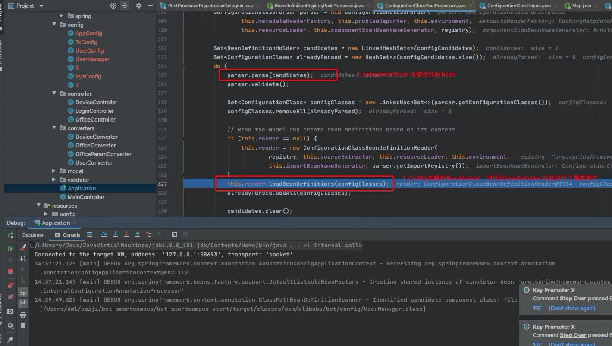

# @Component,@Bean同时作用同一个类

## 测试程序

```java
@Configuration
@ComponentScan("com.test")
public class UserConfig {
	@Value("${key1}")
	String userName;

	@Bean
    public UserManager userManager(){ 
		UserManager userManager = new UserManager(userName);
        return userManager;
    }
}
```

```java
@Component
public class UserManager {
    String userName;
    
    public UserManager() {
        System.out.println("constructor UserManager()");
    }
    
    public UserManager(String userName) {
        this.userName = userName;
        System.out.println("constructor UserManager(String userName)");
    }
}
```

```java
@Component
public class UserPropertyPlaceholderConfigurer extends PropertyPlaceholderConfigurer {

    @Override
    protected void loadProperties(Properties props) throws IOException {
        super.loadProperties(props);
        props.put("key1", "value1");
    }
}
```


测试代码

```java
public static void main(String[] args) {
    AnnotationConfigApplicationContext ac = new AnnotationConfigApplicationContext(UserConfig.class);
    UserManager userManager = ac.getBean(UserManager.class);
    System.out.println(userManager);
}
```

## 结论

默认 @Configuration + @Bean 会覆盖 @Component

## 源码流程



在执行ConfigurationClassPostProcessor的postProcessBeanFactory方法时，BeanDefinition会注册两次

* 第一次：ConfigurationClassPostProcessor内部的@ComponentScan扫描bean完成注册
* 第二次：ConfigurationClassPostProcessor全注解类内部的@Bean方法解析去注册bean,而这会对第一次的注册进行覆盖

