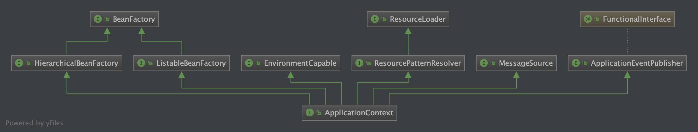

# ApplicationContext



* ApplicationContext和BeanFactory一样都是bean的容器
* BeanFactory是一切Bean容器的父类
* ApplicationContext继承于BeanFactory（继承了BeanFactory），ApplicationContext包含了BeanFactory的所有功能，并且扩展了其他功能

## ClassPathXmlApplicationContext举例

* 解析配置的xml信息，将xml路径信息赋值给configLocations，设置了配置信息之后对ApplicationContext进行初始化操作（refresh方法）

```java
public ClassPathXmlApplicationContext(
        String[] configLocations, boolean refresh, @Nullable ApplicationContext parent)
        throws BeansException {

    //调用父类的构造函数
    super(parent);
    //设置配置xml
    setConfigLocations(configLocations);
    //ApplicationContext初始化
    if (refresh) {
        refresh();
    }
}
```

* refresh方法

```java
@Override
public void refresh() throws BeansException, IllegalStateException {
    synchronized (this.startupShutdownMonitor) {
        // Prepare this context for refreshing.
        //准备刷新
        prepareRefresh();

        // Tell the subclass to refresh the internal bean factory.
        // 获取BeanFactory；默认实现是DefaultListableBeanFactory，在创建容器的时候创建的
        ConfigurableListableBeanFactory beanFactory = obtainFreshBeanFactory();

        // Prepare the bean factory for use in this context.
        //对BeanFactory进行各种功能扩展
        prepareBeanFactory(beanFactory);

        try {
            // Allows post-processing of the bean factory in context subclasses.
            //子类覆盖方法做额外的处理
            postProcessBeanFactory(beanFactory);

            // Invoke factory processors registered as beans in the context.
            // 激活各种BeanFactory处理器
            // 会处理@PropertySources，@ComponentScan，@Import等注解
            invokeBeanFactoryPostProcessors(beanFactory);

            // Register bean processors that intercept bean creation.
            //注册拦截Bean创建对Bean处理器，这里只是注册，真正调用是在getBean对时候
            registerBeanPostProcessors(beanFactory);

            // Initialize message source for this context.
            //为上下文初始化Message
            initMessageSource();

            // Initialize event multicaster for this context.
            //初始化应用消息广播器
            initApplicationEventMulticaster();

            // Initialize other special beans in specific context subclasses.
            //留给子类来初始化其它的Bean
            onRefresh();

            // Check for listener beans and register them.
            //在所有注册对bean中寻找Listener bean，注册到消息广播器中
            registerListeners();

            // Instantiate all remaining (non-lazy-init) singletons.
            //初始化单例bean
            finishBeanFactoryInitialization(beanFactory);

            // Last step: publish corresponding event.
            //完成刷新过程，通知生命周期处理器刷新过程，同时发出ContextRefreshEvent通知别人
            finishRefresh();
        }

        catch (BeansException ex) {
            if (logger.isWarnEnabled()) {
                logger.warn("Exception encountered during context initialization - " +
                        "cancelling refresh attempt: " + ex);
            }

            // Destroy already created singletons to avoid dangling resources.
            destroyBeans();

            // Reset 'active' flag.
            cancelRefresh(ex);

            // Propagate exception to caller.
            throw ex;
        }

        finally {
            // Reset common introspection caches in Spring's core, since we
            // might not ever need metadata for singleton beans anymore...
            resetCommonCaches();
        }
    }
}
```
