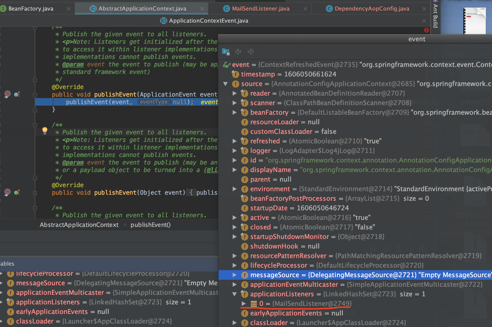

# 事件发布和监听机制

在一个完整的事件体系中，除了事件和监听器以外，还应该有3个概念；

1. 事件源：事件的产生者，任何一个event都必须有一个事件源；
2. 事件广播器：它是事件和事件监听器之间的桥梁，负责把事件通知给事件监听器；
3. 事件监听器注册表：就是spring框架为所有的监听器提供了一个存放的地方；

## 事件类：ApplicationEvent

ApplicationEvent唯一的构造函数是ApplicationEvent（Object source），通过source指定事件源

```java
/**
 * Class to be extended by all application events. Abstract as it
 * doesn't make sense for generic events to be published directly.
 *
 * @author Rod Johnson
 * @author Juergen Hoeller
 */
public abstract class ApplicationEvent extends EventObject {

	/** use serialVersionUID from Spring 1.2 for interoperability. */
	private static final long serialVersionUID = 7099057708183571937L;

	/** System time when the event happened. */
	private final long timestamp;


	/**
	 * Create a new ApplicationEvent.
	 * @param source the object on which the event initially occurred (never {@code null})
	 */
	public ApplicationEvent(Object source) {
		super(source);
		this.timestamp = System.currentTimeMillis();
	}


	/**
	 * Return the system time in milliseconds when the event happened.
	 */
	public final long getTimestamp() {
		return this.timestamp;
	}

}
```

### abstract class ApplicationContextEvent 容器事件(事件源是ApplicationContext)

```java
public abstract class ApplicationContextEvent extends ApplicationEvent {

	/**
	 * Create a new ContextStartedEvent.
	 * @param source the {@code ApplicationContext} that the event is raised for
	 * (must not be {@code null})
	 */
	public ApplicationContextEvent(ApplicationContext source) {
		super(source);
	}

	/**
	 * Get the {@code ApplicationContext} that the event was raised for.
	 */
	public final ApplicationContext getApplicationContext() {
		return (ApplicationContext) getSource();
	}

}
```

### class RequestHandledEvent extends ApplicationEvent

一个与Web应用相关的事件，当一个请求被处理后，才会产生该事件

```java
public class RequestHandledEvent extends ApplicationEvent {

	/** Session id that applied to the request, if any. */
	@Nullable
	private String sessionId;

	/** Usually the UserPrincipal. */
	@Nullable
	private String userName;

	/** Request processing time. */
	private final long processingTimeMillis;

	/** Cause of failure, if any. */
	@Nullable
	private Throwable failureCause;

	/**
	 * Create a new RequestHandledEvent with session information.
	 * @param source the component that published the event
	 * @param sessionId the id of the HTTP session, if any
	 * @param userName the name of the user that was associated with the
	 * request, if any (usually the UserPrincipal)
	 * @param processingTimeMillis the processing time of the request in milliseconds
	 */
	public RequestHandledEvent(Object source, @Nullable String sessionId, @Nullable String userName,
			long processingTimeMillis) {

		super(source);
		this.sessionId = sessionId;
		this.userName = userName;
		this.processingTimeMillis = processingTimeMillis;
	}

	/**
	 * Create a new RequestHandledEvent with session information.
	 * @param source the component that published the event
	 * @param sessionId the id of the HTTP session, if any
	 * @param userName the name of the user that was associated with the
	 * request, if any (usually the UserPrincipal)
	 * @param processingTimeMillis the processing time of the request in milliseconds
	 * @param failureCause the cause of failure, if any
	 */
	public RequestHandledEvent(Object source, @Nullable String sessionId, @Nullable String userName,
			long processingTimeMillis, @Nullable Throwable failureCause) {

		this(source, sessionId, userName, processingTimeMillis);
		this.failureCause = failureCause;
	}

	public long getProcessingTimeMillis() {
		return this.processingTimeMillis;
	}

	@Nullable
	public String getSessionId() {
		return this.sessionId;
	}

	@Nullable
	public String getUserName() {
		return this.userName;
	}

	public boolean wasFailure() {
		return (this.failureCause != null);
	}

	@Nullable
	public Throwable getFailureCause() {
		return this.failureCause;
	}

	public String getShortDescription() {
		StringBuilder sb = new StringBuilder();
		sb.append("session=[").append(this.sessionId).append("]; ");
		sb.append("user=[").append(this.userName).append("]; ");
		return sb.toString();
	}

	public String getDescription() {
		StringBuilder sb = new StringBuilder();
		sb.append("session=[").append(this.sessionId).append("]; ");
		sb.append("user=[").append(this.userName).append("]; ");
		sb.append("time=[").append(this.processingTimeMillis).append("ms]; ");
		sb.append("status=[");
		if (!wasFailure()) {
			sb.append("OK");
		}
		else {
			sb.append("failed: ").append(this.failureCause);
		}
		sb.append(']');
		return sb.toString();
	}

	@Override
	public String toString() {
		return ("RequestHandledEvent: " + getDescription());
	}

}
```

## 事件监听器接口（ApplicationListener）

监听器都需要实现该接口，该接口只定义了一个方法:`onApplicationEvent (E event)`，该方法接收事件对象，在该方法中编写事件的响应处理逻辑。

```java
@FunctionalInterface
public interface ApplicationListener<E extends ApplicationEvent> extends EventListener {

	/**
	 * Handle an application event.
	 * @param event the event to respond to
	 */
	void onApplicationEvent(E event);

}
```

## 例子



* 具体事件，继承`ApplicationContextEvent`

```java
public class MailSendEvent extends ApplicationContextEvent {

	private static final long serialVersionUID = 1L;

	private String to;  //目的地

	public MailSendEvent(ApplicationContext source, String to) {
		super(source);
		this.to = to;
	}

	public String getTo(){
		return this.to;
	}
}
```

* 构造事件实例，并发送事件

实现了`ApplicationContextAware`能获取到`ApplicationContext`，则能进行事件的发布

```java
@Component
public class MailSender implements ApplicationContextAware {
	@Autowired
	private ApplicationContext applicationContext;  // 容器事件由容器触发

	public void sendMail(String to){
		System.out.println("...ApplicationContextAware");
		MailSendEvent event = new MailSendEvent(applicationContext, to);
		applicationContext.publishEvent(event);
	}

	@Override
	public void setApplicationContext(ApplicationContext applicationContext) throws BeansException {
		this.applicationContext = applicationContext;
	}
}
```

* 监听到具体事件

```java
@Component
public class MailSendListener implements ApplicationListener<MailSendEvent> {
	@Override
	public void onApplicationEvent(MailSendEvent mailSendEvent) {
		System.out.println("...onApplicationEvent");
		MailSendEvent event = mailSendEvent;
		System.out.println("MailSender向"+ event.getTo()+ "发送了邮件");
	}
}
```
