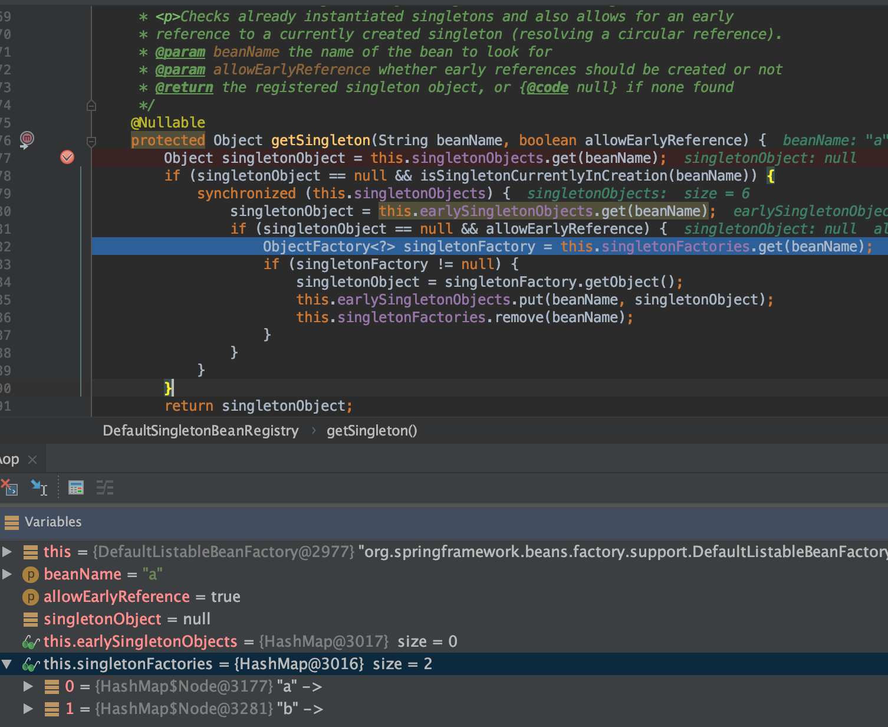
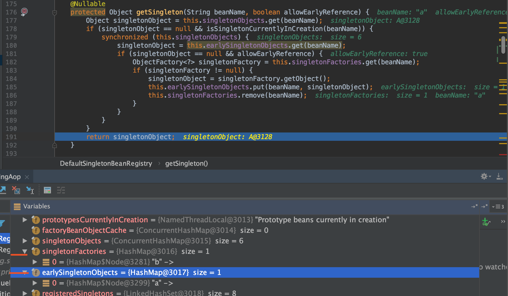
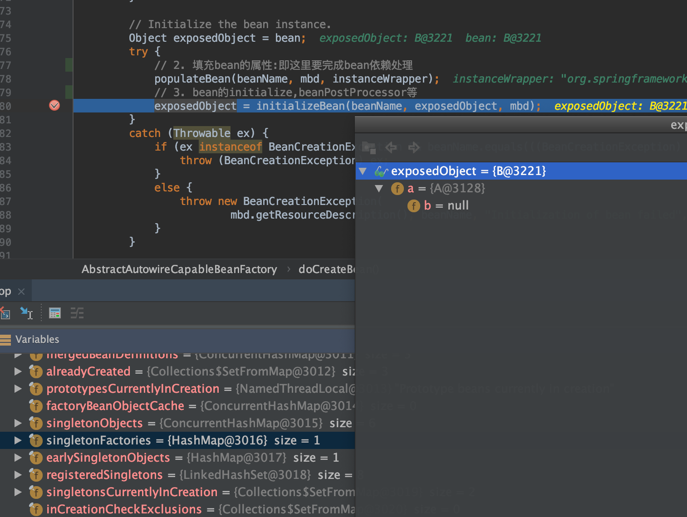
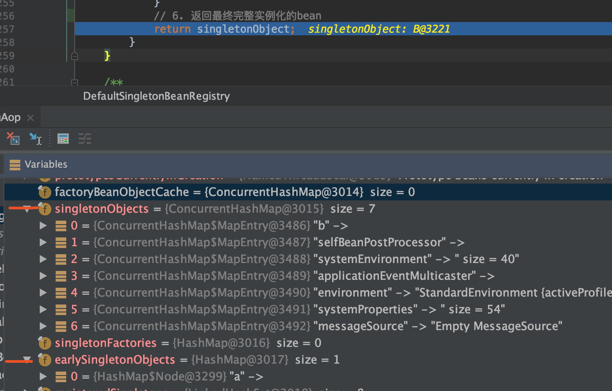
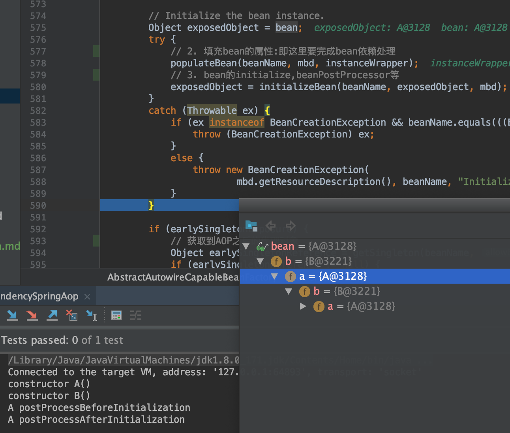

# 循环依赖

## 什么是依赖？

* eg1

```java
A -> B
B -> A
```

* eg2

```java
A -> B -> C -> A
```

## Spring中循环依赖场景

1. 构造器的循环依赖(spring无法解决)
2. field属性的循环依赖(spring能解决单例bean的属性循环依赖)

## singleton bean 属性循环依赖无问题

### 单例Bean循环依赖理解图


### 单例的三级缓存获取:`getSingleton`方法

```java
/**
 * Return the (raw) singleton object registered under the given name.
 * <p>Checks already instantiated singletons and also allows for an early
 * reference to a currently created singleton (resolving a circular reference).
 * @param beanName the name of the bean to look for
 * @param allowEarlyReference whether early references should be created or not
 * @return the registered singleton object, or {@code null} if none found
 */
@Nullable
protected Object getSingleton(String beanName, boolean allowEarlyReference) {
    Object singletonObject = this.singletonObjects.get(beanName);
    if (singletonObject == null && isSingletonCurrentlyInCreation(beanName)) {
        synchronized (this.singletonObjects) {
            singletonObject = this.earlySingletonObjects.get(beanName);
            if (singletonObject == null && allowEarlyReference) {
                ObjectFactory<?> singletonFactory = this.singletonFactories.get(beanName);
                if (singletonFactory != null) {
                    singletonObject = singletonFactory.getObject();
                    this.earlySingletonObjects.put(beanName, singletonObject);
                    this.singletonFactories.remove(beanName);
                }
            }
        }
    }
    return singletonObject;
}
```

### 三级缓存涉及要点说明

#### `singletonObjects`map结构（一级缓存）

```java
/** Cache of singleton objects: bean name to bean instance. */
private final Map<String, Object> singletonObjects = new ConcurrentHashMap<>(256);
```

`singletonObjects`存储的实例是已经实例化的单例，并且初始化完成的(一般称为：单例缓存池)

#### `earlySingletonObjects`map结构(二级缓存)

```java
/** Cache of early singleton objects: bean name to bean instance. */
private final Map<String, Object> earlySingletonObjects = new HashMap<>(16);
```

从`singletonObjects`取不到，且该`Bean`在创建过程中，则从`earlySingletonObjects`获取


#### `singletonsCurrentlyInCreation`Set集合(创建中Bean集合)

`isSingletonCurrentlyInCreation()`方法判断当前单例Bean是否正在创建中（在创建中的Bean是没有初始化完全的）

```java
/**
 * Return whether the specified singleton bean is currently in creation
 * (within the entire factory).
 * @param beanName the name of the bean
 */
public boolean isSingletonCurrentlyInCreation(String beanName) {
    return this.singletonsCurrentlyInCreation.contains(beanName);
}
```

将创建中的bean加入到`singletonsCurrentlyInCreation`集合中

#### `singletonFactories`map结构(三级缓存)

```java
/** Cache of singleton factories: bean name to ObjectFactory. */
private final Map<String, ObjectFactory<?>> singletonFactories = new HashMap<>(16);
```

从`earlySingletonObjects`取不到则从`singletonFactories`取，存储的是`<bean, lambda(bean)>`


### `AbstractBeanFactory`类的`doGetBean`方法

```java
// Create bean instance.
if (mbd.isSingleton()) {
    sharedInstance = getSingleton(beanName, () -> {
        try {
            return createBean(beanName, mbd, args);
        }
        catch (BeansException ex) {
            // Explicitly remove instance from singleton cache: It might have been put there
            // eagerly by the creation process, to allow for circular reference resolution.
            // Also remove any beans that received a temporary reference to the bean.
            destroySingleton(beanName);
            throw ex;
        }
    });
    bean = getObjectForBeanInstance(sharedInstance, name, beanName, mbd);
}
```

也是`getSingleton`方法，有个lambda表达式的`createBean`方法

#### `DefaultSingletonBeanRegistry`类的`getSingleton`方法逻辑

```java
/**
 * Return the (raw) singleton object registered under the given name,
 * creating and registering a new one if none registered yet.
 * @param beanName the name of the bean
 * @param singletonFactory the ObjectFactory to lazily create the singleton
 * with, if necessary
 * @return the registered singleton object
 */
public Object getSingleton(String beanName, ObjectFactory<?> singletonFactory) {
    Assert.notNull(beanName, "Bean name must not be null");
    synchronized (this.singletonObjects) {
        // 1. 仍然是先判断是否在一级缓存中
        Object singletonObject = this.singletonObjects.get(beanName);
        if (singletonObject == null) {
            if (this.singletonsCurrentlyInDestruction) {
                throw new BeanCreationNotAllowedException(beanName,
                        "Singleton bean creation not allowed while singletons of this factory are in destruction " +
                        "(Do not request a bean from a BeanFactory in a destroy method implementation!)");
            }
            if (logger.isDebugEnabled()) {
                logger.debug("Creating shared instance of singleton bean '" + beanName + "'");
            }
            // 2. 创建前加入到`singletonsCurrentlyInCreation`集合中, 表示正在创建
            beforeSingletonCreation(beanName);
            boolean newSingleton = false;
            boolean recordSuppressedExceptions = (this.suppressedExceptions == null);
            if (recordSuppressedExceptions) {
                this.suppressedExceptions = new LinkedHashSet<>();
            }
            try {
                // 3. 执行lambda表达式的创建逻辑获取到单例bean，即执行`doCreateBean` 
                singletonObject = singletonFactory.getObject();
                newSingleton = true;
            }
            catch (IllegalStateException ex) {
                // Has the singleton object implicitly appeared in the meantime ->
                // if yes, proceed with it since the exception indicates that state.
                singletonObject = this.singletonObjects.get(beanName);
                if (singletonObject == null) {
                    throw ex;
                }
            }
            catch (BeanCreationException ex) {
                if (recordSuppressedExceptions) {
                    for (Exception suppressedException : this.suppressedExceptions) {
                        ex.addRelatedCause(suppressedException);
                    }
                }
                throw ex;
            }
            finally {
                if (recordSuppressedExceptions) {
                    this.suppressedExceptions = null;
                }
                // 4. 创建完成后从`singletonsCurrentlyInCreation`集合中移除, 非创建状态
                afterSingletonCreation(beanName);
            }
            if (newSingleton) {
                // 5. 加入到一级缓存中，且从二级，三级缓存移除
                addSingleton(beanName, singletonObject);
            }
        }
        // 6. 返回最终完整实例化的bean
        return singletonObject;
    }
}
```


#### `AbstractAutowireCapableBeanFactory`类的`doCreateBean`方法

```java
/**
 * Actually create the specified bean. Pre-creation processing has already happened
 * at this point, e.g. checking {@code postProcessBeforeInstantiation} callbacks.
 * <p>Differentiates between default bean instantiation, use of a
 * factory method, and autowiring a constructor.
 * @param beanName the name of the bean
 * @param mbd the merged bean definition for the bean
 * @param args explicit arguments to use for constructor or factory method invocation
 * @return a new instance of the bean
 * @throws BeanCreationException if the bean could not be created
 * @see #instantiateBean
 * @see #instantiateUsingFactoryMethod
 * @see #autowireConstructor
 */
protected Object doCreateBean(final String beanName, final RootBeanDefinition mbd, final @Nullable Object[] args)
        throws BeanCreationException {

    // Instantiate the bean.
    BeanWrapper instanceWrapper = null;
    if (mbd.isSingleton()) {
        instanceWrapper = this.factoryBeanInstanceCache.remove(beanName);
    }
    if (instanceWrapper == null) {
        // 1. factoryBeanInstanceCache 没有则需要主动创建
        instanceWrapper = createBeanInstance(beanName, mbd, args);
    }
    final Object bean = instanceWrapper.getWrappedInstance();
    Class<?> beanType = instanceWrapper.getWrappedClass();
    if (beanType != NullBean.class) {
        mbd.resolvedTargetType = beanType;
    }

    // Allow post-processors to modify the merged bean definition.
    synchronized (mbd.postProcessingLock) {
        if (!mbd.postProcessed) {
            try {
                applyMergedBeanDefinitionPostProcessors(mbd, beanType, beanName);
            }
            catch (Throwable ex) {
                throw new BeanCreationException(mbd.getResourceDescription(), beanName,
                        "Post-processing of merged bean definition failed", ex);
            }
            mbd.postProcessed = true;
        }
    }

    // 加入到三级缓存:即添加<bean，lambda(bean)>,此为提前暴露早期对象
    // Eagerly cache singletons to be able to resolve circular references
    // even when triggered by lifecycle interfaces like BeanFactoryAware.
    boolean earlySingletonExposure = (mbd.isSingleton() && this.allowCircularReferences &&
            isSingletonCurrentlyInCreation(beanName));
    if (earlySingletonExposure) {
        if (logger.isTraceEnabled()) {
            logger.trace("Eagerly caching bean '" + beanName +
                    "' to allow for resolving potential circular references");
        }
        addSingletonFactory(beanName, () -> getEarlyBeanReference(beanName, mbd, bean));
    }

    // Initialize the bean instance.
    Object exposedObject = bean;
    try {
        // 2. 填充bean的属性:即这里要完成bean依赖处理
        populateBean(beanName, mbd, instanceWrapper);
        // 3. bean的initialize,beanPostProcessor等
        exposedObject = initializeBean(beanName, exposedObject, mbd);
    }
    catch (Throwable ex) {
        if (ex instanceof BeanCreationException && beanName.equals(((BeanCreationException) ex).getBeanName())) {
            throw (BeanCreationException) ex;
        }
        else {
            throw new BeanCreationException(
                    mbd.getResourceDescription(), beanName, "Initialization of bean failed", ex);
        }
    }

    if (earlySingletonExposure) {
        // 获取到AOP之后的代理对象
        Object earlySingletonReference = getSingleton(beanName, false);
        if (earlySingletonReference != null) {
            // 如果提前暴露的对象和经过了完整的生命周期后的对象相等，那么把代理对象赋值给`exposedObject`
            if (exposedObject == bean) {
                exposedObject = earlySingletonReference;
            }
            // 如果提前暴露的对象和经过了完整的生命周期后的对象不相等
            // allowRawInjectionDespiteWrapping 表示在循环依赖时
            else if (!this.allowRawInjectionDespiteWrapping && hasDependentBean(beanName)) {
                String[] dependentBeans = getDependentBeans(beanName);
                Set<String> actualDependentBeans = new LinkedHashSet<>(dependentBeans.length);
                for (String dependentBean : dependentBeans) {
                    if (!removeSingletonIfCreatedForTypeCheckOnly(dependentBean)) {
                        actualDependentBeans.add(dependentBean);
                    }
                }
                if (!actualDependentBeans.isEmpty()) {
                    throw new BeanCurrentlyInCreationException(beanName,
                            "Bean with name '" + beanName + "' has been injected into other beans [" +
                            StringUtils.collectionToCommaDelimitedString(actualDependentBeans) +
                            "] in its raw version as part of a circular reference, but has eventually been " +
                            "wrapped. This means that said other beans do not use the final version of the " +
                            "bean. This is often the result of over-eager type matching - consider using " +
                            "'getBeanNamesOfType' with the 'allowEagerInit' flag turned off, for example.");
                }
            }
        }
    }

    // Register bean as disposable.
    try {
        registerDisposableBeanIfNecessary(beanName, bean, mbd);
    }
    catch (BeanDefinitionValidationException ex) {
        throw new BeanCreationException(
                mbd.getResourceDescription(), beanName, "Invalid destruction signature", ex);
    }

    return exposedObject;
}
```

#### Debug过程中的要点与截图

* populateBean("b", mbd, instanceWrapper)的时候，发现依赖了A，要去getBean("a"),执行到`getSingleton`方法，此时从三级缓存中取到



* 从三级缓存取到A之后,执行了`lambda(bean A)`的逻辑，并将`bean A`加入二级缓存，并返回



* 由于从三级缓存拿到了提交曝光的A，B就正常的完成A依赖的设置，顺利完成`populateBean`方法



* B实例化全部完成后，加入到单例缓存池(一级缓存)中



* 由于B实例化的完成，A的实例化也就能正常完成，并在最后也加入到单例缓存池(一级缓存)中



### 为什么是三级缓存？

* Bean生命周期 A
    1. class --- BeanDefinition
    2. new A(); // 原始对象
    3. populateBean（依赖注入）--> 单例池中找B --> 找不到 --> 创建B
    4. initializeBean
        * BeanPostProcessor
    5. 完成并添加到单例池中

* Bean生命周期 B
    1. class --- BeanDefinition
    2. new B(); // 原始对象
    3. populateBean（依赖注入）--> 单例池中找A --> 找不到 --> 三级缓存中能找到 --> lambda(A) --> 提前得到代理A
    4. initializeBean
        * BeanPostProcessor
    5. 完成并添加到单例池中


按照如上，如果只有 一级缓存 和 三级缓存，能够解决A,B依赖问题，接着又来了个C(且依赖A)；如果按照上面B的逻辑，那么可以发现`lambda(A)`会再次被执行，这可能导致B，C执行后获取的代理A**不一致**,如下(C也执行工厂方法得到代理A)

* Bean生命周期 C
    1. class --- BeanDefinition
    2. new C(); // 原始对象
    3. populateBean（依赖注入）--> 单例池中找A --> 找不到 --> 三级缓存中能找到 --> lambda(A) --> 提前得到代理A
    4. initializeBean
        *  BeanPostProcessor
    5. 完成并添加到单例池中

所以再来一个缓存, 将工厂产生的代理对象A也缓存起来，所以最后是三个缓存(且备注了其用途)

1. singletonObjects: `单例池`：单例对象实例化一次，缓存最后的代理bean成品
2. earlySingletonObjects: `map<beanName, 代理bean>`：解决性能问题？B,C,D都依赖A,工厂产生是开销的,且是重复的工厂创建，显然可以缓存好
3. singletonFactories: `map<beanName, lambda(原始对象)>`：bean工厂能够任意操作bean，解决循环依赖(提前暴露工厂，产生代理bean，属性注入)

完成populateBean之前，产生工厂，工厂能够产生bean。为什么是工厂？
* 答: 因为populateBean拿到的依赖bean是原始的，显然依赖注入要是最后的代理品，而工厂能够让bean升华这个bean，变成最后的代理类（因为populateBean之后会有代理行为）

参考：bilibili 子路老师

## scope bean 循环依赖有问题？

### 测试代码

```java
@Test
public void testDependencySpringPrototype() {
    ApplicationContext applicationContext =
            new ClassPathXmlApplicationContext("spring-dependency-prototype.xml");
    A a = (A) applicationContext.getBean("a");
    B b = (B) applicationContext.getBean("b");
    Assert.assertTrue(a != null);
    Assert.assertTrue(b != null);
}
```

* spring-dependency-prototype.xml

```java
<?xml version="1.0" encoding="UTF-8"?>
<beans xmlns="http://www.springframework.org/schema/beans"
	   xmlns:xsi="http://www.w3.org/2001/XMLSchema-instance"
	   xsi:schemaLocation="http://www.springframework.org/schema/beans https://www.springframework.org/schema/beans/spring-beans-3.0.xsd">

	<bean id="a" class="com.mb.A" scope="singleton">
		<property name="b" ref="b"/>
	</bean>
	<bean id="b" class="com.mb.B" scope="singleton">
		<property name="a" ref="a"/>
	</bean>

</beans>
```

#### 异常栈

```java
constructor A()
constructor B()

org.springframework.beans.factory.BeanCreationException: Error creating bean with name 'a' defined in class path resource [spring-dependency-prototype.xml]: Cannot resolve reference to bean 'b' while setting bean property 'b'; nested exception is org.springframework.beans.factory.BeanCreationException: Error creating bean with name 'b' defined in class path resource [spring-dependency-prototype.xml]: Cannot resolve reference to bean 'a' while setting bean property 'a'; nested exception is org.springframework.beans.factory.BeanCurrentlyInCreationException: Error creating bean with name 'a': Requested bean is currently in creation: Is there an unresolvable circular reference?

	at org.springframework.beans.factory.support.BeanDefinitionValueResolver.resolveReference(BeanDefinitionValueResolver.java:378)
	at org.springframework.beans.factory.support.BeanDefinitionValueResolver.resolveValueIfNecessary(BeanDefinitionValueResolver.java:110)
	at org.springframework.beans.factory.support.AbstractAutowireCapableBeanFactory.applyPropertyValues(AbstractAutowireCapableBeanFactory.java:1648)
	at org.springframework.beans.factory.support.AbstractAutowireCapableBeanFactory.populateBean(AbstractAutowireCapableBeanFactory.java:1400)
	at org.springframework.beans.factory.support.AbstractAutowireCapableBeanFactory.doCreateBean(AbstractAutowireCapableBeanFactory.java:575)
	at org.springframework.beans.factory.support.AbstractAutowireCapableBeanFactory.createBean(AbstractAutowireCapableBeanFactory.java:498)
	at org.springframework.beans.factory.support.AbstractBeanFactory.doGetBean(AbstractBeanFactory.java:338)
	at org.springframework.beans.factory.support.AbstractBeanFactory.getBean(AbstractBeanFactory.java:199)
	at org.springframework.context.support.AbstractApplicationContext.getBean(AbstractApplicationContext.java:1094)
	at test.com.mb.DependencyTest.testDependencySpringPrototype(DependencyTest.java:44)
	at sun.reflect.NativeMethodAccessorImpl.invoke0(Native Method)
	at sun.reflect.NativeMethodAccessorImpl.invoke(NativeMethodAccessorImpl.java:62)
	at sun.reflect.DelegatingMethodAccessorImpl.invoke(DelegatingMethodAccessorImpl.java:43)
	at java.lang.reflect.Method.invoke(Method.java:498)
	at org.junit.runners.model.FrameworkMethod$1.runReflectiveCall(FrameworkMethod.java:50)
	at org.junit.internal.runners.model.ReflectiveCallable.run(ReflectiveCallable.java:12)
	at org.junit.runners.model.FrameworkMethod.invokeExplosively(FrameworkMethod.java:47)
	at org.junit.internal.runners.statements.InvokeMethod.evaluate(InvokeMethod.java:17)
	at org.junit.runners.ParentRunner.runLeaf(ParentRunner.java:325)
	at org.junit.runners.BlockJUnit4ClassRunner.runChild(BlockJUnit4ClassRunner.java:78)
	at org.junit.runners.BlockJUnit4ClassRunner.runChild(BlockJUnit4ClassRunner.java:57)
	at org.junit.runners.ParentRunner$3.run(ParentRunner.java:290)
	at org.junit.runners.ParentRunner$1.schedule(ParentRunner.java:71)
	at org.junit.runners.ParentRunner.runChildren(ParentRunner.java:288)
	at org.junit.runners.ParentRunner.access$000(ParentRunner.java:58)
	at org.junit.runners.ParentRunner$2.evaluate(ParentRunner.java:268)
	at org.junit.runners.ParentRunner.run(ParentRunner.java:363)
	at org.junit.runner.JUnitCore.run(JUnitCore.java:137)
	at com.intellij.junit4.JUnit4IdeaTestRunner.startRunnerWithArgs(JUnit4IdeaTestRunner.java:68)
	at com.intellij.rt.execution.junit.IdeaTestRunner$Repeater.startRunnerWithArgs(IdeaTestRunner.java:47)
	at com.intellij.rt.execution.junit.JUnitStarter.prepareStreamsAndStart(JUnitStarter.java:242)
	at com.intellij.rt.execution.junit.JUnitStarter.main(JUnitStarter.java:70)
Caused by: org.springframework.beans.factory.BeanCreationException: Error creating bean with name 'b' defined in class path resource [spring-dependency-prototype.xml]: Cannot resolve reference to bean 'a' while setting bean property 'a'; nested exception is org.springframework.beans.factory.BeanCurrentlyInCreationException: Error creating bean with name 'a': Requested bean is currently in creation: Is there an unresolvable circular reference?
	at org.springframework.beans.factory.support.BeanDefinitionValueResolver.resolveReference(BeanDefinitionValueResolver.java:378)
	at org.springframework.beans.factory.support.BeanDefinitionValueResolver.resolveValueIfNecessary(BeanDefinitionValueResolver.java:110)
	at org.springframework.beans.factory.support.AbstractAutowireCapableBeanFactory.applyPropertyValues(AbstractAutowireCapableBeanFactory.java:1648)
	at org.springframework.beans.factory.support.AbstractAutowireCapableBeanFactory.populateBean(AbstractAutowireCapableBeanFactory.java:1400)
	at org.springframework.beans.factory.support.AbstractAutowireCapableBeanFactory.doCreateBean(AbstractAutowireCapableBeanFactory.java:575)
	at org.springframework.beans.factory.support.AbstractAutowireCapableBeanFactory.createBean(AbstractAutowireCapableBeanFactory.java:498)
	at org.springframework.beans.factory.support.AbstractBeanFactory.doGetBean(AbstractBeanFactory.java:338)
	at org.springframework.beans.factory.support.AbstractBeanFactory.getBean(AbstractBeanFactory.java:199)
	at org.springframework.beans.factory.support.BeanDefinitionValueResolver.resolveReference(BeanDefinitionValueResolver.java:367)
	... 31 more
Caused by: org.springframework.beans.factory.BeanCurrentlyInCreationException: Error creating bean with name 'a': Requested bean is currently in creation: Is there an unresolvable circular reference?
	at org.springframework.beans.factory.support.AbstractBeanFactory.doGetBean(AbstractBeanFactory.java:264)
	at org.springframework.beans.factory.support.AbstractBeanFactory.getBean(AbstractBeanFactory.java:199)
	at org.springframework.beans.factory.support.BeanDefinitionValueResolver.resolveReference(BeanDefinitionValueResolver.java:367)
	... 39 more
```
