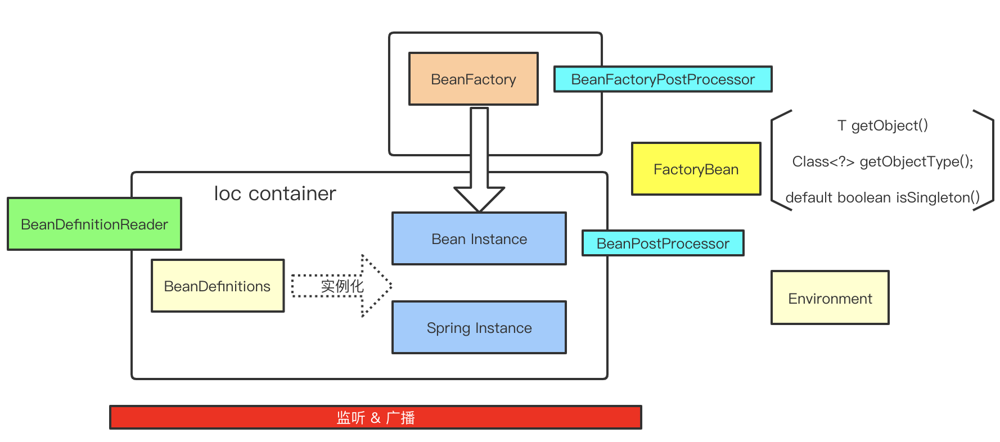

# IoC 容器 & Bean

## Spring处理流程简图



附：<a href="https://docs.spring.io/spring/docs/5.1.3.RELEASE/spring-framework-reference/core.html#spring-core" target="_blank">spring docs</a>

## IoC(Inversion of Control) Container

The org.springframework.context.ApplicationContext interface represents the Spring IoC container and is responsible for instantiating, configuring, and assembling the beans. The container gets its instructions on what objects to instantiate, configure, and assemble by reading configuration metadata. The configuration metadata is represented in XML, Java annotations, or Java code. It lets you express the objects that compose your application and the rich interdependencies between those objects.

ApplicationContext这个接口就代表IoC容器，它负责实例化、配置和组装bean。容器通过读取配置文件的元数据来获取要实例化、配置和组装哪些对象的指令。配置文件支持xml,Java注解和纯Java代码。它允许您表达组成应用程序的对象以及这些对象之间丰富的相互依赖关系。

### Ioc是什么？有什么用？为什么要Ioc?

Spring通过DI(dependency injection依赖注入)来实现Ioc，把对象的实例化过程的控制权给到了容器(即Spring容器)：以前创建一个对象都是程序员自己控制new出来的，现在是容器来决定产生时机和使用哪个构造方法(Spring源码中有通过BeanPostProcessor来推断构造方法的)

* 对象怎么创建？
    1. new
    2. 工厂
    3. 反射
* 那么是随便什么对象都是由容器创建的吗？显然不是，必须是定义成bean的？
    1. BeanDefinition

#### 为什么要有Ioc?

传统开发中，类与类之间是有依赖关系的，耦合性强；要**面向抽象**编程，借助"第三方"实现具有依赖关系的对象之间的解耦

#### Ioc容器的理解？

* 代码级别理解：容器可以理解为`ApplicationContext`对象，一切`ApplicationContext`的实现类都能成为容器
* 理论角度：容器是由很多Spring组件一起构成的，比如beanDefinitionMap, 单例池，beanFactory，各种PostProcessor

#### Ioc容器的实现机制？

关键技术点：简单工厂 + 反射

```java
import org.apache.hadoop.util.hash.Hash;

import java.util.HashMap;
import java.util.Map;

interface BaseOutService{
    void drive();
}

class CarServiceImpl implements BaseOutService{

    @Override
    public void drive() {
        System.out.println("car drive");
    }
}

class PlaneServiceImpl implements BaseOutService{

    @Override
    public void drive() {
        System.out.println("plane drive");
    }
}

class TrainServiceImpl implements BaseOutService{

    @Override
    public void drive() {
        System.out.println("train drive");
    }
}

class Factory {

    Map<String, String> beanMap;

    public Factory(){
        beanMap = new HashMap();
    }

    public void addBeanDefinition(String beanName, String className){
        beanMap.put(beanName, className);
    }

    public BaseOutService getBean(String beanName) {
        BaseOutService baseService = null;
        String className = beanMap.get(beanName);
        try {
            Class clz = Class.forName(className);
            Object o = clz.newInstance();
            baseService = (BaseOutService) o;
        } catch (Exception e) {

        }
        return baseService;
    }
}


public class Solution {


    public static void main(String[] args) throws InterruptedException {
        Factory factory = new Factory();
        factory.addBeanDefinition("car", "com.CarServiceImpl");
        factory.addBeanDefinition("plane", "com.PlaneServiceImpl");

        BaseOutService carService = factory.getBean("car");
        carService.drive();

        BaseOutService planeService = factory.getBean("plane");
        planeService.drive();

        factory.addBeanDefinition("train", "com.TrainServiceImpl");
        BaseOutService trainService = factory.getBean("train");
        trainService.drive();
    }

}
```

如上，使用简单工厂加上反射：要实现一个BaseOutService，则只需要添加一个BeanDefinition到工厂中，然后就能从工厂获取这个bean了

### IoC和DI的区别是什么？

IoC：控制反转，控制对象创建的产生方式：不是自己new，而是交给容器，让容器维护对象间的对象关系（一种设计思想，解决耦合问题）

DI: 依赖注入，实现了IoC；是IoC实现的重要一环

## Bean

In Spring, the objects that form the backbone of your application and that are managed
by the Spring IoC container are called beans. A bean is an object that is
instantiated, assembled, and otherwise managed by a Spring IoC container. Otherwise, a
bean is simply one of many objects in your application. Beans, and the dependencies
among them, are reflected in the configuration metadata used by a container.

在 Spring 中，构成应用程序主干并由Spring IoC容器管理的对象称为bean。Bean是一个由Spring IoC容器实例化、组装和管理的对象。

Within the container itself, these bean definitions are represented as BeanDefinition objects, which contain (among other information) the following metadata:

在容器内部，这些bean定义表示为`BeanDefinition`对象，包含着以下元数据：

1. A package-qualified class name: typically, the actual implementation class of the bean being defined.（全限定类名）

2. Bean behavioral configuration elements, which state how the bean should behave in the container (scope, lifecycle callbacks, and so forth).（Bean的行为配置元素，作用域，生命周期回调等）

3. References to other beans that are needed for the bean to do its work. These references are also called collaborators or dependencies.（对该bean执行其工作所需的其它bean的引用。）

4. Other configuration settings to set in the newly created object — for example, the size limit of the pool or the number of connections to use in a bean that manages a connection pool.（在创建bean对象时的其他配置，如连接池的最大数量）

### BeanDefinition 包括那些内容？

属性|说明
:---:|:---:
Class| 类
Name | 名称
Scope | bean作用域
Constructor arguments | 构造器参数
Properties | 成员属性
Autowiring mode | 自动装配模式(是否自动装配的候选，是否主要的候选)
Lazy initialization mode | 懒加载模式
initialization method | 初始化方法
Destruction methods | 销毁方法

#### BeanDefinition的理解

* 普通Java对象的产生

假设磁盘上有N个.java文件，首先我们把这些java文件编译成class文件，继而java虚拟机启动会把这些class文件load到内存，当遇到new关键字的时候会根据类的模板信息实例化这个对象，即在堆上分配内存生成对象

* spring的bean实例化过程


1. 当spring容器启动的时候会去调用`ConfigurationClassPostProcessor`这个bean工厂的后置处理器完成扫描(把类的信息读取到，但是读取到类的信息存放起来) ---> beanDefinition
2. 每扫描到一个符合规则的类，spring都会实例化一个`BeanDefinition`对象，然后把根据类的类名生成一个bean的名字（当然程序员可以自定义）
3. beanDefinitionMap 存放所有的bean
4. 可以有自定义的`BeanFactoryPostProcessor`（这里注意不同的 BeanFactoryPostProcessor 执行时机不同，`BeanDefinitionRegistryPostProcessor`先于`BeanFactoryPostProcessor`）
5. 根据 BeanDefinition 完成实例化（注意 Bean 实例化也仅仅只需要 BeanDefinition）

#### Spring框架支持以下5种bean的作用域

* singleton：bean在每个Spring ioc 容器中只有一个实例，即常说的`单例bean`
* prototype：一个bean的定义可以有多个实例。
* request：每次http请求都会创建一个bean，该作用域仅在基于web的Spring ApplicationContext情形下有效。
* session：在一个HTTP Session中，一个bean定义对应一个实例。该作用域仅在基于web的Spring ApplicationContext情形下有效。
* global-session：在一个全局的HTTP Session中，一个bean定义对应一个实例。该作用域仅在基于web的Spring ApplicationContext情形下有效。

缺省的Spring bean的作用域是singleton.

#### 自定义/定制化beanDefinition：AbstractBeanDefinition，GenericBeanDefinition等

* AbstractBeanDefinition(模板)
* RootBeanDefinition: 作为父beanDefinition,真实beanDefinition
* ChildBeanDefinition：能够继承父beanDefinition
* GenericBeanDefinition
* AnnotatedBeanDefinition
* ConfigurationClassBeanDefinition
* ScannedGenericBeanDefinition

## Dependency Injection

DI主要是两类变形：Constructor-based Dependency Injection & Setter-based Dependency Injection

* Constructor-based Dependency Injection

```java
<?xml version = "1.0" encoding = "UTF-8"?>
 
<beans xmlns = "http://www.springframework.org/schema/beans" xmlns:xsi = "http://www.w3.org/2001/XMLSchema-instance" xsi:schemaLocation = "http://www.springframework.org/schema/beans http://www.springframework.org/schema/beans/spring-beans-3.0.xsd">
 
   <!-- Definition for textEditor bean -->
   <bean id = "textEditor" class = "com.tutorialspoint.TextEditor">
      <constructor-arg ref = "spellChecker"/>
   </bean>
 
   <!-- Definition for spellChecker bean -->
   <bean id = "spellChecker" class = "com.tutorialspoint.SpellChecker"></bean>
 
</beans>
```

* Setter-based Dependency Injection

```java
<?xml version = "1.0" encoding = "UTF-8"?>
 
<beans xmlns = "http://www.springframework.org/schema/beans" xmlns:xsi = "http://www.w3.org/2001/XMLSchema-instance" xsi:schemaLocation = "http://www.springframework.org/schema/beans http://www.springframework.org/schema/beans/spring-beans-3.0.xsd">
 
   <!-- Definition for textEditor bean -->
   <bean id = "textEditor" class = "com.breakyizhan.TextEditor">
      <property name = "spellChecker" ref = "spellChecker"/>
   </bean>
 
   <!-- Definition for spellChecker bean -->
   <bean id = "spellChecker" class = "com.breakyizhan.SpellChecker"></bean>
 
</beans>
```

### 回答：有哪些不同类型的IOC（依赖注入）方式？两种注入方式

1. 构造器依赖注入：构造器依赖注入通过容器触发一个类的构造器来实现的，该类有一系列参数，每个参数代表一个对其他类的依赖。
2. Setter方法注入：Setter方法注入是容器通过调用无参构造器或无参static工厂 方法实例化bean之后，调用该bean的setter方法，即实现了基于setter的依赖注入。

```java
// 1. 构造方法参数
<constructor-arg ref = "spellChecker"/>

// 2. set属性
<property name = "spellChecker" ref = "spellChecker"/>
```
