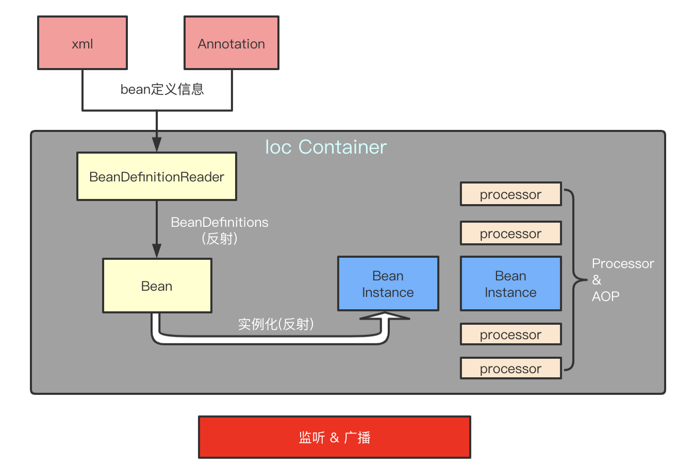

# Ioc 容器 & Bean

## Spring处理流程

附：<a href="https://docs.spring.io/spring/docs/5.1.3.RELEASE/spring-framework-reference/core.html#spring-core" target="_blank">spring docs</a>

## Ioc Container

The org.springframework.context.ApplicationContext interface represents the Spring IoC container and is responsible for instantiating, configuring, and assembling the beans. The container gets its instructions on what objects to instantiate, configure, and assemble by reading configuration metadata. The configuration metadata is represented in XML, Java annotations, or Java code. It lets you express the objects that compose your application and the rich interdependencies between those objects.

ApplicationContext这个接口就代表IoC容器，它负责实例化、配置和组装bean。容器通过读取配置文件的元数据来获取要实例化、配置和组装哪些对象的指令。配置文件支持xml,Java注解和纯Java代码。它允许您表达组成应用程序的对象以及这些对象之间丰富的相互依赖关系。

## Bean

In Spring, the objects that form the backbone of your application and that are managed
by the Spring IoC container are called beans. A bean is an object that is
instantiated, assembled, and otherwise managed by a Spring IoC container. Otherwise, a
bean is simply one of many objects in your application. Beans, and the dependencies
among them, are reflected in the configuration metadata used by a container.

在 Spring 中，构成应用程序主干并由Spring IoC容器管理的对象称为bean。Bean是一个由Spring IoC容器实例化、组装和管理的对象。

Within the container itself, these bean definitions are represented as BeanDefinition objects, which contain (among other information) the following metadata:

在容器内部，这些bean定义表示为BeanDefinition对象，包含着以下元数据：

1. A package-qualified class name: typically, the actual implementation class of the bean being defined.（全限定类名）

2. Bean behavioral configuration elements, which state how the bean should behave in the container (scope, lifecycle callbacks, and so forth).（Bean的行为配置元素，作用域，生命周期回调等）

3. References to other beans that are needed for the bean to do its work. These references are also called collaborators or dependencies.（对该bean执行其工作所需的其它bean的引用。）

4. Other configuration settings to set in the newly created object — for example, the size limit of the pool or the number of connections to use in a bean that manages a connection pool.（在创建bean对象时的其他配置，如连接池的最大数量）
