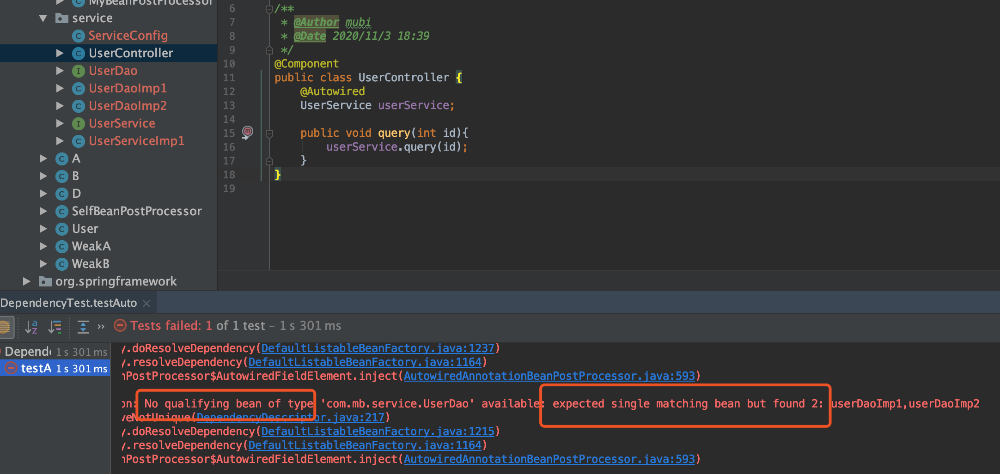
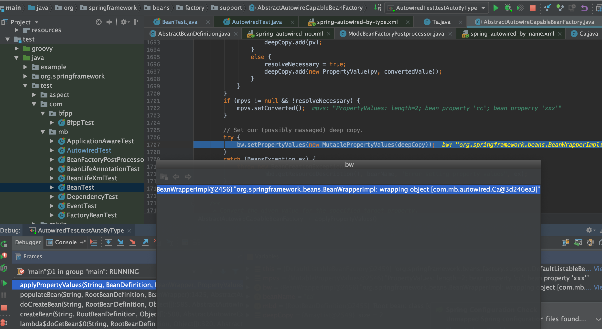
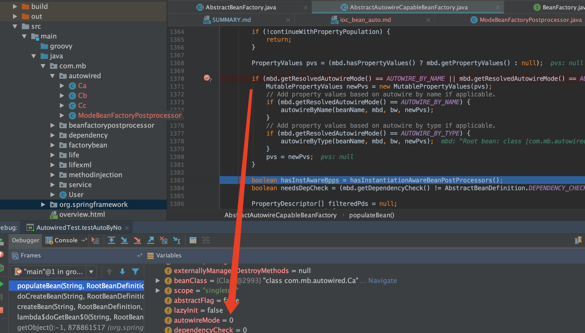
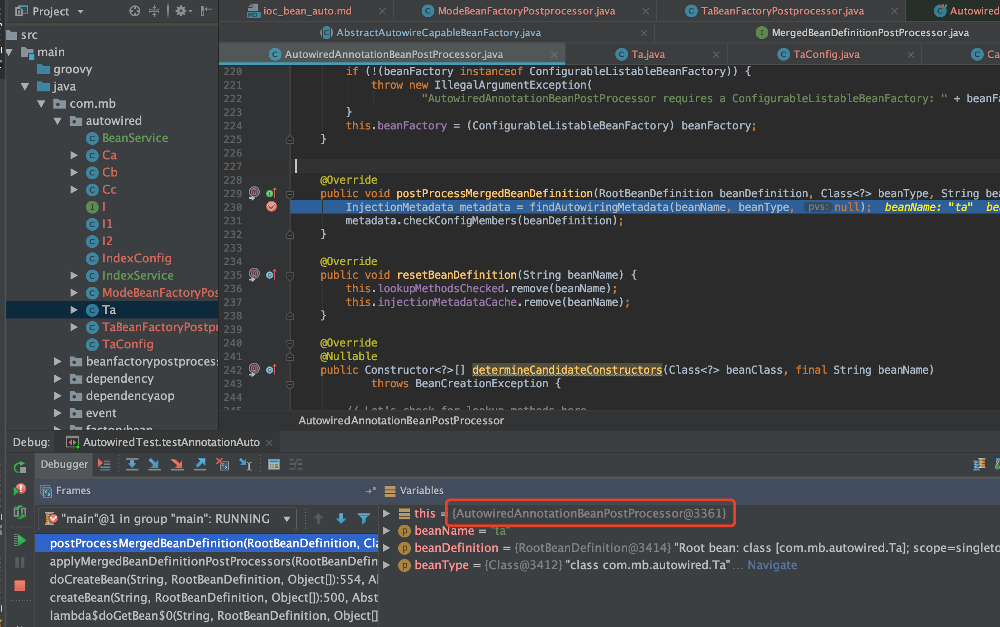
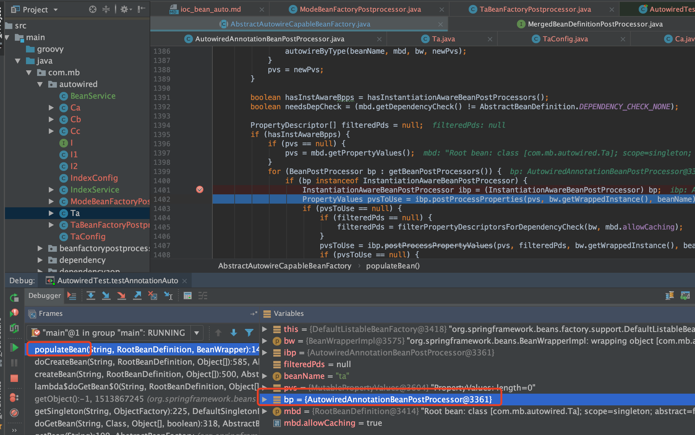
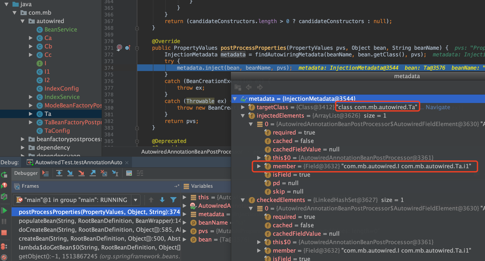
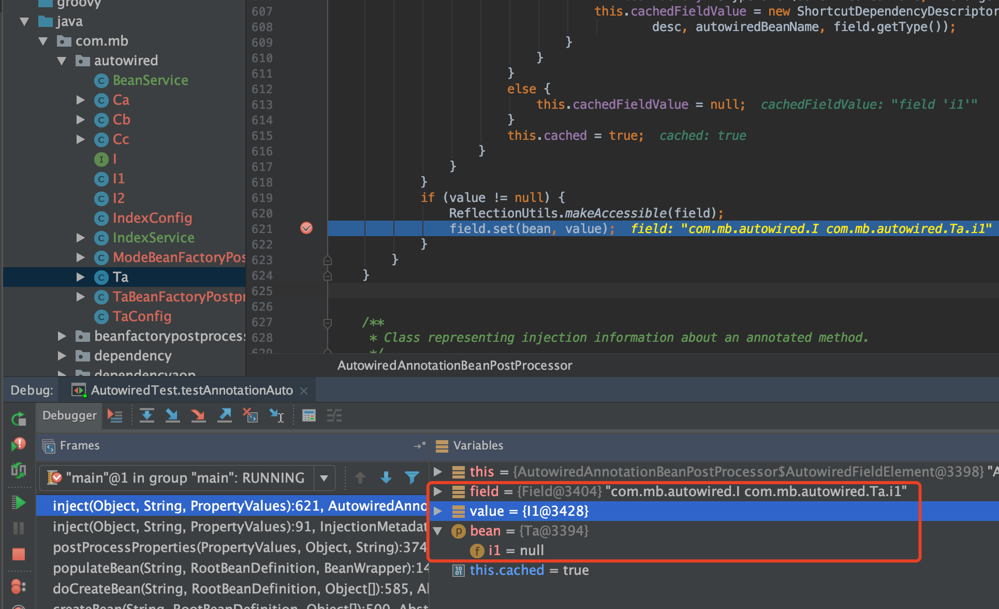

# 自动装配 & @Autowired

<a href="https://docs.spring.io/spring-framework/docs/5.1.3.RELEASE/spring-framework-reference/core.html#beans-factory-autowire">Autowiring Collaborators</a>

IOC注入需要提供依赖关系：一是类中定义，二是spring的配置中定义好描述关系，而自动装配把第二种方式取消了，这样只需要在类中提供依赖关系，使用自动转配就能交给容易完成依赖关系

推荐博客文章：<a herf='https://blog.csdn.net/java_lyvee/article/details/102499560'>子路：spring自动注入</a>

## 手动装配例子

```java
public class A {
	B b;
	public void setB(B b) {
		this.b = b;
	}
}

public class B {

}

// 然后xml手动指定依赖关系，然后set方法就能设置好依赖bean（即setter注入方式采用手动方式完成）

<?xml version="1.0" encoding="UTF-8"?>
<beans xmlns="http://www.springframework.org/schema/beans"
       xmlns:xsi="http://www.w3.org/2001/XMLSchema-instance"
       xsi:schemaLocation="http://www.springframework.org/schema/beans
       http://www.springframework.org/schema/beans/spring-beans.xsd">

		<bean id="a" class="com.test.A" >
			<!-- 由程序员手动指定的依赖关系 称为手动装配-->
			<property name="b">
				<ref bean="b" />
			</property>
		</bean>

		<bean id="b"  class="com.test.B">
		</bean>
</beans>
```

## 自动装配优点

1. Autowiring can significantly reduce the need to specify properties or constructor arguments. (Other mechanisms such as a bean template discussed elsewhere in this chapter are also valuable in this regard.)
2. Autowiring can update a configuration as your objects evolve. For example, if you need to add a dependency to a class, that dependency can be satisfied automatically without you needing to modify the configuration. Thus autowiring can be especially useful during development, without negating the option of switching to explicit wiring when the code base becomes more stable.

1. 自动装配可以减少属性依赖设置和构造参数依赖设置
2. 自动装配也可以在解析对象时更新配置

## 自动装配缺点

Consider the limitations and disadvantages of autowiring:

1. Explicit dependencies in property and constructor-arg settings always override autowiring. You cannot autowire simple properties such as primitives, Strings, and Classes (and arrays of such simple properties). This limitation is by-design.
2. Autowiring is less exact than explicit wiring. Although, as noted in the earlier table, Spring is careful to avoid guessing in case of ambiguity that might have unexpected results. The relationships between your Spring-managed objects are no longer documented explicitly.
3. Wiring information may not be available to tools that may generate documentation from a Spring container.
4. Multiple bean definitions within the container may match the type specified by the setter method or constructor argument to be autowired. For arrays, collections, or Map instances, this is not necessarily a problem. However, for dependencies that expect a single value, this ambiguity is not arbitrarily resolved. If no unique bean definition is available, an exception is thrown.

1. 在`property`和`constructor-arg`设置中的依赖总是重载自动装配，我们无法对原始类型（如int，long，boolean等就是首字母小写的那些类型），还有String，Classes做自动装配。这是受限于设计。
2. 自动装配跟直接装配（explicit wiring）相比较，在准确性方便还是差那么点，虽然没有明确地说明，但是Spring还是尽量避免这种模棱两可的情况，导致出现没预料到的结果。
3. Spring容器生成文档的工具可能会不能使用装配的信息。
4. 容器中多个bean的定义可能要对setter和构造器参数做类型匹配才能做依赖注入，虽然对于array，collection和map来说不是啥问题，但是对于只有单一值的依赖来讲，这就有点讲不清楚了，所以如果没有唯一的bean定义，那只能抛出异常。

## 自动装配方式(默认：非自动装配)

1. no：默认方式（即默认是手动装配方式，需要通过ref设定bean的依赖关系，不是自动装配的）
2. byName：根据bean的名字进行装配，当一个bean的名称和其它bean的属性一致，则自动装配
3. byType：根据bean的类型进行装配，当一个bean的属性类型与其它bean的属性的数据类型一致，则自动装配
4. constructor：根据构造器进行装配，与 byType 类似，如果bean的构造器有与其它bean类型相同的属性，则进行自动装配

源码：

```java
AUTOWIRE_NO = 0;
AUTOWIRE_BY_NAME = 1;
AUTOWIRE_BY_TYPE = 2;
AUTOWIRE_CONSTRUCTOR = 3;
/**
 * Constant that indicates determining an appropriate autowire strategy
 * through introspection of the bean class.
 * @see #createBean
 * @see #autowire
 * @deprecated as of Spring 3.0: If you are using mixed autowiring strategies,
 * prefer annotation-based autowiring for clearer demarcation of autowiring needs.
 */
@Deprecated
int AUTOWIRE_AUTODETECT = 4;
```

### 非自动装配例子

```java
public class Ca {

	/**
	 * Autowired 是手动注入
	 */
	@Autowired
	Cb cb;

	/**
	 * 代码能运行起来，A能注入B
	 * 但是在xml配置文件中并没有去手动维护、描述他们之间的依赖关系，
	 * 而是在xml的根标签上面写了一行default-autowire="byType"
	 * 且set方法名子也无所谓，只要里面的type是个bean: cb
	 */
	public void setXxx(Cb cb) {
		System.out.println("这个set方法如果配置了自动装配且是byType方式是可以的,byName不行:" + cb);
	}

	public void setCc(Cc cc) {
		System.out.println("cc byName, byType都可以:" + cc);
	}

	public void cbOut(){
		System.out.println("Cb:" + cb);
	}
}
```

如上，非自动装配的情况下，`setXxx(Cb cb)`方法不会被执行，且`setCc(Cc cc)`方法也不会执行

### byName自动注入,但是set方法name不匹配,也无法注入

```java
public class Ca {

	/**
	 * Autowired 是手动注入
	 */
	@Autowired
	Cb cb;

	/**
	 * 代码能运行起来，A能注入B
	 * 但是在xml配置文件中并没有去手动维护、描述他们之间的依赖关系，
	 * 而是在xml的根标签上面写了一行default-autowire="byType"
	 * 且set方法名子也无所谓，只要里面的type是个bean: cb
	 */
	public void setXxx(Cb cb) {
		System.out.println("这个set方法如果配置了自动装配且是byType方式是可以的,byName不行:" + cb);
	}

	public void setCc(Cc cc) {
		System.out.println("cc byName, byType都可以:" + cc);
	}

	public void cbOut(){
		System.out.println("Cb:" + cb);
	}
}
```

如上是byName的自动装配方式，但是`setXxx(Cb cb)`方法不是`setCb(Cb cb)`方法，所以该方法不会被执行到

## 自动装配常见的` No qualifying bean of type`错误



## 自定义 BeanNameGenerator

eg如下，自定义beanName

```java
@ComponentScan(basePackages = "com.mb.service", nameGenerator = MyBeanNameGenerator.class)
```

补充bean名字生成的流程：

bean将自己的全路径类名作为自己的bean名字，如果没有类名，那就看是否有父bean，如果有，假设父bean名字为hehe，那么就用hehe$child作为此子bean的名字，如果没有父bean，那就看bean的工厂bean的名字，如果有，假设工厂bean名字为haha，那么bean的名字就是haha$created，如果没有工厂，那就报错“既没有自己的类名、也没有父bean类名、也没有工厂bean类名”。不管最终用的是哪一个的名字，对这个名字进行唯一性检查，如果名字重复了（已经有这个名字存在了），那就在名字后面+#+数字，这样，每个bean的名字就是唯一的了。

## 自动装配在populateBean阶段完成注入

* org.springframework.beans.factory.support.AbstractAutowireCapableBeanFactory#populateBean 如下代码

在两种自动注入方式下会去解析依赖的属性

```java
PropertyValues pvs = (mbd.hasPropertyValues() ? mbd.getPropertyValues() : null);

if (mbd.getResolvedAutowireMode() == AUTOWIRE_BY_NAME || mbd.getResolvedAutowireMode() == AUTOWIRE_BY_TYPE) {
    MutablePropertyValues newPvs = new MutablePropertyValues(pvs);
    // Add property values based on autowire by name if applicable.
    if (mbd.getResolvedAutowireMode() == AUTOWIRE_BY_NAME) {
        autowireByName(beanName, mbd, bw, newPvs);
    }
    // Add property values based on autowire by type if applicable.
    if (mbd.getResolvedAutowireMode() == AUTOWIRE_BY_TYPE) {
        autowireByType(beanName, mbd, bw, newPvs);
    }
    pvs = newPvs;
}
```

找到了属性接着执行`org.springframework.beans.factory.support.AbstractAutowireCapableBeanFactory#applyPropertyValues`,里面有循环依赖的解决,最后设置属性即可



## @Autowired是通过`byType`来完成注入的？

<font color='red'>错误</font>，解释如下

* byType仅仅是一种自动注入模型而已(no、byType、byName、constructor)

* @Autowired是一个注解，这个注解会被spring的后置处理器解析，和处理byType不是同一回事。

理论依据

在不配置BeanFactoryPostProcessor和修改beanDefinition的情况下注解的类是不支持自动装配的；且即使是自动装配，有`@Autowired`注解，属性也不一定注入进去



结论1：在一个注解类里面提供了一个构造方法之所以能达到和自动注入的效果一样并不是因为这种方式就是自动装配，而是因为spring源码当中做了判断；使这种情况下调用的代码和自动装配调用的逻辑一样

结论2：`@Autowried`是个手动装配,当然也是可以设置成自动装配的

### AutowiredAnnotationBeanPostProcessor解析@AutoWired和@Value的属性或方法，把其封装成`InjectionMetadata`类

在`org.springframework.beans.factory.support.AbstractAutowireCapableBeanFactory#doCreateBean`方法中的`populateBean`方法之前会应用所有的bpp去修改bean definition



```java
public void postProcessMergedBeanDefinition(RootBeanDefinition beanDefinition, Class<?> beanType, String beanName) {
	InjectionMetadata metadata = findAutowiringMetadata(beanName, beanType, null);
	metadata.checkConfigMembers(beanDefinition);
}

private InjectionMetadata findAutowiringMetadata(String beanName, Class<?> clazz, @Nullable PropertyValues pvs) {
    // 返回类名作为缓存键，以便与自定义调用方向后兼容。
    String cacheKey = (StringUtils.hasLength(beanName) ? beanName : clazz.getName());
    // 首先对并发映射进行快速检查，只需最少的锁定。
    InjectionMetadata metadata = this.injectionMetadataCache.get(cacheKey);
    if (InjectionMetadata.needsRefresh(metadata, clazz)) {
        synchronized (this.injectionMetadataCache) {
            metadata = this.injectionMetadataCache.get(cacheKey);
            if (InjectionMetadata.needsRefresh(metadata, clazz)) {
                if (metadata != null) {
                    metadata.clear(pvs);
                }
                metadata = buildAutowiringMetadata(clazz);
                this.injectionMetadataCache.put(cacheKey, metadata);
            }
        }
    }
    return metadata;
}
private InjectionMetadata buildAutowiringMetadata(final Class<?> clazz) {
    List<InjectionMetadata.InjectedElement> elements = new ArrayList<>();
    Class<?> targetClass = clazz;

    do {
        final List<InjectionMetadata.InjectedElement> currElements = new ArrayList<>();
        //解析属性
        ReflectionUtils.doWithLocalFields(targetClass, field -> {
            //解析当前对象属性，判断其是否有@Autowired和@value注解，如果有返回其注解对象
            AnnotationAttributes ann = findAutowiredAnnotation(field);
            if (ann != null) {
                 //如果属性是静态属性，就不处理
                if (Modifier.isStatic(field.getModifiers())) {
                    if (logger.isInfoEnabled()) {
                        logger.info("Autowired annotation is not supported on static fields: " + field);
                    }
                    return;
                }
                boolean required = determineRequiredStatus(ann);
                //把当前属性封装成AutowiredFieldElement对象储存到injectionMetadataCache中
                currElements.add(new AutowiredFieldElement(field, required));
            }
        });
        //解析方法
        ReflectionUtils.doWithLocalMethods(targetClass, method -> {
            Method bridgedMethod = BridgeMethodResolver.findBridgedMethod(method);
            if (!BridgeMethodResolver.isVisibilityBridgeMethodPair(method, bridgedMethod)) {
                return;
            }
             //解析当前对象属性，判断其是否有@Autowired和@value注解，如果有返回其注解对象
            AnnotationAttributes ann = findAutowiredAnnotation(bridgedMethod);
            if (ann != null && method.equals(ClassUtils.getMostSpecificMethod(method, clazz))) {
                //如果方法是静态方法，就不处理
                if (Modifier.isStatic(method.getModifiers())) {
                    if (logger.isInfoEnabled()) {
                        logger.info("Autowired annotation is not supported on static methods: " + method);
                    }
                    return;
                }
                //如果方法是无参的，就不处理
                if (method.getParameterCount() == 0) {
                    if (logger.isInfoEnabled()) {
                        logger.info("Autowired annotation should only be used on methods with parameters: " +
                                method);
                    }
                }
                boolean required = determineRequiredStatus(ann);
                PropertyDescriptor pd = BeanUtils.findPropertyForMethod(bridgedMethod, clazz);
                //把当前方法封装成AutowiredMethodElement对象储存到injectionMetadataCache中
                currElements.add(new AutowiredMethodElement(method, required, pd));
            }
        });

        elements.addAll(0, currElements);
        //开始解析其父类
        targetClass = targetClass.getSuperclass();
    }
    while (targetClass != null && targetClass != Object.class);
    return new InjectionMetadata(clazz, elements);
}
```

### `populateBean`阶段赋值标注@AutoWired和@Value的属性或方法

populateBean阶段会应用所有的`InstantiationAwareBeanPostProcessor`,而`AutowiredAnnotationBeanPostProcessor`继承了`InstantiationAwareBeanPostProcessorAdapter`，见`org.springframework.beans.factory.support.AbstractAutowireCapableBeanFactory#populateBean`方法





```java
public void inject(Object target, @Nullable String beanName, @Nullable PropertyValues pvs) throws Throwable {
    Collection<InjectedElement> checkedElements = this.checkedElements;
    Collection<InjectedElement> elementsToIterate =
            (checkedElements != null ? checkedElements : this.injectedElements);
    if (!elementsToIterate.isEmpty()) {
        // 遍历 InjectedElement 然后inject
        for (InjectedElement element : elementsToIterate) {
            if (logger.isTraceEnabled()) {
                logger.trace("Processing injected element of bean '" + beanName + "': " + element);
            }
            element.inject(target, beanName, pvs);
        }
    }
}
```

### AutowiredFieldElement的inject(利用反射`filed.set`)

```java
private class AutowiredFieldElement extends InjectionMetadata.InjectedElement {

    private final boolean required;

    private volatile boolean cached = false;

    @Nullable
    private volatile Object cachedFieldValue;

    public AutowiredFieldElement(Field field, boolean required) {
        super(field, null);
        this.required = required;
    }

    @Override
    protected void inject(Object bean, @Nullable String beanName, @Nullable PropertyValues pvs) throws Throwable{
        // 显然此处父类的member就指的是filed
        Field field = (Field) this.member;
        Object value;
        // 走缓存，关于cachedFieldValue的值
        if (this.cached) {
            value = resolvedCachedArgument(beanName, this.cachedFieldValue);
        }
        else {
            // 每个Field都包装成一个DependencyDescriptor
            // 如果是Method包装成DependencyDescriptor,毕竟一个方法可以有多个入参
            // 此处包装成它后，显然和元数据都无关了，只和Field有关了  完全隔离
            DependencyDescriptor desc = new DependencyDescriptor(field, this.required);
            desc.setContainingClass(bean.getClass());
            Set<String> autowiredBeanNames = new LinkedHashSet<>(1);
            Assert.state(beanFactory != null, "No BeanFactory available");
            // 转换器使用的bean工厂的转换器~~~
            TypeConverter typeConverter = beanFactory.getTypeConverter();
            try {
                // 获取依赖的value值的工作  最终还是委托给beanFactory.resolveDependency()去完成的~~~~
                //到容器中查询要装配的值，这是自动装配的核心方法。后面出一片文章单独讲解
                value = beanFactory.resolveDependency(desc, beanName, autowiredBeanNames, typeConverter);
            }
            catch (BeansException ex) {
                throw new UnsatisfiedDependencyException(null, beanName, new InjectionPoint(field), ex);
            }
            // 下面代码是把缓存值缓存起来  让同一个Field注入多次能提高效率
            synchronized (this) {
                if (!this.cached) {
                    // 可以看到value！=null并且required=true才会进行缓存的处理
                    if (value != null || this.required) {
                        this.cachedFieldValue = desc;
                        // 简单的说就是注册到bean工厂去，比如此处b是依赖a的  所以就注册这个依赖关系进去了
                        // 参考this.beanFactory.registerDependentBean(autowiredBeanName, beanName);
                        registerDependentBeans(beanName, autowiredBeanNames);
                        // autowiredBeanNames里可能会有别名的名称~~~所以size可能大于1
                        if (autowiredBeanNames.size() == 1) {
                            // beanFactory.isTypeMatch挺重要的~~~~因为@Autowired是按照类型注入的
                            String autowiredBeanName = autowiredBeanNames.iterator().next();
                            //如果容器中包含这个bean的名字，且类型一样
                            if (beanFactory.containsBean(autowiredBeanName) &&beanFactory.isTypeMatch(autowiredBeanName, field.getType())) {
                                this.cachedFieldValue = new ShortcutDependencyDescriptor(
                                        desc, autowiredBeanName, field.getType());
                            }
                        }
                    }
                    else {
                        this.cachedFieldValue = null;
                    }
                    this.cached = true;
                }
            }
        }
        // 不为null，就完成最终的set值  利用反射给filed属性赋值~~~~
        if (value != null) {
            ReflectionUtils.makeAccessible(field);
            field.set(bean, value);
        }
    }
}
```




## 非自动配置下通过构造函数进行注入

```java
public class IndexService {

	/**
	 * 这里能注入进来,why?
	 * @param beanService
	 */
	public IndexService(BeanService beanService) {
		System.out.println("beanService:" + beanService);
	}

}
```

关键代码如下：能找到一个构造函数，或者 自动装配模型是`AUTOWIRE_CONSTRUCTOR`就可以执行`autowireConstructor`完成了

```java
Constructor<?>[] ctors = determineConstructorsFromBeanPostProcessors(beanClass, beanName);
    if (ctors != null || mbd.getResolvedAutowireMode() == AUTOWIRE_CONSTRUCTOR ||
            mbd.hasConstructorArgumentValues() || !ObjectUtils.isEmpty(args)) {
    return autowireConstructor(beanName, mbd, ctors, args);
}
```

结论：在一个注解类里面提供了一个构造方法之所以能达到和自动注入的效果一样并不是因为这种方式就是自动装配，而是因为spring源码当中做了特殊判断，使这种情况下调用的代码和自动装配调用的逻辑一下。
