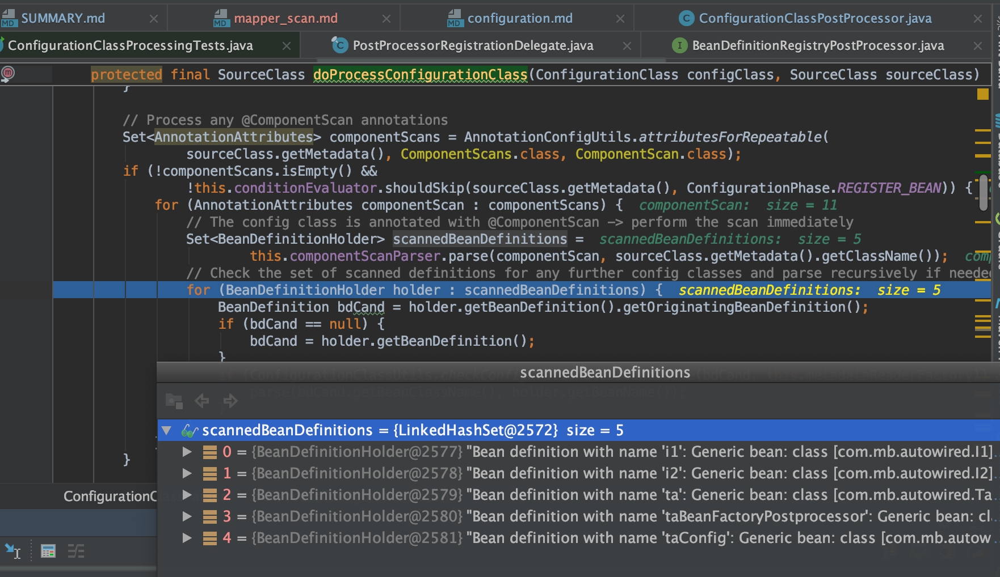
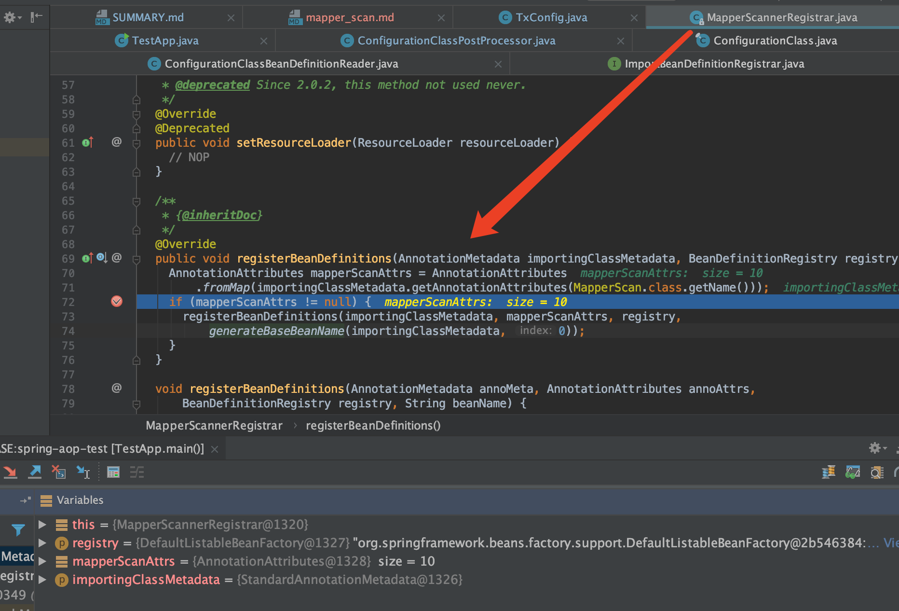
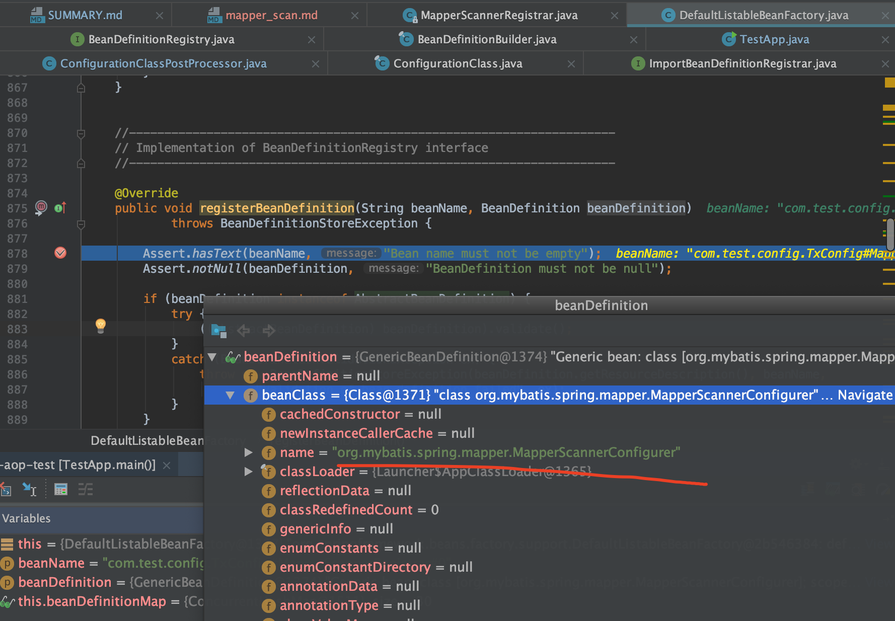

# @MapperScan 原理

## 回顾 ConfigurationClassPostProcessor

```java
org.springframework.context.support.AbstractApplicationContext#refresh
    invokeBeanFactoryPostProcessors(beanFactory);
        org.springframework.context.support.PostProcessorRegistrationDelegate#invokeBeanDefinitionRegistryPostProcessors
            // ConfigurationClassPostProcessor implements BeanDefinitionRegistryPostProcessor
            org.springframework.context.annotation.ConfigurationClassPostProcessor#postProcessBeanDefinitionRegistry
```

ConfigurationClassPostProcessor具体执行

1. 先判断了`@Configuration`全注解，然后得到全注解bean,作为candidate
2. 然后会new一个`ConfigurationClassParser`
3. 首先执行了`parser.parse(candidates);` 完成Spring自己的bean扫描，并做了其它处理

`org.springframework.context.annotation.ConfigurationClassParser#doProcessConfigurationClass`可以看到扫描，且扫描出来都是都是`ScannedGenericBeanDefinition`



在`parser.parse(candidates);`过程中可以看到

```java
// Process any @Import annotations
// Process any @ImportResource annotations
// Process individual @Bean methods
// Process default methods on interfaces
// Process superclass, if any
```

其中`@Import`种类很多，实现了某个特定接口的需要特殊处理

```java
1. ImportSelector

2. ImportBeanDefinitionRegistrar

3. 其它@Import
// Candidate class not an ImportSelector or ImportBeanDefinitionRegistrar ->
// process it as an @Configuration class
```

对于`ImportBeanDefinitionRegistrar`是put到了一个如下的map中

```java
private final Map<ImportBeanDefinitionRegistrar, AnnotationMetadata> importBeanDefinitionRegistrars =
		new LinkedHashMap<>();
```

是在`this.reader.loadBeanDefinitions(configClasses);`这句去执行`ImportBeanDefinitionRegistrar`的

```java
private void loadBeanDefinitionsFromRegistrars(Map<ImportBeanDefinitionRegistrar, AnnotationMetadata> registrars) {
	registrars.forEach((registrar, metadata) ->
			registrar.registerBeanDefinitions(metadata, this.registry));
}
```

其中ImportBeanDefinitionRegistrar是个接口，能够将自己定义BeanDefinition注册到Spring容器中

```java
public interface ImportBeanDefinitionRegistrar {

	/**
	 * Register bean definitions as necessary based on the given annotation metadata of
	 * the importing {@code @Configuration} class.
	 * <p>Note that {@link BeanDefinitionRegistryPostProcessor} types may <em>not</em> be
	 * registered here, due to lifecycle constraints related to {@code @Configuration}
	 * class processing.
	 * @param importingClassMetadata annotation metadata of the importing class
	 * @param registry current bean definition registry
	 */
	public void registerBeanDefinitions(
			AnnotationMetadata importingClassMetadata, BeanDefinitionRegistry registry);

}
```

## @MapperScan

spring-mybatis的 @MapperScan 注解定义如下

```java
@Retention(RetentionPolicy.RUNTIME)
@Target(ElementType.TYPE)
@Documented
@Import(MapperScannerRegistrar.class)
@Repeatable(MapperScans.class)
public @interface MapperScan {
```

可以看到import了一个`MapperScannerRegistrar`，其定义如下(实现了`ImportBeanDefinitionRegistrar`)

```java
public class MapperScannerRegistrar implements ImportBeanDefinitionRegistrar, ResourceLoaderAware {
```

根据前文介绍，会走到`MapperScannerRegistrar`的`registerBeanDefinitions`方法，如下（不过不同版本的`MapperScannerRegistrar`可能里面的实现是不一样的）



可以看到注册了一个bean:`org.mybatis.spring.mapper.MapperScannerConfigurer`



### `MapperScannerConfigurer`类定义可以看到其实现了`BeanDefinitionRegistryPostProcessor`

```java
public class MapperScannerConfigurer
    implements BeanDefinitionRegistryPostProcessor, InitializingBean, ApplicationContextAware, BeanNameAware {
```

```java
/**
 * Extension to the standard {@link BeanFactoryPostProcessor} SPI, allowing for
 * the registration of further bean definitions <i>before</i> regular
 * BeanFactoryPostProcessor detection kicks in. In particular,
 * BeanDefinitionRegistryPostProcessor may register further bean definitions
 * which in turn define BeanFactoryPostProcessor instances.
 *
 * @author Juergen Hoeller
 * @since 3.0.1
 * @see org.springframework.context.annotation.ConfigurationClassPostProcessor
 */
public interface BeanDefinitionRegistryPostProcessor extends BeanFactoryPostProcessor {

	/**
	 * Modify the application context's internal bean definition registry after its
	 * standard initialization. All regular bean definitions will have been loaded,
	 * but no beans will have been instantiated yet. This allows for adding further
	 * bean definitions before the next post-processing phase kicks in.
	 * @param registry the bean definition registry used by the application context
	 * @throws org.springframework.beans.BeansException in case of errors
	 */
	void postProcessBeanDefinitionRegistry(BeanDefinitionRegistry registry) throws BeansException;

}
```

我们知道Spring的自己的`ConfigurationClassPostProcessor`是实现了`BeanDefinitionRegistryPostProcessor`的,它完成了对Spring bean的扫描，那么容易猜想到`MapperScannerConfigurer`能实现对mybatis的@MapperScan的bean扫描出来，并加到Spring中

查看`org.mybatis.spring.mapper.MapperScannerConfigurer.postProcessBeanDefinitionRegistry`，可以看到mybatis自己定义了扫描器去扫描加载BeanDefinition

```java
 @Override
  public void postProcessBeanDefinitionRegistry(BeanDefinitionRegistry registry) {
    if (this.processPropertyPlaceHolders) {
      processPropertyPlaceHolders();
    }

    ClassPathMapperScanner scanner = new ClassPathMapperScanner(registry);
    scanner.setAddToConfig(this.addToConfig);
    scanner.setAnnotationClass(this.annotationClass);
    scanner.setMarkerInterface(this.markerInterface);
    scanner.setSqlSessionFactory(this.sqlSessionFactory);
    scanner.setSqlSessionTemplate(this.sqlSessionTemplate);
    scanner.setSqlSessionFactoryBeanName(this.sqlSessionFactoryBeanName);
    scanner.setSqlSessionTemplateBeanName(this.sqlSessionTemplateBeanName);
    scanner.setResourceLoader(this.applicationContext);
    scanner.setBeanNameGenerator(this.nameGenerator);
    scanner.setMapperFactoryBeanClass(this.mapperFactoryBeanClass);
    if (StringUtils.hasText(lazyInitialization)) {
      scanner.setLazyInitialization(Boolean.valueOf(lazyInitialization));
    }
    scanner.registerFilters();
    scanner.scan(
        StringUtils.tokenizeToStringArray(this.basePackage, ConfigurableApplicationContext.CONFIG_LOCATION_DELIMITERS));
  }
```
