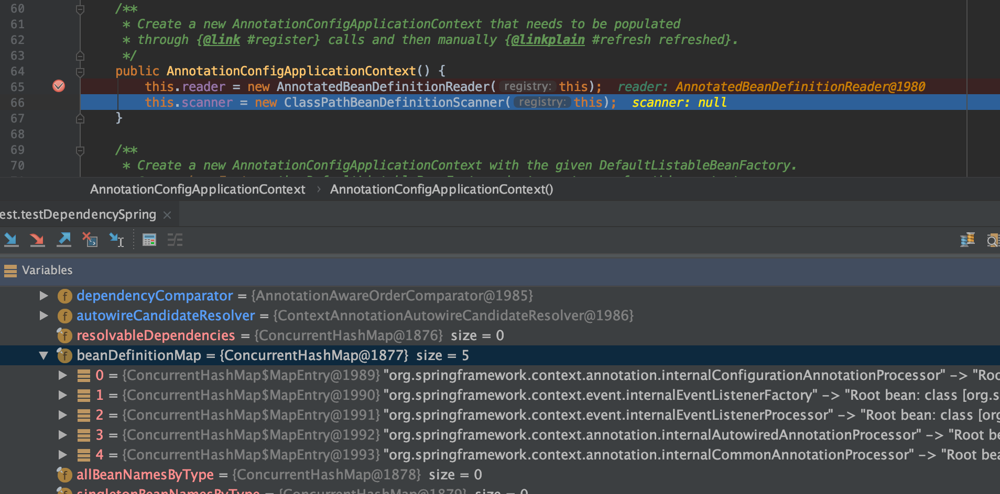
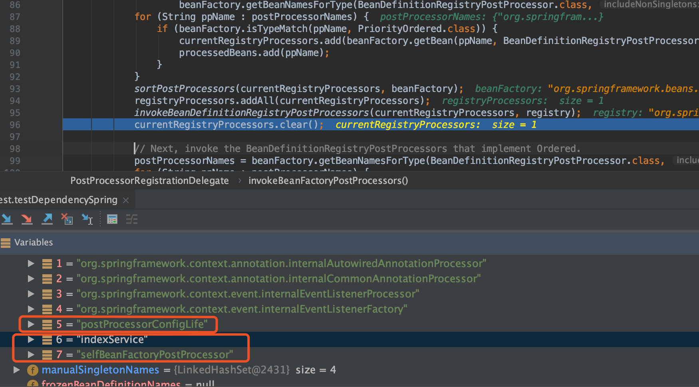
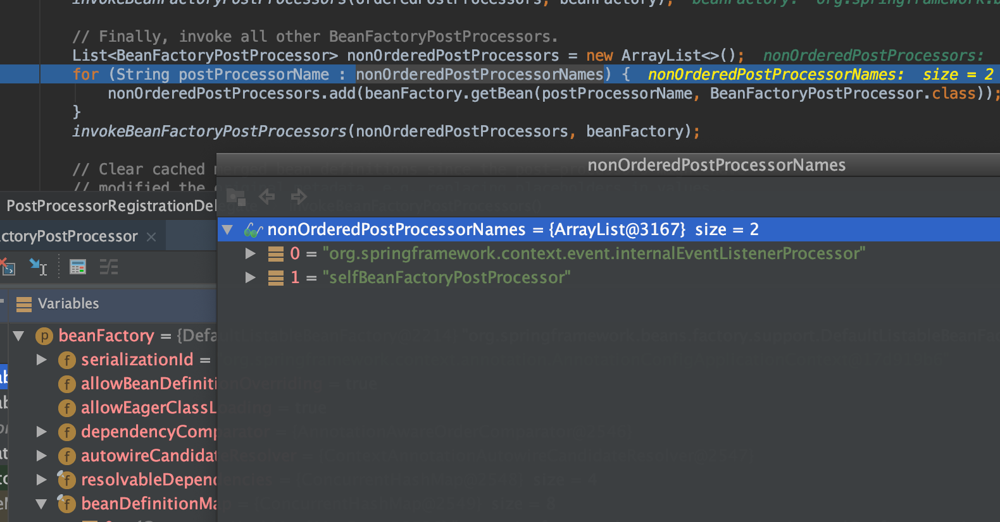
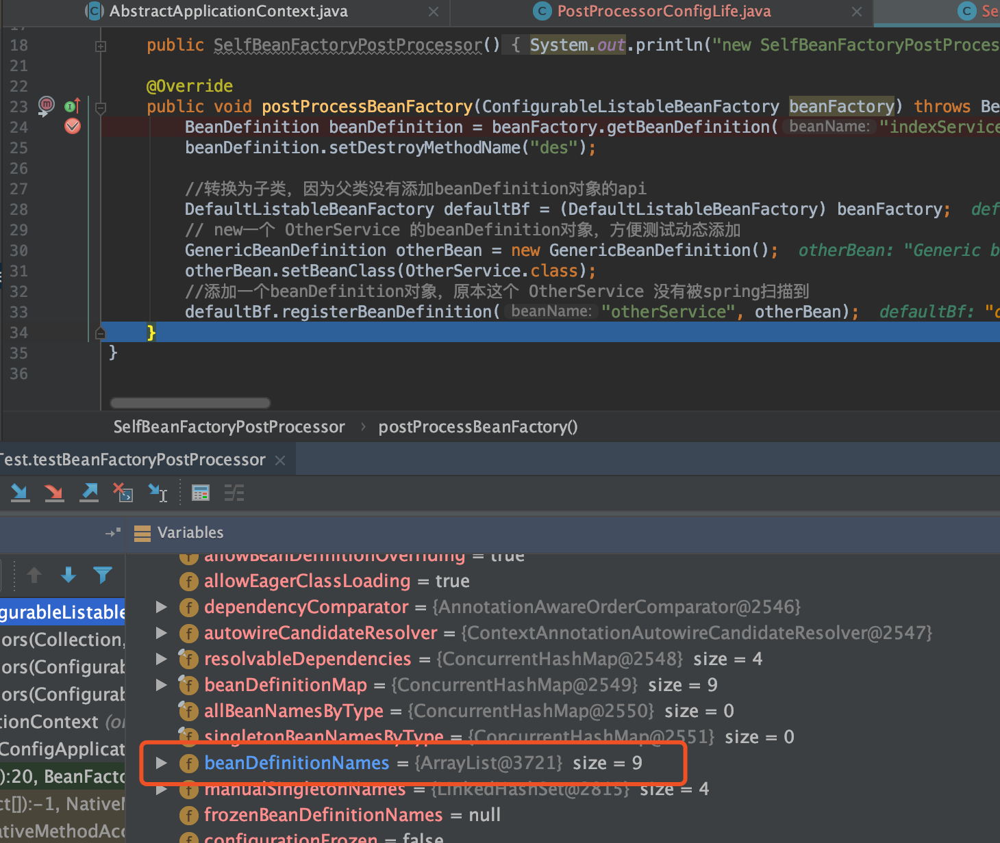
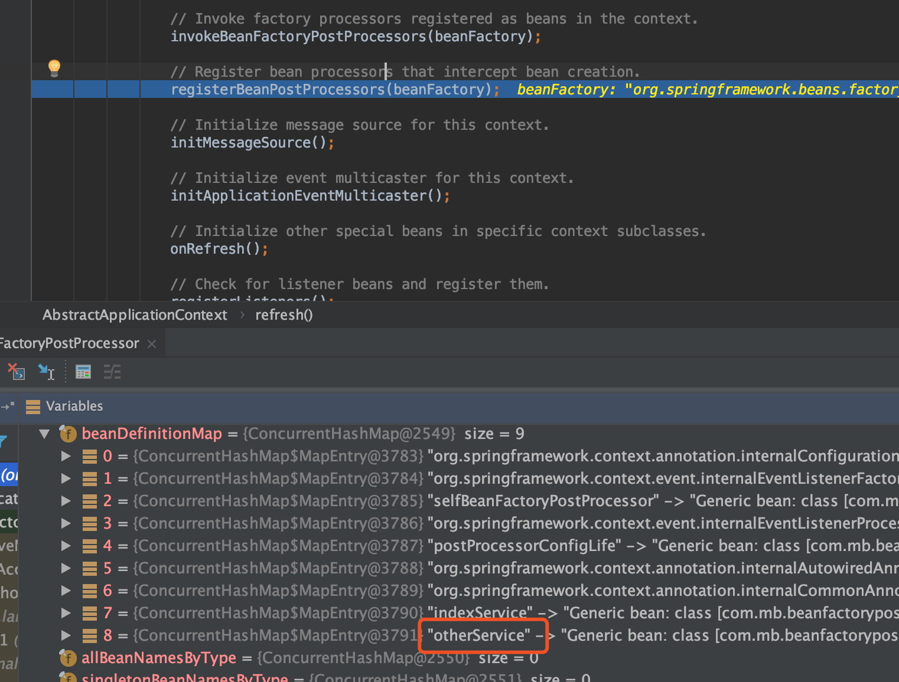

# BeanFactoryPostProcessor

bean工厂后置处理器：干预`beanFactory`的工作流程（默认就是干预`DefaultListableBeanFactory`）

`BeanFactoryPostProcessor`是个接口，可以被继承，从而实现更多的功能，比如`BeanDefinitionRegistryPostProcessor`

```java
public interface BeanDefinitionRegistryPostProcessor extends BeanFactoryPostProcessor {

	/**
	 * Modify the application context's internal bean definition registry after its
	 * standard initialization. All regular bean definitions will have been loaded,
	 * but no beans will have been instantiated yet. This allows for adding further
	 * bean definitions before the next post-processing phase kicks in.
	 * @param registry the bean definition registry used by the application context
	 * @throws org.springframework.beans.BeansException in case of errors
	 */
	void postProcessBeanDefinitionRegistry(BeanDefinitionRegistry registry) throws BeansException;
}
```

其中一个实现类`ConfigurationClassPostProcessor`

```java
/**
 * {@link BeanFactoryPostProcessor} used for bootstrapping processing of
 * {@link Configuration @Configuration} classes.
 *
 * <p>Registered by default when using {@code <context:annotation-config/>} or
 * {@code <context:component-scan/>}. Otherwise, may be declared manually as
 * with any other BeanFactoryPostProcessor.
 *
 * <p>This post processor is priority-ordered as it is important that any
 * {@link Bean} methods declared in {@code @Configuration} classes have
 * their corresponding bean definitions registered before any other
 * {@link BeanFactoryPostProcessor} executes.
 *
 * @author Chris Beams
 * @author Juergen Hoeller
 * @author Phillip Webb
 * @since 3.0
 */
public class ConfigurationClassPostProcessor implements BeanDefinitionRegistryPostProcessor,
		PriorityOrdered, ResourceLoaderAware, BeanClassLoaderAware, EnvironmentAware {
```

beanFactoryPostProcessor的作用
1. 修改BeanDefinition
2. 注册BeanDefinition
3. cglib代理
4. 其它更多的扩展功能

## Spring 内置的 bean



* org.springframework.context.annotation.ConfigurationClassPostProcessor
* org.springframework.context.event.DefaultEventListenerFactory
* org.springframework.context.event.EventListenerMethodProcessor
* org.springframework.beans.factory.annotation.AutowiredAnnotationBeanPostProcessor
* org.springframework.context.annotation.CommonAnnotationBeanPostProcessor

## ConfigurationClassPostProcessor

ConfigurationClassPostProcessor实现了很多接口, 两个重要接口
* BeanDefinitionRegistryPostProcessor （继承了BeanFactoryPostProcessor）
* BeanFactoryPostProcessor

由于BeanDefinitionRegistryPostProcessor是继承了BeanFactoryPostProcessor所以也可以理解这是一个接口

### refresh 12个方法中的`invokeBeanFactoryPostProcessors(beanFactory);`

显示遍历找到`BeanDefinitionRegistryPostProcessor`，目前就是一个`ConfigurationClassPostProcessor`，然后执行一次

执行到`invokeBeanDefinitionRegistryPostProcessors(currentRegistryProcessors, registry);`前后`beanDefinitionMap`有变化



可以看到执行完：自动被扫描的bean和一个自定义的BeanFactoryPostProcessor加入进来了

---

源码中：currentRegistryProcessors（就是`ConfigurationClassPostProcessor`），然后执行了`ConfigurationClassPostProcessor`的`postProcessBeanDefinitionRegistry`方法，该方法就是`BeanDefinitionRegistryPostProcessor`接口方法

1. 获取全注解类的bean(@Configuration), 当然有全注解类且之前已经加入到`beanDefinitionMap`中了，本例中就是`postProcessorConfigLife`bean
2. 根据全注解类bean构造一个`ConfigurationClassBeanDefinitionReader`的reader直接读取到当次能读取到的bean加入到`beanDefinitionMap`中，显然第一次就是只能获取到`indexService`和`selfBeanFactoryPostProcessor`

在最后可以看到要去执行自定义的`beanPostProcessor`



可以看到这次执行的是`BeanFactoryPostProcessor`接口的`postProcessBeanFactory`方法



所以最后可以看到refresh的12个方法中的`invokeBeanFactoryPostProcessors(beanFactory);`执行完则完成了所有bean加入到了`beanDefinitionMap`中去了


