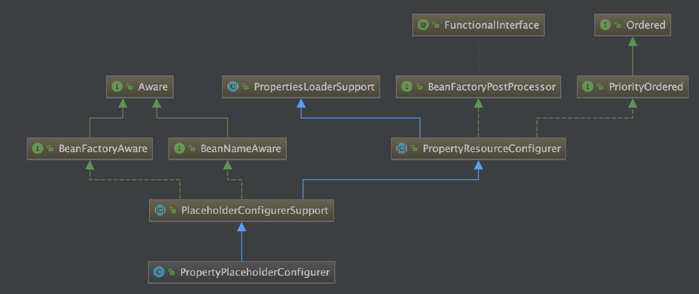
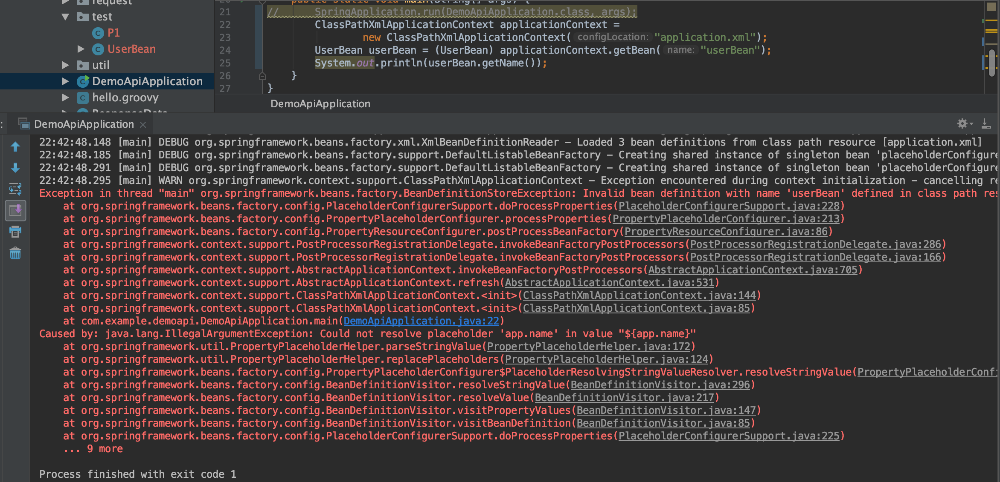
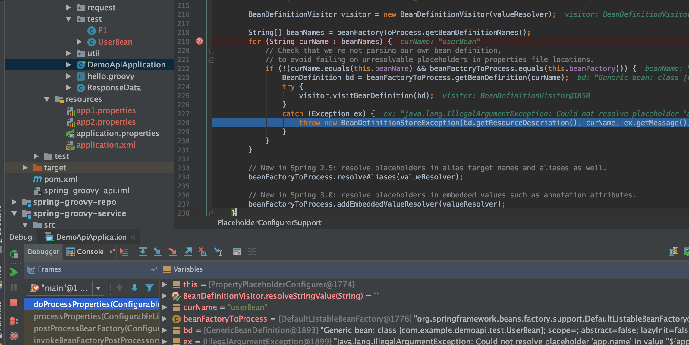
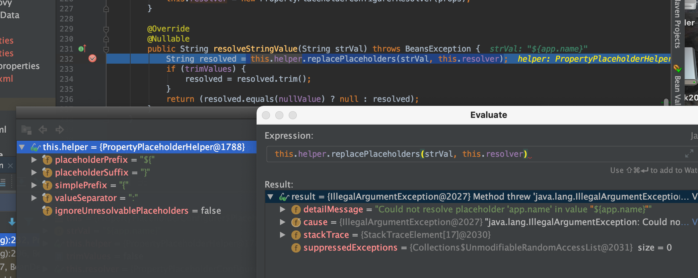
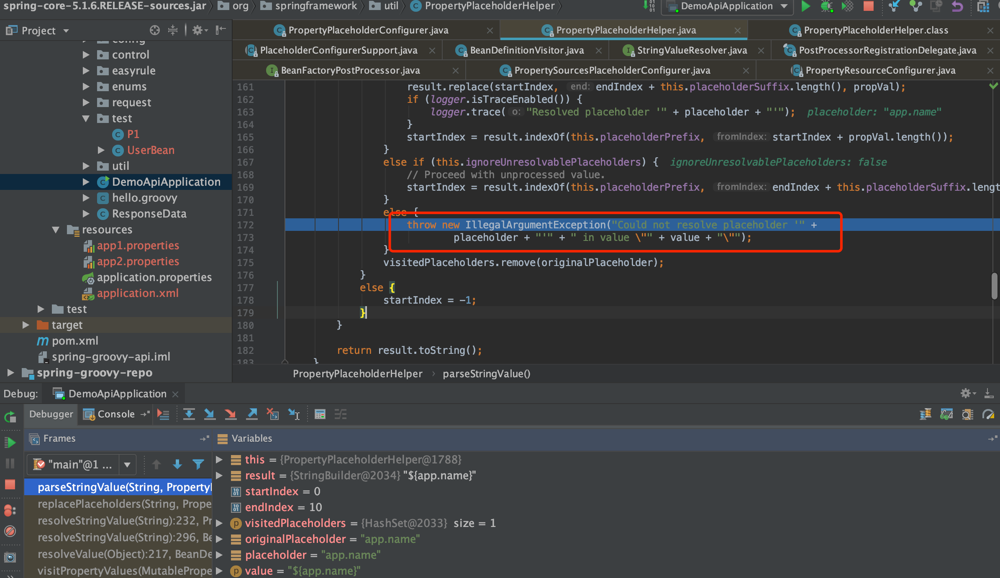
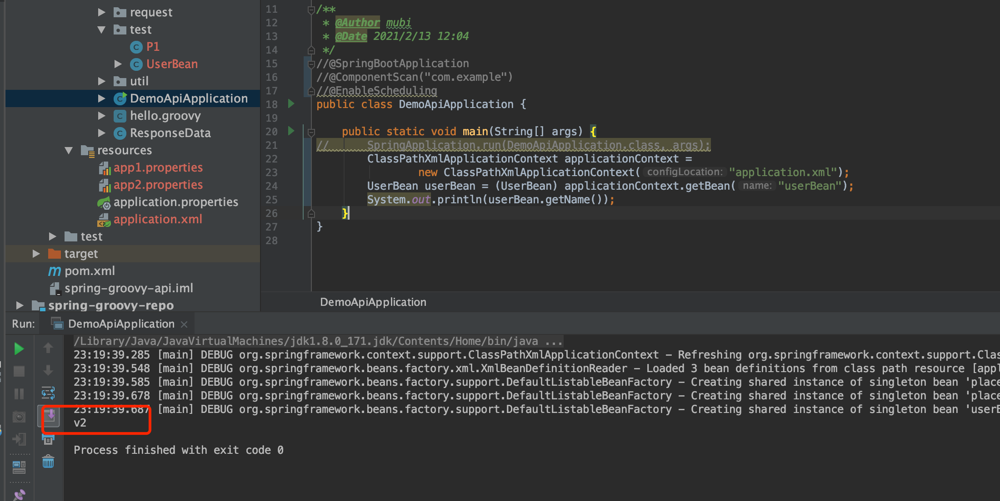
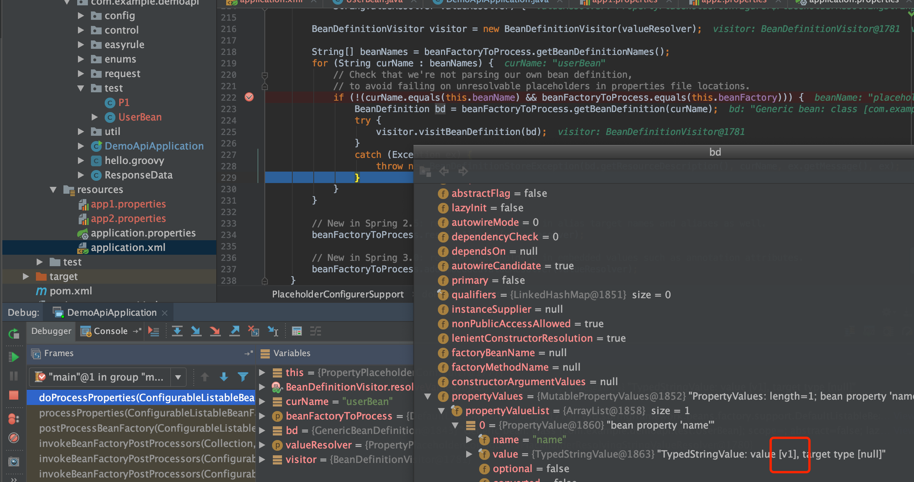
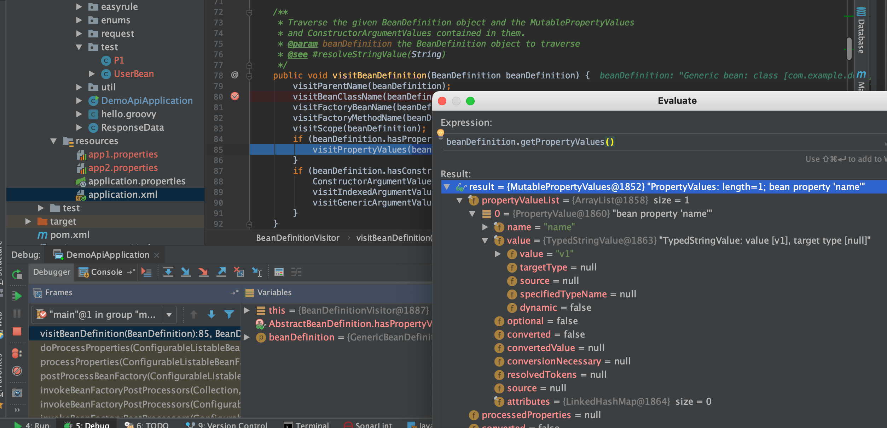
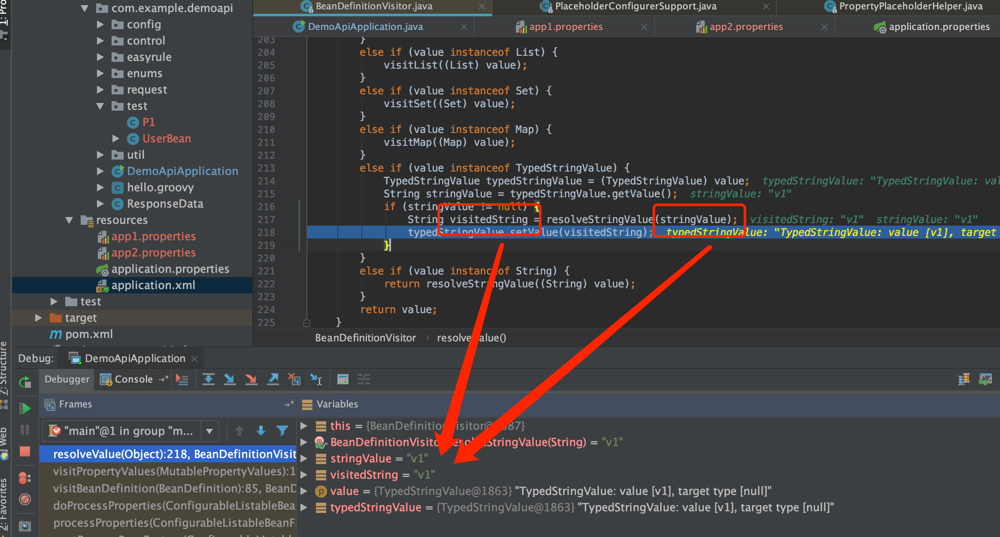
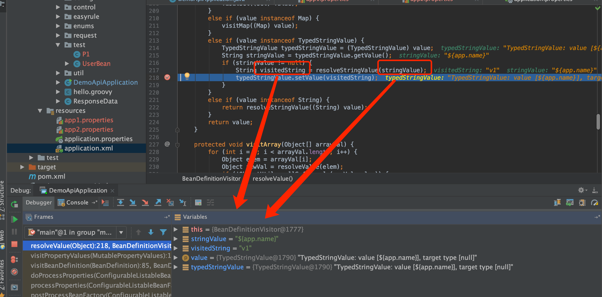

# PropertyPlaceholderConfigurer

PropertyPlaceholderConfigurer的类图如下，可以看到其也是一个BeanFactoryPostProcessor



## 例子代码报错

```java
public static void main(String[] args) {
		ClassPathXmlApplicationContext applicationContext =
				new ClassPathXmlApplicationContext("application.xml");
		UserBean userBean = (UserBean) applicationContext.getBean("userBean");
		System.out.println(userBean.getName());
	}
```

```xml
<?xml version="1.0" encoding="UTF-8"?>
<beans xmlns="http://www.springframework.org/schema/beans"
       xmlns:xsi="http://www.w3.org/2001/XMLSchema-instance"
       xsi:schemaLocation="http://www.springframework.org/schema/beans https://www.springframework.org/schema/beans/spring-beans-3.0.xsd">

    <bean id="placeholderConfigurer1" class="org.springframework.beans.factory.config.PropertyPlaceholderConfigurer">
        <property name="order" value="1"/>
        <property name="locations">
            <list>
                <value>classpath:app1.properties</value>
            </list>
        </property>
    </bean>

    <bean id="placeholderConfigurer2" class="org.springframework.beans.factory.config.PropertyPlaceholderConfigurer">
        <property name="order" value="2"/>
        <property name="locations">
            <list>
                <value>classpath:app2.properties</value>
            </list>
        </property>
    </bean>

    <bean name="userBean" class="com.example.demoapi.test.UserBean">
        <property name="name" value="${app.name}"/>
    </bean>


</beans>
```

app1.properties

```json
#app.name=v1
```

app2.properties

```json
app.name=v2
```

注意到app1.properties是注释掉的，执行后报错如下



### 追踪源码看报错

当执行`org.springframework.context.support.PostProcessorRegistrationDelegate.invokeBeanFactoryPostProcessors()`时可以看到有2个bfpp，一个是`placeholderConfigurer1`，一个是`placeholderConfigurer2`,这里先执行的是`placeholderConfigurer1`

#### bfpp的顺序问题？

回到：`org.springframework.context.support.PostProcessorRegistrationDelegate.invokeBeanFactoryPostProcessors()`的如下代码

```java
// Separate between BeanFactoryPostProcessors that implement PriorityOrdered,
// Ordered, and the rest.
List<BeanFactoryPostProcessor> priorityOrderedPostProcessors = new ArrayList<>();
List<String> orderedPostProcessorNames = new ArrayList<>();
List<String> nonOrderedPostProcessorNames = new ArrayList<>();
for (String ppName : postProcessorNames) {
    if (processedBeans.contains(ppName)) {
        // skip - already processed in first phase above
    }
    else if (beanFactory.isTypeMatch(ppName, PriorityOrdered.class)) {
        priorityOrderedPostProcessors.add(beanFactory.getBean(ppName, BeanFactoryPostProcessor.class));
    }
    else if (beanFactory.isTypeMatch(ppName, Ordered.class)) {
        orderedPostProcessorNames.add(ppName);
    }
    else {
        nonOrderedPostProcessorNames.add(ppName);
    }
}
```

且注意到PropertyPlaceholderConfigurer是实现了`PriorityOrdered`的,我们也配置了顺序

#### 执行到第一个placeholderConfigurer1找不到配置即报错？为什么不接着找placeholderConfigurer2

执行`org.springframework.beans.factory.config.PropertyResourceConfigurer#postProcessBeanFactory`

```java
@Override
public void postProcessBeanFactory(ConfigurableListableBeanFactory beanFactory) throws BeansException {
    try {
        Properties mergedProps = mergeProperties();

        // Convert the merged properties, if necessary.
        convertProperties(mergedProps);

        // Let the subclass process the properties.
        processProperties(beanFactory, mergedProps);
    }
    catch (IOException ex) {
        throw new BeanInitializationException("Could not load properties", ex);
    }
}
```

mergedProp获取为空，在`processProperties(beanFactory, mergedProps);`这句报错了,进入到方法内部报错如下



placeholderConfigurer1的BeanDefinitionVisitor在解析${app.name}报错找不到



继续debug下去可以看到最后的报错位置如下，注意到`ignoreUnresolvablePlaceholders=false`，即【不忽略解析错误】是false, 可以看到如果是true就不会抛出异常了



#### 根据debug分析尝试修改ignoreUnresolvablePlaceholders=true

```java
<bean id="placeholderConfigurer1" class="org.springframework.beans.factory.config.PropertyPlaceholderConfigurer">
    <property name="order" value="1"/>
    <property name="ignoreUnresolvablePlaceholders" value="true"/>
    <property name="locations">
        <list>
            <value>classpath:app1.properties</value>
        </list>
    </property>
</bean>
```

重新运行且成功拿到了配置2的值



## 多个配置覆盖问题

经过上一个报错，就会有个疑问，如果配置有多个且争取，那么到底最后会是哪一个？

实际执行是order更小的，即第一个bfpp能正常解析到的配置就是userBean的配置值

### 跟踪源码解释

placeholderConfigurer1正确执行后userBean的BeanDefinition已经正确赋值了${app.name}的值



当placeholderConfigurer2正确执行时：如下（可以理解为之前都解析好了，这次还解析个鬼）





附第一次解析对比：(如下，才是真正的解析)


