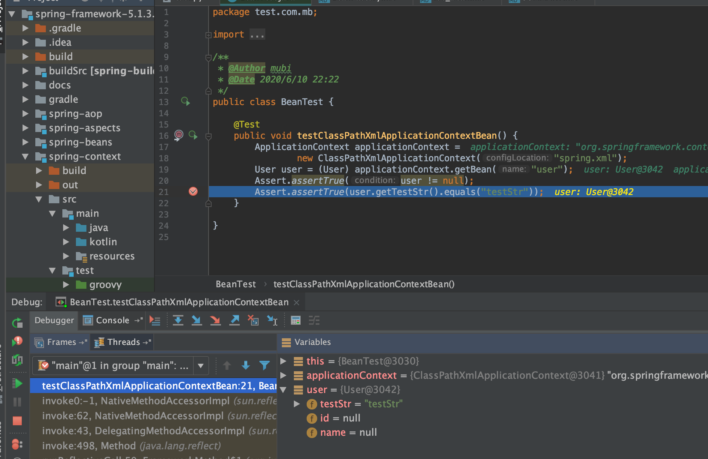
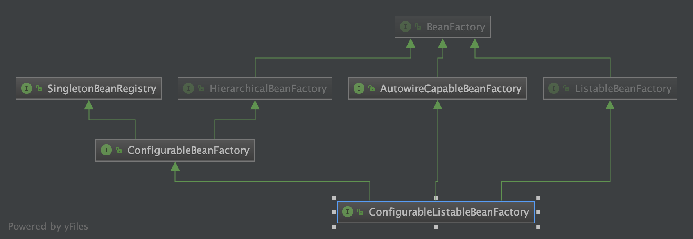
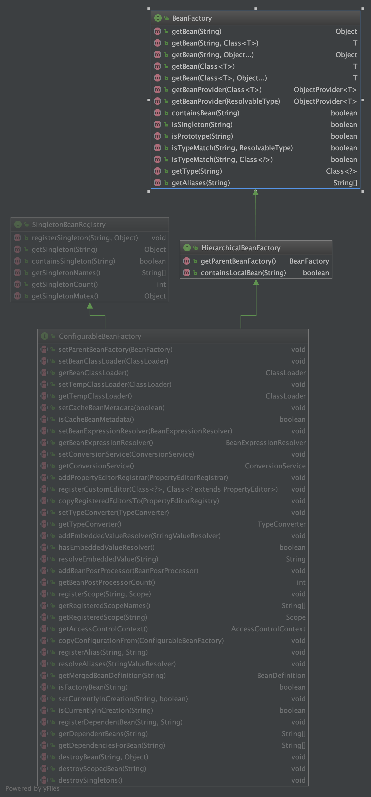
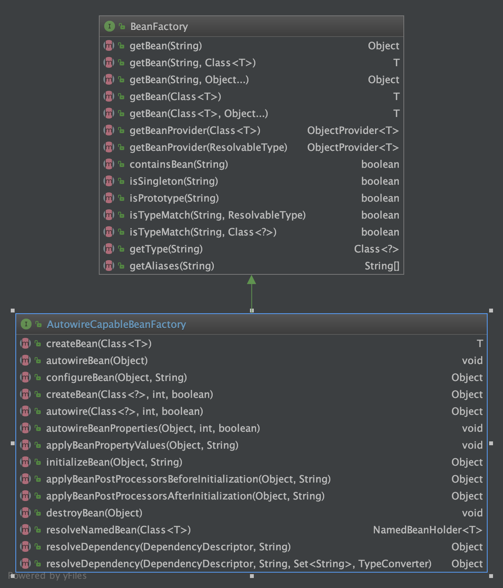

# `ClassPathXmlApplicationContext` & Bean

## 测试代码 & Debug

直接源码debug如下，需要弄懂这里面的流程



见：`spring-framework-5.1.3.RELEASE/spring-context/src/test/java/test/com/mb/BeanTest.java`

```java
@Test
public void testClassPathXmlApplicationContextBean() {
	ClassPathXmlApplicationContext applicationContext =
			new ClassPathXmlApplicationContext("spring.xml");
	User user = (User) applicationContext.getBean("user");
	Assert.assertTrue(user != null);
	Assert.assertTrue(user.getTestStr().equals("testStr"));
}
```

## ConfigurableListableBeanFactory接口 & bean创建

`ConfigurableListableBeanFactory`接口定义和类图

```java
/**
 * Configuration interface to be implemented by most listable bean factories.
 * In addition to {@link ConfigurableBeanFactory}, it provides facilities to
 * analyze and modify bean definitions, and to pre-instantiate singletons.
 *
 * <p>This subinterface of {@link org.springframework.beans.factory.BeanFactory}
 * is not meant to be used in normal application code: Stick to
 * {@link org.springframework.beans.factory.BeanFactory} or
 * {@link org.springframework.beans.factory.ListableBeanFactory} for typical
 * use cases. This interface is just meant to allow for framework-internal
 * plug'n'play even when needing access to bean factory configuration methods.
 *
 * @author Juergen Hoeller
 * @since 03.11.2003
 * @see org.springframework.context.support.AbstractApplicationContext#getBeanFactory()
 */
public interface ConfigurableListableBeanFactory
		extends ListableBeanFactory, AutowireCapableBeanFactory, ConfigurableBeanFactory {

```



## ListableBeanFactory

```java
public interface ListableBeanFactory extends BeanFactory
```

Extension of the BeanFactory interface to be implemented by bean factories that can enumerate（v. 列举; 枚举;）all their bean instances, rather than attempting bean lookup by name one by one as requested by clients. BeanFactory implementations that preload all their bean definitions (such as XML-based factories) may implement this interface.

ListableBeanFactory 比 BeanFactory 多了一些方法

* containsBeanDefinition(String beanName)

Check if this bean factory contains a bean definition with the given name.

* findAnnotationOnBean(String beanName, Class<A> annotationType)

Find an Annotation of annotationType on the specified bean, traversing its interfaces and super classes if no annotation can be found on the given class itself, as well as checking the bean's factory method (if any).

* getBeanDefinitionCount()

Return the number of beans defined in the factory.

* getBeanDefinitionNames()

Return the names of all beans defined in this factory.

* getBeanNamesForAnnotation(Class<? extends Annotation> annotationType)

Find all names of beans which are annotated with the supplied Annotation type, without creating corresponding bean instances yet.

* getBeanNamesForType(Class<?> type)

Return the names of beans matching the given type (including subclasses), judging from either bean definitions or the value of getObjectType in the case of FactoryBeans.

* getBeanNamesForType(Class<?> type, boolean includeNonSingletons, boolean allowEagerInit)

Return the names of beans matching the given type (including subclasses), judging from either bean definitions or the value of getObjectType in the case of FactoryBeans.

* getBeanNamesForType(ResolvableType type)

Return the names of beans matching the given type (including subclasses), judging from either bean definitions or the value of getObjectType in the case of FactoryBeans.

* getBeanNamesForType(ResolvableType type, boolean includeNonSingletons, boolean allowEagerInit)

Return the names of beans matching the given type (including subclasses), judging from either bean definitions or the value of getObjectType in the case of FactoryBeans.

* getBeansOfType(Class<T> type)

Return the bean instances that match the given object type (including subclasses), judging from either bean definitions or the value of getObjectType in the case of FactoryBeans.

* getBeansOfType(Class<T> type, boolean includeNonSingletons, boolean allowEagerInit)

Return the bean instances that match the given object type (including subclasses), judging from either bean definitions or the value of getObjectType in the case of FactoryBeans.

* getBeansWithAnnotation(Class<? extends Annotation> annotationType)

Find all beans which are annotated with the supplied Annotation type, returning a Map of bean names with corresponding bean instances.

## ConfigurableBeanFactory

```java
public interface ConfigurableBeanFactory extends HierarchicalBeanFactory, SingletonBeanRegistry
```

同时继承了HierarchicalBeanFactory 和 SingletonBeanRegistry 这两个接口，即同时继承了分层和单例类注册的功能



## AutowireCapableBeanFactory



## 测试代码流程走读


###  ClassPathXmlApplicationContext构造函数执行

附`ClassPathXmlApplicationContext`类的UML


```java
public ClassPathXmlApplicationContext(
		String[] configLocations, boolean refresh, @Nullable ApplicationContext parent)
		throws BeansException {

	super(parent);
	// 设置`this.configLocations`
	setConfigLocations(configLocations);
	if (refresh) {
		// 这里refresh为true（重点方法）
		// 这里使用了父类`AbstractApplicationContext`的`refresh`方法
		refresh();
	}
}
```

### `AbstractApplicationContext`的`refresh`方法

```java
@Override
public void refresh() throws BeansException, IllegalStateException {
	synchronized (this.startupShutdownMonitor) {
		// Prepare this context for refreshing.
		prepareRefresh();

		// 内部的 BeanFactory
		// Tell the subclass to refresh the internal bean factory.
		ConfigurableListableBeanFactory beanFactory = obtainFreshBeanFactory();

		// Prepare the bean factory for use in this context.
		prepareBeanFactory(beanFactory);

		// 先看try里面做了哪些事情(读别的源码也一样，先主后次)
		try {
			// Allows post-processing of the bean factory in context subclasses.
			postProcessBeanFactory(beanFactory);

			// Invoke factory processors registered as beans in the context.
			invokeBeanFactoryPostProcessors(beanFactory);

			// Register bean processors that intercept bean creation.
			registerBeanPostProcessors(beanFactory);

			// Initialize message source for this context.
			initMessageSource();

			// Initialize event multicaster for this context.
			initApplicationEventMulticaster();

			// Initialize other special beans in specific context subclasses.
			onRefresh();

			// Check for listener beans and register them.
			registerListeners();

			// Instantiate all remaining (non-lazy-init) singletons.
			finishBeanFactoryInitialization(beanFactory);

			// Last step: publish corresponding event.
			finishRefresh();
		}

		catch (BeansException ex) {
			if (logger.isWarnEnabled()) {
				logger.warn("Exception encountered during context initialization - " +
						"cancelling refresh attempt: " + ex);
			}

			// Destroy already created singletons to avoid dangling resources.
			destroyBeans();

			// Reset 'active' flag.
			cancelRefresh(ex);

			// Propagate exception to caller.
			throw ex;
		}

		finally {
			// Reset common introspection caches in Spring's core, since we
			// might not ever need metadata for singleton beans anymore...
			resetCommonCaches();
		}
	}
}
```

* 构造生成`ConfigurableListableBeanFactory`类型的`BeanFactory`(具体是`DefaultListableBeanFactory`)

调用了抽象类`AbstractRefreshableApplicationContext`的`refreshBeanFactory`方法

```java
@Override
	protected final void refreshBeanFactory() throws BeansException {
		// 如果BeanFactory不为空，则清除BeanFactory里面的实例，并销毁BeanFactory
		if (hasBeanFactory()) {
			destroyBeans();
			closeBeanFactory();
		}
		try {
			// BeanFactory的实例工厂：DefaultListableBeanFactory
			DefaultListableBeanFactory beanFactory = createBeanFactory();
			beanFactory.setSerializationId(getId());

			// 设置是否可以同名覆盖，循环依赖
			customizeBeanFactory(beanFactory);

			// 解析比如xml文件，并把xml文件中的标签封装成BeanDefinition对象，加载到工厂中, 通常是通过代理读取器实现
			// 比如 通过 XmlBeanDefinitionReader 读取 ClassPathXmlApplicationContext中传入的 configResources xml【模板设计】
			loadBeanDefinitions(beanFactory);
			synchronized (this.beanFactoryMonitor) {
				this.beanFactory = beanFactory;
			}
		}
		catch (IOException ex) {
			throw new ApplicationContextException("I/O error parsing bean definition source for " + getDisplayName(), ex);
		}
	}
```

### 抽象类`AbstractXmlApplicationContext`的`loadBeanDefinitions`方法

BeanFactory实例工厂完成解析xml文件中的Bean并封装成`BeanDefinition`加载到工厂中


* `DefaultListableBeanFactory`存储了BeanDefinition

```java
/** Map of bean definition objects, keyed by bean name. */
	private final Map<String, BeanDefinition> beanDefinitionMap = new ConcurrentHashMap<>(256);
```


* 附`DefaultListableBeanFactory`UML（`DefaultListableBeanFactory`就是一个独立的Ioc容器）


* 有了beanFactory,要使用之，还要做各种工作，回到refresh方法


### prepareBeanFactory

```java
/**
	* Configure the factory's standard context characteristics,
	* such as the context's ClassLoader and post-processors.
	* @param beanFactory the BeanFactory to configure
	*/
protected void prepareBeanFactory(ConfigurableListableBeanFactory beanFactory) {
	// 设置类加载器（要实例化bean,就需要类加载器）
	// Tell the internal bean factory to use the context's class loader etc.
	beanFactory.setBeanClassLoader(getClassLoader());
	// 设置EL表达式解析器（Bean初始化完成后填充属性时会用到）
	beanFactory.setBeanExpressionResolver(new StandardBeanExpressionResolver(beanFactory.getBeanClassLoader()));
	// 设置属性注册解析器PropertyEditor
	beanFactory.addPropertyEditorRegistrar(new ResourceEditorRegistrar(this, getEnvironment()));

	// Configure the bean factory with context callbacks.
	beanFactory.addBeanPostProcessor(new ApplicationContextAwareProcessor(this));
	beanFactory.ignoreDependencyInterface(EnvironmentAware.class);
	beanFactory.ignoreDependencyInterface(EmbeddedValueResolverAware.class);
	beanFactory.ignoreDependencyInterface(ResourceLoaderAware.class);
	beanFactory.ignoreDependencyInterface(ApplicationEventPublisherAware.class);
	beanFactory.ignoreDependencyInterface(MessageSourceAware.class);
	beanFactory.ignoreDependencyInterface(ApplicationContextAware.class);

	// BeanFactory interface not registered as resolvable type in a plain factory.
	// MessageSource registered (and found for autowiring) as a bean.
	beanFactory.registerResolvableDependency(BeanFactory.class, beanFactory);
	beanFactory.registerResolvableDependency(ResourceLoader.class, this);
	beanFactory.registerResolvableDependency(ApplicationEventPublisher.class, this);
	beanFactory.registerResolvableDependency(ApplicationContext.class, this);

	// Register early post-processor for detecting inner beans as ApplicationListeners.
	beanFactory.addBeanPostProcessor(new ApplicationListenerDetector(this));

	// Detect a LoadTimeWeaver and prepare for weaving, if found.
	if (beanFactory.containsBean(LOAD_TIME_WEAVER_BEAN_NAME)) {
		beanFactory.addBeanPostProcessor(new LoadTimeWeaverAwareProcessor(beanFactory));
		// Set a temporary ClassLoader for type matching.
		beanFactory.setTempClassLoader(new ContextTypeMatchClassLoader(beanFactory.getBeanClassLoader()));
	}

	// 注册各种系统环境的bean组件（environment，systemProperties，systemEnvironment）
	// Register default environment beans.
	if (!beanFactory.containsLocalBean(ENVIRONMENT_BEAN_NAME)) {
		beanFactory.registerSingleton(ENVIRONMENT_BEAN_NAME, getEnvironment());
	}
	if (!beanFactory.containsLocalBean(SYSTEM_PROPERTIES_BEAN_NAME)) {
		beanFactory.registerSingleton(SYSTEM_PROPERTIES_BEAN_NAME, getEnvironment().getSystemProperties());
	}
	if (!beanFactory.containsLocalBean(SYSTEM_ENVIRONMENT_BEAN_NAME)) {
		beanFactory.registerSingleton(SYSTEM_ENVIRONMENT_BEAN_NAME, getEnvironment().getSystemEnvironment());
	}
}
```

### postProcessBeanFactory(beanFactory初始化后的一些定制化处理)

在所有的beanDenifition加载完成之后，bean实例化之前执行

```java
/**
* Modify the application context's internal bean factory after its standard
* initialization. All bean definitions will have been loaded, but no beans
* will have been instantiated yet. This allows for registering special
* BeanPostProcessors etc in certain ApplicationContext implementations.
* @param beanFactory the bean factory used by the application context
*/
protected void postProcessBeanFactory(ConfigurableListableBeanFactory beanFactory) {
}
```

// TODO 测试

* `invokeBeanFactoryPostProcessors(beanFactory)`

```java
/**
	* Instantiate and invoke all registered BeanFactoryPostProcessor beans,
	* respecting explicit order if given.
	* <p>Must be called before singleton instantiation.
	*/
protected void invokeBeanFactoryPostProcessors(ConfigurableListableBeanFactory beanFactory) {
	// 1.getBeanFactoryPostProcessors(): 拿到当前应用上下文beanFactoryPostProcessors变量中的值
	// 2.invokeBeanFactoryPostProcessors: 实例化并调用所有已注册的BeanFactoryPostProcessor
	PostProcessorRegistrationDelegate.invokeBeanFactoryPostProcessors(beanFactory, getBeanFactoryPostProcessors());

	// Detect a LoadTimeWeaver and prepare for weaving, if found in the meantime
	// (e.g. through an @Bean method registered by ConfigurationClassPostProcessor)
	if (beanFactory.getTempClassLoader() == null && beanFactory.containsBean(LOAD_TIME_WEAVER_BEAN_NAME)) {
		beanFactory.addBeanPostProcessor(new LoadTimeWeaverAwareProcessor(beanFactory));
		beanFactory.setTempClassLoader(new ContextTypeMatchClassLoader(beanFactory.getBeanClassLoader()));
	}
}
```

### registerBeanPostProcessors(beanFactory)

```java
/**
	* Instantiate and invoke all registered BeanPostProcessor beans,
	* respecting explicit order if given.
	* <p>Must be called before any instantiation of application beans.
	*/
protected void registerBeanPostProcessors(ConfigurableListableBeanFactory beanFactory) {
	PostProcessorRegistrationDelegate.registerBeanPostProcessors(beanFactory, this);
}
```

### initMessageSource & initApplicationEventMulticaster

```java
// Initialize message source for this context.
initMessageSource();

// Initialize event multicaster for this context.
initApplicationEventMulticaster();
```

消息处理 & 事件监听

* Initialize other special beans in specific context subclasses. `onRefresh()`

```java
/**
* Template method which can be overridden to add context-specific refresh work.
* Called on initialization of special beans, before instantiation of singletons.
* <p>This implementation is empty.
* @throws BeansException in case of errors
* @see #refresh()
*/
protected void onRefresh() throws BeansException {
	// For subclasses: do nothing by default.
}
```

### Check for listener beans and register them. `registerListeners()`

```java
/**
	* Add beans that implement ApplicationListener as listeners.
	* Doesn't affect other listeners, which can be added without being beans.
	*/
protected void registerListeners() {
	// 注册特殊的监听器
	// Register statically specified listeners first.
	for (ApplicationListener<?> listener : getApplicationListeners()) {
		getApplicationEventMulticaster().addApplicationListener(listener);
	}

	// 取到所有监听器的名称，设置到上文初始化的广播器
	// Do not initialize FactoryBeans here: We need to leave all regular beans
	// uninitialized to let post-processors apply to them!
	String[] listenerBeanNames = getBeanNamesForType(ApplicationListener.class, true, false);
	for (String listenerBeanName : listenerBeanNames) {
		getApplicationEventMulticaster().addApplicationListenerBean(listenerBeanName);
	}

	// 如果存在早期应用事件，发布
	// Publish early application events now that we finally have a multicaster...
	Set<ApplicationEvent> earlyEventsToProcess = this.earlyApplicationEvents;
	this.earlyApplicationEvents = null;
	if (earlyEventsToProcess != null) {
		for (ApplicationEvent earlyEvent : earlyEventsToProcess) {
			getApplicationEventMulticaster().multicastEvent(earlyEvent);
		}
	}
}
```

* Instantiate all remaining (non-lazy-init) singletons. `finishBeanFactoryInitialization(beanFactory)`

创建所有非懒加载的单例类（并invoke BeanPostProcessors）

### publish corresponding event.`finishRefresh()`

```java
/**
	* Finish the refresh of this context, invoking the LifecycleProcessor's
	* onRefresh() method and publishing the
	* {@link org.springframework.context.event.ContextRefreshedEvent}.
	*/
protected void finishRefresh() {
	// Clear context-level resource caches (such as ASM metadata from scanning).
	clearResourceCaches();

	// Initialize lifecycle processor for this context.
	initLifecycleProcessor();

	// Propagate refresh to lifecycle processor first.
	getLifecycleProcessor().onRefresh();

	// Publish the final event.
	publishEvent(new ContextRefreshedEvent(this));

	// Participate in LiveBeansView MBean, if active.
	LiveBeansView.registerApplicationContext(this);
}
```

### `User user = (User) applicationContext.getBean("user");`

`AbstractBeanFactory`的`doGetBean`方法

```java
protected <T> T doGetBean(final String name, @Nullable final Class<T> requiredType,
			@Nullable final Object[] args, boolean typeCheckOnly) throws BeansException {
```
