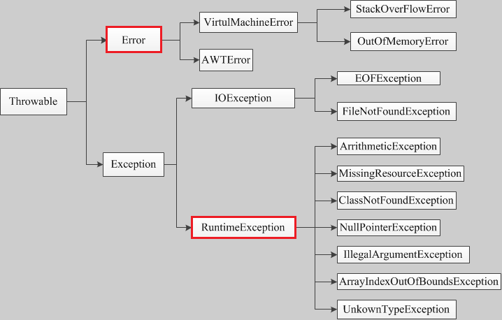

# @Transactional

## 事务的传播特性

### 什么是事务的传播特性？

指的是当一个事务方法被另一个事务方法调用时，这个事务方法该如何进行？

```java
@Transactional
public void A(){
    // xx
    B();
    C();
    // xx
    // 出现异常
}

@Transactional
public void B(){
    // xx
    // 出现异常
}

@Transactional
public void C(){
    // xx
    // 出现异常
}
```

如上：事务A内部有事务B,事务C；如果A异常了，那么B,C怎么处理事务；如果B，C事务异常，那么事务A怎么处理？

### Spring给出的7种事务的传播类型

```java
/**
 * Enumeration that represents transaction propagation behaviors for use
 * with the {@link Transactional} annotation, corresponding to the
 * {@link TransactionDefinition} interface.
 *
 * @author Colin Sampaleanu
 * @author Juergen Hoeller
 * @since 1.2
 */
public enum Propagation {

	/**
	 *  
	 * Support a current transaction, create a new one if none exists.
	 * Analogous to EJB transaction attribute of the same name.
	 * <p>This is the default setting of a transaction annotation.
	 */
	REQUIRED(TransactionDefinition.PROPAGATION_REQUIRED),

	/**
	 * Support a current transaction, execute non-transactionally if none exists.
	 * Analogous to EJB transaction attribute of the same name.
	 * <p>Note: For transaction managers with transaction synchronization,
	 * PROPAGATION_SUPPORTS is slightly different from no transaction at all,
	 * as it defines a transaction scope that synchronization will apply for.
	 * As a consequence, the same resources (JDBC Connection, Hibernate Session, etc)
	 * will be shared for the entire specified scope. Note that this depends on
	 * the actual synchronization configuration of the transaction manager.
	 * @see org.springframework.transaction.support.AbstractPlatformTransactionManager#setTransactionSynchronization
	 */
	SUPPORTS(TransactionDefinition.PROPAGATION_SUPPORTS),

	/**
	 * Support a current transaction, throw an exception if none exists.
	 * Analogous to EJB transaction attribute of the same name.
	 */
	MANDATORY(TransactionDefinition.PROPAGATION_MANDATORY),

	/**
	 * Create a new transaction, and suspend the current transaction if one exists.
	 * Analogous to the EJB transaction attribute of the same name.
	 * <p><b>NOTE:</b> Actual transaction suspension will not work out-of-the-box
	 * on all transaction managers. This in particular applies to
	 * {@link org.springframework.transaction.jta.JtaTransactionManager},
	 * which requires the {@code javax.transaction.TransactionManager} to be
	 * made available it to it (which is server-specific in standard Java EE).
	 * @see org.springframework.transaction.jta.JtaTransactionManager#setTransactionManager
	 */
	REQUIRES_NEW(TransactionDefinition.PROPAGATION_REQUIRES_NEW),

	/**
	 * Execute non-transactionally, suspend the current transaction if one exists.
	 * Analogous to EJB transaction attribute of the same name.
	 * <p><b>NOTE:</b> Actual transaction suspension will not work out-of-the-box
	 * on all transaction managers. This in particular applies to
	 * {@link org.springframework.transaction.jta.JtaTransactionManager},
	 * which requires the {@code javax.transaction.TransactionManager} to be
	 * made available it to it (which is server-specific in standard Java EE).
	 * @see org.springframework.transaction.jta.JtaTransactionManager#setTransactionManager
	 */
	NOT_SUPPORTED(TransactionDefinition.PROPAGATION_NOT_SUPPORTED),

	/**
	 * Execute non-transactionally, throw an exception if a transaction exists.
	 * Analogous to EJB transaction attribute of the same name.
	 */
	NEVER(TransactionDefinition.PROPAGATION_NEVER),

	/**
	 * Execute within a nested transaction if a current transaction exists,
	 * behave like PROPAGATION_REQUIRED else. There is no analogous feature in EJB.
	 * <p>Note: Actual creation of a nested transaction will only work on specific
	 * transaction managers. Out of the box, this only applies to the JDBC
	 * DataSourceTransactionManager when working on a JDBC 3.0 driver.
	 * Some JTA providers might support nested transactions as well.
	 * @see org.springframework.jdbc.datasource.DataSourceTransactionManager
	 */
	NESTED(TransactionDefinition.PROPAGATION_NESTED);


	private final int value;


	Propagation(int value) {
		this.value = value;
	}

	public int value() {
		return this.value;
	}

}
```

传播属性 | 描述 
 :---: | :---: 
required(默认) | 如果存在一个事务，则支持当前事务。如果没有事务则开启一个新的事务。被设置成这个级别时，会为每一个被调用的方法创建一个逻辑事务域。如果前面的方法已经创建了事务，那么后面的方法支持当前的事务，如果当前没有事务会重新建立事务。
requires_new | 不管当前是否已经存在事务，都会新建一个事务；开启的事务相互独立，互不干扰。
Mandatory | 支持当前事务，如果当前没有事务，就抛出异常。
Never | 以非事务方式执行，如果当前存在事务，则抛出异常。
Not_supports | 以非事务方式执行操作，如果当前存在事务，就把当前事务挂起。
Supports | 支持当前事务，如果当前没有事务，就以非事务方式执行。
Nested | 支持当前事务，新增Savepoint点，与当前事务同步提交或回滚。嵌套事务一个非常重要的概念就是内层事务依赖于外层事务。外层事务失败时，会回滚内层事务所做的动作。而内层事务操作失败并不会引起外层事务的回滚。

### PROPAGATION_REQUIRED

```java
@Transactional(propagation = Propagation.REQUIRED)
public void methodA() {
	methodB();
	// do something
}
 
@Transactional(propagation = Propagation.REQUIRED)
public void methodB() {
	// do something
}
```

* 单独调用methodB方法时，因为当前上下文不存在事务，所以会开启一个新的事务。 
* 调用methodA方法时，因为当前上下文不存在事务，所以会开启一个新的事务。当执行到methodB时，methodB发现当前上下文有事务，因此就加入到当前事务中来。

### PROPAGATION_SUPPORTS

```java
@Transactional(propagation = Propagation.REQUIRED)
public void methodA() {
	methodB();
	// do something
}
 
// 事务属性为SUPPORTS
@Transactional(propagation = Propagation.SUPPORTS)
public void methodB() {
	// do something
}
```

* 单纯的调用methodB时，methodB方法是非事务的执行的。
* 当调用methodA时,methodB则加入了methodA的事务中,事务地执行。

## Spring的5种事务隔离级别

```java
/**
 * Enumeration that represents transaction isolation levels for use
 * with the {@link Transactional} annotation, corresponding to the
 * {@link TransactionDefinition} interface.
 *
 * @author Colin Sampaleanu
 * @author Juergen Hoeller
 * @since 1.2
 */
public enum Isolation {

	/**
	 * 这是一个PlatformTransactionManager默认的隔离级别，使用数据库默认的事务隔离级别
	 *
	 * Use the default isolation level of the underlying datastore.
	 * All other levels correspond to the JDBC isolation levels.
	 * @see java.sql.Connection
	 */
	DEFAULT(TransactionDefinition.ISOLATION_DEFAULT),

	/**
	 * A constant indicating that dirty reads, non-repeatable reads and phantom reads
	 * can occur. This level allows a row changed by one transaction to be read by
	 * another transaction before any changes in that row have been committed
	 * (a "dirty read"). If any of the changes are rolled back, the second
	 * transaction will have retrieved an invalid row.
	 * @see java.sql.Connection#TRANSACTION_READ_UNCOMMITTED
	 */
	READ_UNCOMMITTED(TransactionDefinition.ISOLATION_READ_UNCOMMITTED),

	/**
	 * A constant indicating that dirty reads are prevented; non-repeatable reads
	 * and phantom reads can occur. This level only prohibits a transaction
	 * from reading a row with uncommitted changes in it.
	 * @see java.sql.Connection#TRANSACTION_READ_COMMITTED
	 */
	READ_COMMITTED(TransactionDefinition.ISOLATION_READ_COMMITTED),

	/**
	 * A constant indicating that dirty reads and non-repeatable reads are
	 * prevented; phantom reads can occur. This level prohibits a transaction
	 * from reading a row with uncommitted changes in it, and it also prohibits
	 * the situation where one transaction reads a row, a second transaction
	 * alters the row, and the first transaction rereads the row, getting
	 * different values the second time (a "non-repeatable read").
	 * @see java.sql.Connection#TRANSACTION_REPEATABLE_READ
	 */
	REPEATABLE_READ(TransactionDefinition.ISOLATION_REPEATABLE_READ),

	/**
	 * A constant indicating that dirty reads, non-repeatable reads and phantom
	 * reads are prevented. This level includes the prohibitions in
	 * {@code ISOLATION_REPEATABLE_READ} and further prohibits the situation
	 * where one transaction reads all rows that satisfy a {@code WHERE}
	 * condition, a second transaction inserts a row that satisfies that
	 * {@code WHERE} condition, and the first transaction rereads for the
	 * same condition, retrieving the additional "phantom" row in the second read.
	 * @see java.sql.Connection#TRANSACTION_SERIALIZABLE
	 */
	SERIALIZABLE(TransactionDefinition.ISOLATION_SERIALIZABLE);


	private final int value;


	Isolation(int value) {
		this.value = value;
	}

	public int value() {
		return this.value;
	}

}
```


## `rollbackFor`属性

```java
/**
 * Defines zero (0) or more exception {@link Class classes}, which must be
 * subclasses of {@link Throwable}, indicating which exception types must cause
 * a transaction rollback.
 * <p>By default, a transaction will be rolling back on {@link RuntimeException}
 * and {@link Error} but not on checked exceptions (business exceptions). See
 * {@link org.springframework.transaction.interceptor.DefaultTransactionAttribute#rollbackOn(Throwable)}
 * for a detailed explanation.
 * <p>This is the preferred way to construct a rollback rule (in contrast to
 * {@link #rollbackForClassName}), matching the exception class and its subclasses.
 * <p>Similar to {@link org.springframework.transaction.interceptor.RollbackRuleAttribute#RollbackRuleAttribute(Class clazz)}.
 * @see #rollbackForClassName
 * @see org.springframework.transaction.interceptor.DefaultTransactionAttribute#rollbackOn(Throwable)
 */
Class<? extends Throwable>[] rollbackFor() default {};
```

* `roll back`默认是`Error`和`RuntimeException`




eg1: 不加rollbackFor属性，抛出RuntimeException，正常回滚


```java
@Transactional
```

eg2: 不加rollbackFor属性，抛出IOException，不回滚

```
@Transactional
```

eg3: 加上rollbackFor = Exception.class，抛出IOException，正常回滚

```java
@Transactional(rollbackFor = Exception.class)
```

eg4: 不加rollbackFor属性，抛出OutOfMemoryError，正常回滚

```
@Transactional()

throw new OutOfMemoryError();
```

eg5: 加上rollbackFor = Exception.class，抛出OutOfMemoryError，正常回滚

```java
@Transactional(rollbackFor = Exception.class)

throw new OutOfMemoryError();
```
