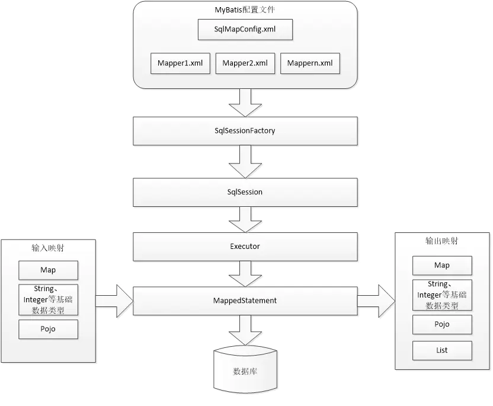

# MyBatis 源码



* SqlSession

通过会话工厂创建sqlSession即会话，程序员通过sqlsession会话接口对数据库进行增删改查操作。

* MappedStatement

    * 它是mybatis一个底层封装对象，它包装了mybatis配置信息及sql映射信息等。mapper.xml文件中一个select\insert\update\delete标签对应一个Mapped Statement对象，select\insert\update\delete标签的id即是Mapped statement的id。

    * Mapped Statement对sql执行输入参数进行定义，包括HashMap、基本类型、pojo，Executor通过MappedStatement在执行sql前将输入的java对象映射至sql中，输入参数映射就是jdbc编程中对preparedStatement设置参数。

    * Mapped Statement对sql执行输出结果进行定义，包括HashMap、基本类型、pojo，Executor通过MappedStatement在执行sql后将输出结果映射至java对象中，输出结果映射过程相当于jdbc编程中对结果的解析处理过程。

* Executor
  
MyBatis执行器，是MyBatis 调度的核心，负责SQL语句的生成和查询缓存的维护
  
* StatementHandler

装了JDBC Statement操作，负责对JDBC statement 的操作，如设置参数、将Statement结果集转换成List集合。

## SpringBoot项目如何使用mybatis的

一个常规的springboot项目整合mybatis如下


1. 项目启动类加上了`@MapperScan`

```java

@SpringBootApplication
@MapperScan("com.example.demo.repository")
@EnableScheduling
public class DemoApplication {

	public static void main(String[] args) {
		SpringApplication.run(DemoApplication.class, args);
	}

}
```

2. 有model类，Mapper接口和对应的xml文件，xml文件例子如下

```java
<?xml version="1.0" encoding="UTF-8"?>
<!DOCTYPE mapper PUBLIC "-//mybatis.org//DTD Mapper 3.0//EN" "http://mybatis.org/dtd/mybatis-3-mapper.dtd">
<mapper namespace="com.example.demo.repository.mapper.TbUserMapper">
  <resultMap id="BaseResultMap" type="com.example.demo.repository.model.TbUser">
    <id column="id" jdbcType="INTEGER" property="id" />
    <result column="userID" jdbcType="VARCHAR" property="userid" />
    <result column="password" jdbcType="VARCHAR" property="password" />
    <result column="name" jdbcType="VARCHAR" property="name" />
    <result column="phone" jdbcType="VARCHAR" property="phone" />
    <result column="address" jdbcType="VARCHAR" property="address" />
  </resultMap>
  <sql id="Example_Where_Clause">
    <where>
      <foreach collection="oredCriteria" item="criteria" separator="or">
        <if test="criteria.valid">
          <trim prefix="(" prefixOverrides="and" suffix=")">
            <foreach collection="criteria.criteria" item="criterion">
              <choose>
                <when test="criterion.noValue">
                  and ${criterion.condition}
                </when>
                <when test="criterion.singleValue">
                  and ${criterion.condition} #{criterion.value}
                </when>
                <when test="criterion.betweenValue">
                  and ${criterion.condition} #{criterion.value} and #{criterion.secondValue}
                </when>
                <when test="criterion.listValue">
                  and ${criterion.condition}
                  <foreach close=")" collection="criterion.value" item="listItem" open="(" separator=",">
                    #{listItem}
                  </foreach>
                </when>
              </choose>
            </foreach>
          </trim>
        </if>
      </foreach>
    </where>
  </sql>
  <sql id="Update_By_Example_Where_Clause">
    <where>
      <foreach collection="example.oredCriteria" item="criteria" separator="or">
        <if test="criteria.valid">
          <trim prefix="(" prefixOverrides="and" suffix=")">
            <foreach collection="criteria.criteria" item="criterion">
              <choose>
                <when test="criterion.noValue">
                  and ${criterion.condition}
                </when>
                <when test="criterion.singleValue">
                  and ${criterion.condition} #{criterion.value}
                </when>
                <when test="criterion.betweenValue">
                  and ${criterion.condition} #{criterion.value} and #{criterion.secondValue}
                </when>
                <when test="criterion.listValue">
                  and ${criterion.condition}
                  <foreach close=")" collection="criterion.value" item="listItem" open="(" separator=",">
                    #{listItem}
                  </foreach>
                </when>
              </choose>
            </foreach>
          </trim>
        </if>
      </foreach>
    </where>
  </sql>
  <sql id="Base_Column_List">
    id, userID, password, name, phone, address
  </sql>
  <select id="selectByExample" parameterType="com.example.demo.repository.model.TbUserExample" resultMap="BaseResultMap">
    select
    <if test="distinct">
      distinct
    </if>
    <include refid="Base_Column_List" />
    from tb_user
    <if test="_parameter != null">
      <include refid="Example_Where_Clause" />
    </if>
    <if test="orderByClause != null">
      order by ${orderByClause}
    </if>
  </select>
  <select id="selectByPrimaryKey" parameterType="java.lang.Integer" resultMap="BaseResultMap">
    select 
    <include refid="Base_Column_List" />
    from tb_user
    where id = #{id,jdbcType=INTEGER}
  </select>
  <delete id="deleteByPrimaryKey" parameterType="java.lang.Integer">
    delete from tb_user
    where id = #{id,jdbcType=INTEGER}
  </delete>
  <delete id="deleteByExample" parameterType="com.example.demo.repository.model.TbUserExample">
    delete from tb_user
    <if test="_parameter != null">
      <include refid="Example_Where_Clause" />
    </if>
  </delete>
  <insert id="insert" parameterType="com.example.demo.repository.model.TbUser">
    insert into tb_user (id, userID, password, 
      name, phone, address
      )
    values (#{id,jdbcType=INTEGER}, #{userid,jdbcType=VARCHAR}, #{password,jdbcType=VARCHAR}, 
      #{name,jdbcType=VARCHAR}, #{phone,jdbcType=VARCHAR}, #{address,jdbcType=VARCHAR}
      )
  </insert>
  <insert id="insertSelective" parameterType="com.example.demo.repository.model.TbUser">
    insert into tb_user
    <trim prefix="(" suffix=")" suffixOverrides=",">
      <if test="id != null">
        id,
      </if>
      <if test="userid != null">
        userID,
      </if>
      <if test="password != null">
        password,
      </if>
      <if test="name != null">
        name,
      </if>
      <if test="phone != null">
        phone,
      </if>
      <if test="address != null">
        address,
      </if>
    </trim>
    <trim prefix="values (" suffix=")" suffixOverrides=",">
      <if test="id != null">
        #{id,jdbcType=INTEGER},
      </if>
      <if test="userid != null">
        #{userid,jdbcType=VARCHAR},
      </if>
      <if test="password != null">
        #{password,jdbcType=VARCHAR},
      </if>
      <if test="name != null">
        #{name,jdbcType=VARCHAR},
      </if>
      <if test="phone != null">
        #{phone,jdbcType=VARCHAR},
      </if>
      <if test="address != null">
        #{address,jdbcType=VARCHAR},
      </if>
    </trim>
  </insert>
  <select id="countByExample" parameterType="com.example.demo.repository.model.TbUserExample" resultType="java.lang.Integer">
    select count(*) from tb_user
    <if test="_parameter != null">
      <include refid="Example_Where_Clause" />
    </if>
  </select>
  <update id="updateByExampleSelective" parameterType="map">
    update tb_user
    <set>
      <if test="record.id != null">
        id = #{record.id,jdbcType=INTEGER},
      </if>
      <if test="record.userid != null">
        userID = #{record.userid,jdbcType=VARCHAR},
      </if>
      <if test="record.password != null">
        password = #{record.password,jdbcType=VARCHAR},
      </if>
      <if test="record.name != null">
        name = #{record.name,jdbcType=VARCHAR},
      </if>
      <if test="record.phone != null">
        phone = #{record.phone,jdbcType=VARCHAR},
      </if>
      <if test="record.address != null">
        address = #{record.address,jdbcType=VARCHAR},
      </if>
    </set>
    <if test="_parameter != null">
      <include refid="Update_By_Example_Where_Clause" />
    </if>
  </update>
  <update id="updateByExample" parameterType="map">
    update tb_user
    set id = #{record.id,jdbcType=INTEGER},
      userID = #{record.userid,jdbcType=VARCHAR},
      password = #{record.password,jdbcType=VARCHAR},
      name = #{record.name,jdbcType=VARCHAR},
      phone = #{record.phone,jdbcType=VARCHAR},
      address = #{record.address,jdbcType=VARCHAR}
    <if test="_parameter != null">
      <include refid="Update_By_Example_Where_Clause" />
    </if>
  </update>
  <update id="updateByPrimaryKeySelective" parameterType="com.example.demo.repository.model.TbUser">
    update tb_user
    <set>
      <if test="userid != null">
        userID = #{userid,jdbcType=VARCHAR},
      </if>
      <if test="password != null">
        password = #{password,jdbcType=VARCHAR},
      </if>
      <if test="name != null">
        name = #{name,jdbcType=VARCHAR},
      </if>
      <if test="phone != null">
        phone = #{phone,jdbcType=VARCHAR},
      </if>
      <if test="address != null">
        address = #{address,jdbcType=VARCHAR},
      </if>
    </set>
    where id = #{id,jdbcType=INTEGER}
  </update>
  <update id="updateByPrimaryKey" parameterType="com.example.demo.repository.model.TbUser">
    update tb_user
    set userID = #{userid,jdbcType=VARCHAR},
      password = #{password,jdbcType=VARCHAR},
      name = #{name,jdbcType=VARCHAR},
      phone = #{phone,jdbcType=VARCHAR},
      address = #{address,jdbcType=VARCHAR}
    where id = #{id,jdbcType=INTEGER}
  </update>
  <select id="selectByExampleWithRowbounds" parameterType="com.example.demo.repository.model.TbUserExample" resultMap="BaseResultMap">
    select
    <if test="distinct">
      distinct
    </if>
    <include refid="Base_Column_List" />
    from tb_user
    <if test="_parameter != null">
      <include refid="Example_Where_Clause" />
    </if>
    <if test="orderByClause != null">
      order by ${orderByClause}
    </if>
  </select>
</mapper>
```

通常是使用mybatis-generator来自动生成的

3. 配置文件要加上数据库配置，也可以自定义Datasource, 一般项目会加上各种starter

```java
spring.datasource.driverClassName=com.mysql.jdbc.Driver
spring.datasource.url=jdbc:mysql://localhost:3306/test?autoReconnect=true&amp;autoReconnectForPools=true&amp;useUnicode=true&amp;characterEncoding=utf-8
spring.datasource.username=root
spring.datasource.password=123456
```

```java
compile('org.springframework.boot:spring-boot-starter-jdbc')
compile('org.springframework.boot:spring-boot-starter-web')
compile('org.mybatis.spring.boot:mybatis-spring-boot-starter:1.3.2')
```


## 使用很简单;原理呢?

通过学习`@Configuration`,到学习`ConfigurationClassPostProcessor`这个bfpp，再到`@MapperScan`的学习到mybatis的`org.mybatis.spring.mapper.MapperScannerConfigurer`的bfpp，这样mybatis是将Mapper的`BeanDefinition`注册到spring容器中了


通过springboot的starter的学习，可以知道datasource是如何注入的(**通过@Import注解 + 实现ImportSelector接口的方式向IOC容器里注入Bean**)