# SpringBoot

<a href="https://docs.spring.io/spring/docs/5.2.8.RELEASE/spring-framework-reference/web.html#spring-web">spring web 官方文档</a>

* 内嵌容器原理

* 零配置

## MVC

在JavaWeb程序中，MVC框架模式是经常用到的，举一个Web程序的结构可以更好的理解MVC的理念

* V：View视图，Web程序中指用户可以看到的并可以与之进行数据交互的界面，比如一个Html网页界面，或者某些客户端的界面，在前面讲过，MVC可以为程序处理很多不同的视图，用户在视图中进行输出数据以及一系列操作，注意：视图中不会发生数据的处理操作。

* M：Model模型：进行所有数据的处理工作，模型返回的数据是中立的，和数据格式无关，一个模型可以为多个视图来提供数据，所以模型的代码重复性比较低

* C：Controller控制器：负责接受用户的输入，并且调用模型和视图去完成用户的需求，控制器不会输出也不会做出任何处理，只会接受请求并调用模型构件去处理用户的请求，然后在确定用哪个视图去显示返回的数据

Spring MVC采用了松散耦合的可插拔组件结构，比其他的MVC框架更具有灵活性和扩展性，Spring MVC通过使用一套注解，使一个Java类成为前端控制器(Controller)，不需要实现任何接口，同时，Spring MVC支持RES形式的URL请求，除此之外，Spring MVC在在数据绑定、视图解析、本地化处理及静态资源处理上都有许多不俗的表现

Spring MVC围绕`DispatcherServlet`(前端控制器)为中心展开，DispatcherServlet(前端控制器)是Spring MVC的中枢，和MVC的思想一样，它负责从视图获取用户请求并且分派给相应的处理器处理，并决定用哪个视图去把数据呈现给给用户

## Spring MVC 原理

Spring Web MVC is the original web framework built on the Servlet API and has been included in the Spring Framework from the very beginning.

Spring MVC 构建在Servlet API基础上实现了MVC设计模式的web框架

DispatcherServlet uses Spring configuration to discover the delegate components it needs for request mapping, view resolution, exception handling

```java
public class MyWebApplicationInitializer implements WebApplicationInitializer {

    @Override
    public void onStartup(ServletContext servletCxt) {

        // Load Spring web application configuration
        AnnotationConfigWebApplicationContext ac = new AnnotationConfigWebApplicationContext();
        ac.register(AppConfig.class);
        ac.refresh();

        // Create and register the DispatcherServlet
        DispatcherServlet servlet = new DispatcherServlet(ac);
        ServletRegistration.Dynamic registration = servletCxt.addServlet("app", servlet);
        registration.setLoadOnStartup(1);
        registration.addMapping("/app/*");
    }
}
```

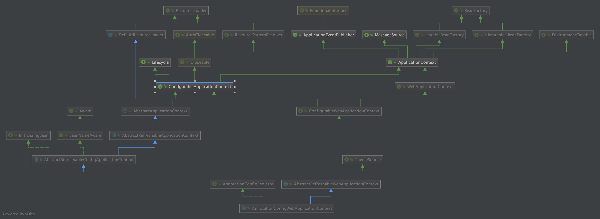

### spring mvc处理流程


* 第一步：发起请求到前端控制器(DispatcherServlet)
* 第二步：前端控制器请求HandlerMapping查找 Handler （可以根据xml配置、注解进行查找）
* 第三步：处理器映射器HandlerMapping向前端控制器返回Handler，HandlerMapping会把请求映射为HandlerExecutionChain对象（包含一个Handler处理器（页面控制器）对象，多个HandlerInterceptor拦截器对象），通过这种策略模式，很容易添加新的映射策略
* 第四步：前端控制器调用处理器适配器去执行Handler
* 第五步：处理器适配器HandlerAdapter将会根据适配的结果去执行Handler
* 第六步：Handler执行完成给适配器返回ModelAndView
* 第七步：处理器适配器向前端控制器返回ModelAndView （ModelAndView是springmvc框架的一个底层对象，包括 Model和view）
* 第八步：前端控制器请求视图解析器去进行视图解析 （根据逻辑视图名解析成真正的视图(jsp)），通过这种策略很容易更换其他视图技术，只需要更改视图解析器即可
* 第九步：视图解析器向前端控制器返回View
* 第十步：前端控制器进行视图渲染 （视图渲染将模型数据(在ModelAndView对象中)填充到request域）
* 第十一步：前端控制器向用户响应结果

### 请求是怎么由@Controller的方法处理的?

#### @Controller处理架构图


#### debug打点,访问`http://localhost:8098/boot/json.do`

```java
@Controller
public class TestController {

	private static final Log logger = LogFactory.getLog(TestController.class);

	@GetMapping("/test.do")
	@ResponseBody
	public String test(HttpServletRequest request, HttpServletResponse response){
		String uri = request.getRequestURI();
		logger.info("TestController test");
		return uri;
	}

	@GetMapping("/json.do")
	@ResponseBody
	public Map<String, String> getJson(HttpServletRequest request, HttpServletResponse response){
		Map<String,String> mp = new HashMap<>(2);
		mp.put("key", "val");
		return mp;
	}
}
```

#### 请求统一交给`DispatchServlet`分发处理

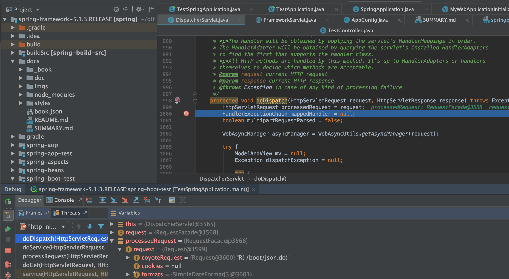

#### 从Spring加载好的`HandlerExecutionChain`找到对应的Handler的适配器`HandlerAdapter`处理请求

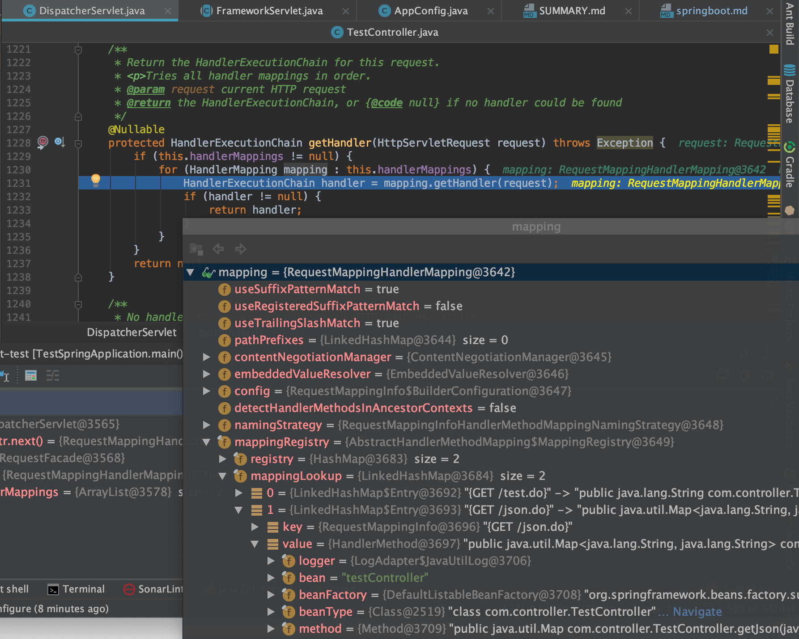

spring mvc中，在 web.xml 文件中配置 url 映射配置，通俗来讲就是请求的 URL 怎么能被 SpringMVC 识别，从而去执行我们编写好的 Handler；Spring boot中加载了`@Controller`下各个Mapping注解bean

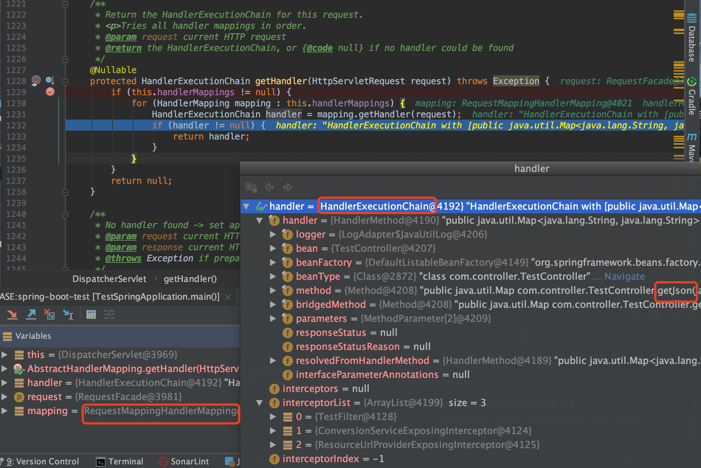

然后

```java
HandlerAdapter ha = getHandlerAdapter(mappedHandler.getHandler());

// Actually invoke the handler.
mv = ha.handle(processedRequest, response, mappedHandler.getHandler());
```

#### RequestMappingHandlerAdapter:`invokeHandlerMethod(request, response, handlerMethod)`完成处理

RequestMappingHandlerAdapter继承的抽象类AbstractHandlerMethodAdapter定义了抽象handle方法，最后会走到`org.springframework.web.servlet.mvc.method.annotation.RequestMappingHandlerAdapter#handleInternal`

```java
public class RequestMappingHandlerAdapter extends AbstractHandlerMethodAdapter
		implements BeanFactoryAware, InitializingBean {
```

request中包括了处理请求的网络连接的tomcat连接器情况

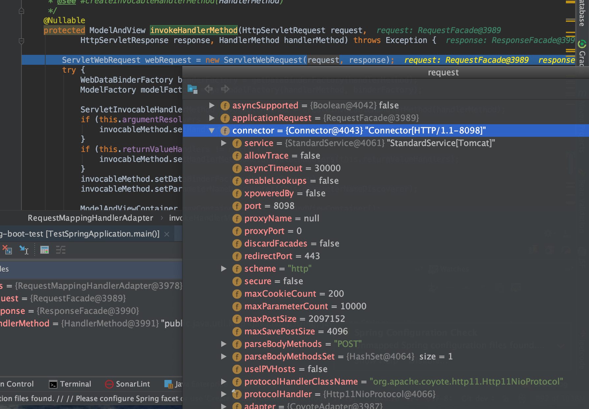

要执行具体的请求业务逻辑，先new出来了一个`ServletInvocableHandlerMethod`

```java
ServletInvocableHandlerMethod invocableMethod = createInvocableHandlerMethod(handlerMethod);
```

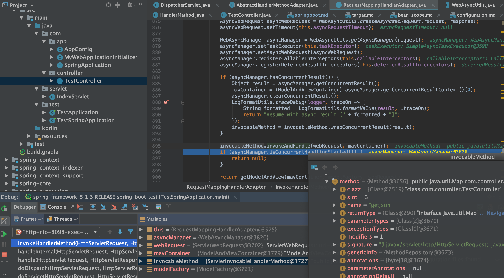

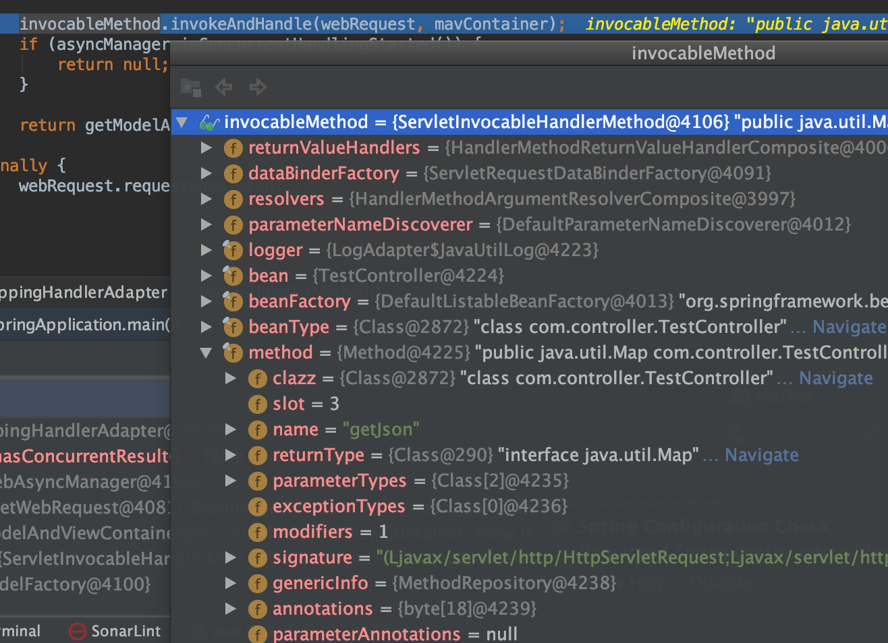

#### 仍然是利用`反射`实现`@RequestMapping`方法的调用

```java
invocableMethod.invokeAndHandle(webRequest, mavContainer);
    org.springframework.web.method.support.InvocableHandlerMethod#invokeForRequest
    
    @Nullable
	public Object invokeForRequest(NativeWebRequest request, @Nullable ModelAndViewContainer mavContainer,
			Object... providedArgs) throws Exception {

		Object[] args = getMethodArgumentValues(request, mavContainer, providedArgs);
		if (logger.isTraceEnabled()) {
			logger.trace("Arguments: " + Arrays.toString(args));
		}
		return doInvoke(args);
	}
```

```java
org.springframework.web.method.support.InvocableHandlerMethod#doInvoke
    getBridgedMethod().invoke(getBean(), args);
```

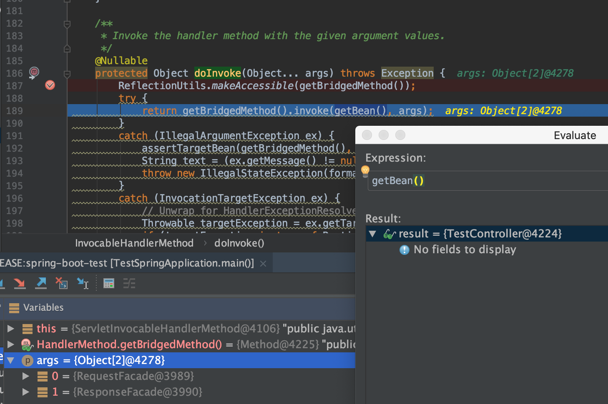

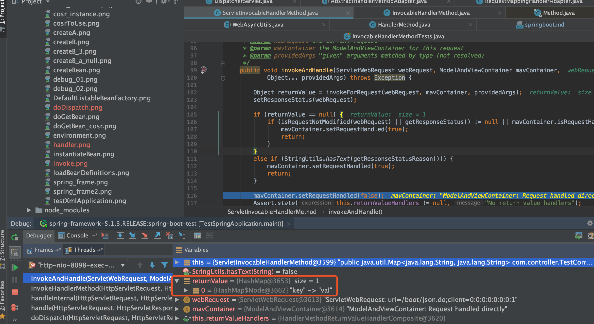

返回结果交给了`returnValueHandlers`

```java
/**
 * Iterate over registered {@link HandlerMethodReturnValueHandler HandlerMethodReturnValueHandlers} and invoke the one that supports it.
 * @throws IllegalStateException if no suitable {@link HandlerMethodReturnValueHandler} is found.
 */
@Override
public void handleReturnValue(@Nullable Object returnValue, MethodParameter returnType,
        ModelAndViewContainer mavContainer, NativeWebRequest webRequest) throws Exception {

    HandlerMethodReturnValueHandler handler = selectHandler(returnValue, returnType);
    if (handler == null) {
        throw new IllegalArgumentException("Unknown return value type: " + returnType.getParameterType().getName());
    }
    handler.handleReturnValue(returnValue, returnType, mavContainer, webRequest);
}
```

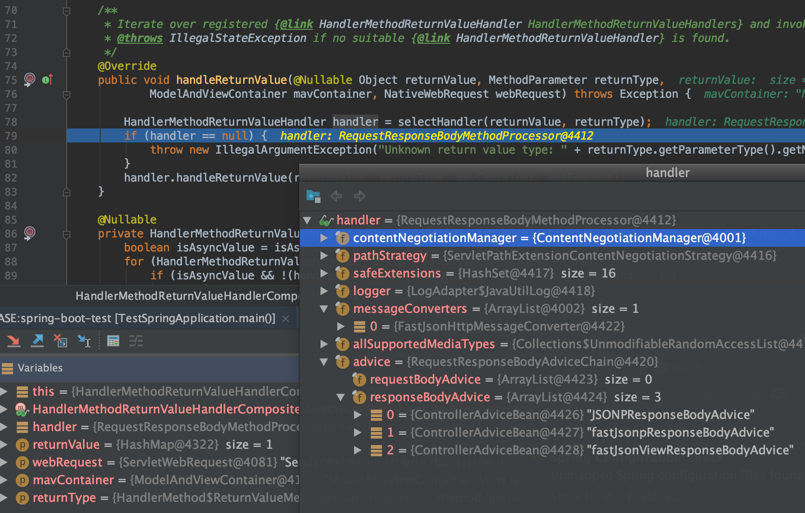

最后仍然是`HTTPServletResponse`处理返回，并应用`Converters`操作

## 附：HandlerInterceptor

Spring MVC提供了Interceptor拦截器机制，类似于Servlet中的Filter过滤器，用于拦截用户的请求并做出相应的处理。比如通过拦截器来进行用户权限验证，或者用来判断用户是否已经登录。Spring MVC拦截器是可插拔式的设计，需要某一功能拦截器，只需在配置文件中应用该拦截器即可；如果不需要这个功能拦截器，只需在配置文件中取消应用该拦截器。

拦截器是 AOP 的一种实现策略，用于在某个方法或字段被访问前对它进行拦截，然后在其之前或之后加上某些操作。同 filter 一样，interceptor 也是链式调用。每个 interceptor 的调用会依据它的声明顺序依次执行。一般来说拦截器可以用于以下方面 ：

* 日志记录 ：几率请求信息的日志，以便进行信息监控、信息统计等等
* 权限检查 ：对用户的访问权限，认证，或授权等进行检查
* 性能监控 ：通过拦截器在进入处理器前后分别记录开始时间和结束时间，从而得到请求的处理时间
* 通用行为 ：读取 cookie 得到用户信息并将用户对象放入请求头中，从而方便后续流程使用

在Spring MVC中定义一个拦截器有两种方法：
  
* 实现HandlerInterceptor接口
* 实现WebRequestInterceptor接口

```java
// 1. 定义拦截器
import org.slf4j.Logger;
import org.slf4j.LoggerFactory;
import org.springframework.web.servlet.HandlerInterceptor;
import org.springframework.web.servlet.ModelAndView;

import javax.servlet.http.HttpServletRequest;
import javax.servlet.http.HttpServletResponse;

public class UrlInterceptor implements HandlerInterceptor {

    private static final Logger logger = LoggerFactory.getLogger(UrlInterceptor.class);

    private static final String GET_ALL = "getAll";
    private static final String GET_HEADER = "getHeader";

    /**
     * 进入Controller层之前拦截请求，默认是拦截所有请求
     * @param httpServletRequest request
     * @param httpServletResponse response
     * @param o object
     * @return 是否拦截当前请求，true表示拦截当前请求，false表示不拦截当前请求
     * @throws Exception 可能出现的异常
     */
    @Override
    public boolean preHandle(HttpServletRequest httpServletRequest, HttpServletResponse httpServletResponse, Object o) throws Exception {
        logger.info("go into preHandle method ... ");
        String requestURI = httpServletRequest.getRequestURI();
        if (requestURI.contains(GET_ALL)) {
            return true;
        }
        if (requestURI.contains(GET_HEADER)) {
            httpServletResponse.sendRedirect("/user/redirect");
        }
        return true;
    }

    /**
     * 处理完请求后但还未渲染试图之前进行的操作
     * @param httpServletRequest request
     * @param httpServletResponse response
     * @param o object
     * @param modelAndView mv
     * @throws Exception E
     */
    @Override
    public void postHandle(HttpServletRequest httpServletRequest, HttpServletResponse httpServletResponse, Object o, ModelAndView modelAndView) throws Exception {
        logger.info("go into postHandle ... ");
    }

    /**
     * 视图渲染后但还未返回到客户端时的操作
     * @param httpServletRequest request
     * @param httpServletResponse response
     * @param o object
     * @param e exception
     * @throws Exception
     */
    @Override
    public void afterCompletion(HttpServletRequest httpServletRequest, HttpServletResponse httpServletResponse, Object o, Exception e) throws Exception {
        logger.info("go into afterCompletion ... ");
    }
}

// 2. 注册拦截器
import com.glodon.tot.interceptor.UrlInterceptor;
import org.springframework.context.annotation.Configuration;
import org.springframework.web.servlet.config.annotation.InterceptorRegistry;
import org.springframework.web.servlet.config.annotation.WebMvcConfigurer;

@Configuration
public class MvcConfig implements WebMvcConfigurer {

    /**
     * 注册配置的拦截器
     * @param registry 拦截器注册器
     */
    @Override
    public void addInterceptors(InterceptorRegistry registry) {
        // 这里的拦截器是new出来的，在Spring框架中可以交给IOC进行依赖注入，直接使用@Autowired注入
        registry.addInterceptor(new UrlInterceptor());
    }

}
```

## Filter过滤器的生命周期

过滤器 Filter，是在 Servlet 规范中定义的，是 Servlet 容器支持的，该接口定义在 javax.servlet包下，主要是在客户端请求(HttpServletRequest)进行预处理，以及对服务器响应(HttpServletResponse)进行后处理。

Filter（过滤器）生命周期各方法执行顺序

1. 服务器启动，首先执行构造方法和init方法（这两个方法只执行一次）
2. 当有匹配过滤条件的请求时执行doFilter方法（该方法可以执行多次）
3. 服务器正常关闭的时候，或者该Filter类重新加载的时候会执行destroy方法（该方法只执行一次）

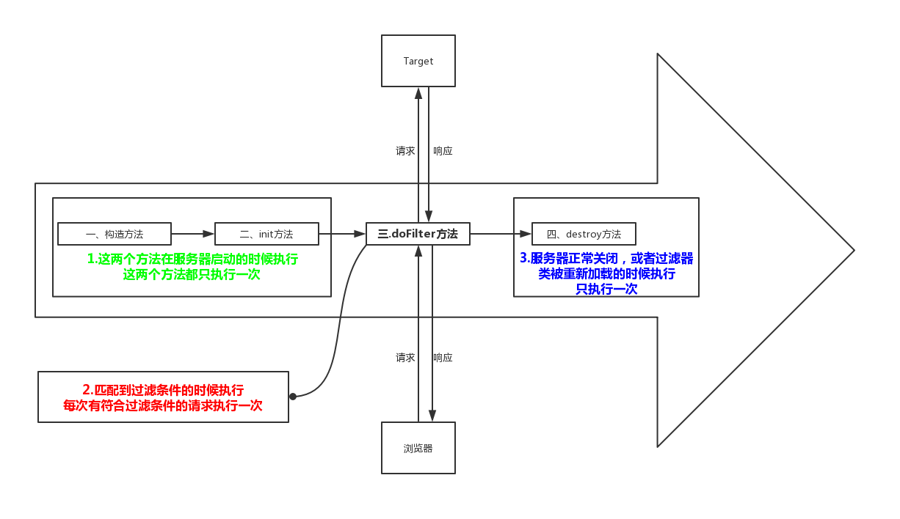

* 当启动服务器时init方法马上执行了（在还没打开网页前已经执行了）
* 在过滤时(网页刷新时)才运行doFilter方法
* 当关掉服务器时执行destroy方法，就是当你点击关闭服务器是，就在执行了，伴随关闭一起执行

## 过滤器 和 拦截器

* 作用域差异：Filter是Servlet规范中规定的，只能用于WEB中，拦截器既可以用于WEB，也可以用于Application、Swing中（即过滤器是依赖于Servlet容器的，和它类似的还有Servlet中的监听器同样依赖该容器，而拦截器则不依赖它）；

* 规范差异：Filter是Servlet规范中定义的，是Servlet容器支持的，而拦截器是Spring容器内的，是Spring框架支持的；

* 资源差异：拦截器是Spring的一个组件，归Spring管理配置在Spring的文件中，可以使用Spring内的任何资源、对象（可以粗浅的认为是IOC容器中的Bean对象），而Filter则不能使用访问这些资源；

* 深度差异：Filter只在Servlet前后起作用，而拦截器可以深入到方法的前后、异常抛出前后等更深层次的程度作处理（这里也在一定程度上论证了拦截器是利用java的反射机制实现的），所以在Spring框架中，优先使用拦截器；