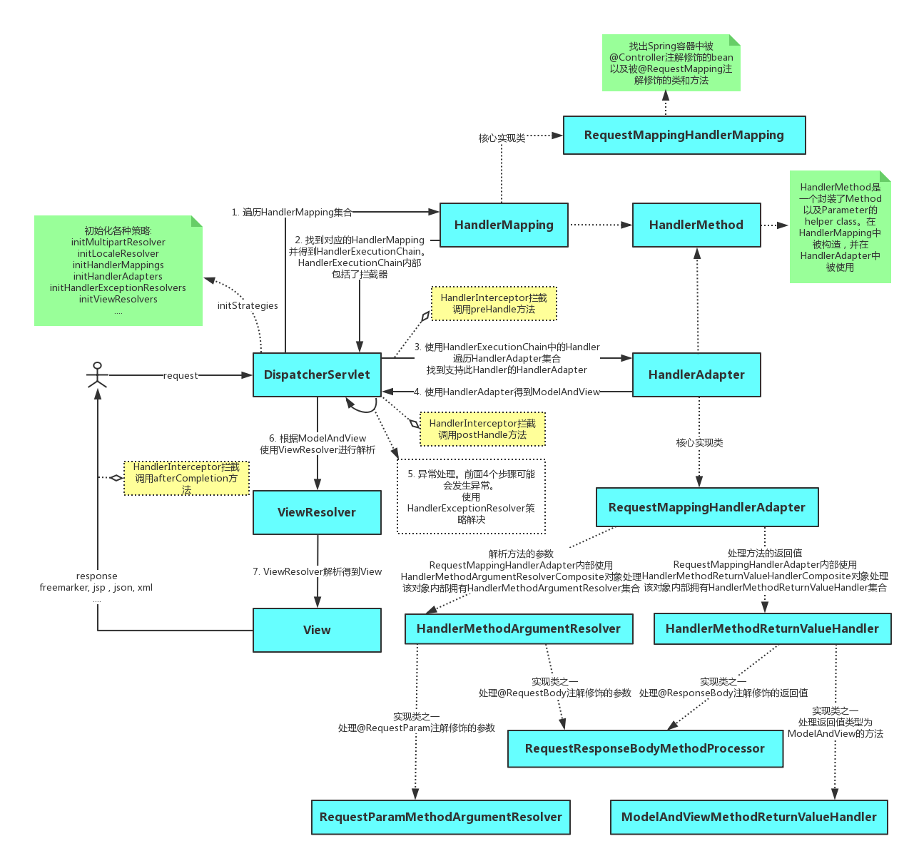

# SpringBoot

<a href="https://docs.spring.io/spring/docs/5.2.8.RELEASE/spring-framework-reference/web.html#spring-web">spring web 官方文档</a>

* 内嵌容器原理

* 零配置

## 请求是怎么由@Controller的方法处理的?

### @Controller处理架构图



### debug打点,访问`http://localhost:8098/boot/json.do`

```java
@Controller
public class TestController {

	private static final Log logger = LogFactory.getLog(TestController.class);

	@GetMapping("/test.do")
	@ResponseBody
	public String test(HttpServletRequest request, HttpServletResponse response){
		String uri = request.getRequestURI();
		logger.info("TestController test");
		return uri;
	}

	@GetMapping("/json.do")
	@ResponseBody
	public Map<String, String> getJson(HttpServletRequest request, HttpServletResponse response){
		Map<String,String> mp = new HashMap<>(2);
		mp.put("key", "val");
		return mp;
	}
}
```

#### 请求统一交给`DispatchServlet`分发处理


#### 从Spring加载好的`HandlerExecutionChain`找到对应的Handler的适配器`HandlerAdapter`处理请求


#### `invokeHandlerMethod(request, response, handlerMethod)`完成处理


#### 仍然是利用`反射`实现`@RequestMapping`方法的调用

debug会走到如下的一行代码,即一个常见jdk的`InvocationHandler`反射调用代码

```java
getBridgedMethod().invoke(getBean(), args);
```


返回结果交给了`returnValueHandlers`

最后仍然是`HTTPServletResponse`处理返回，并应用`Converters`操作
