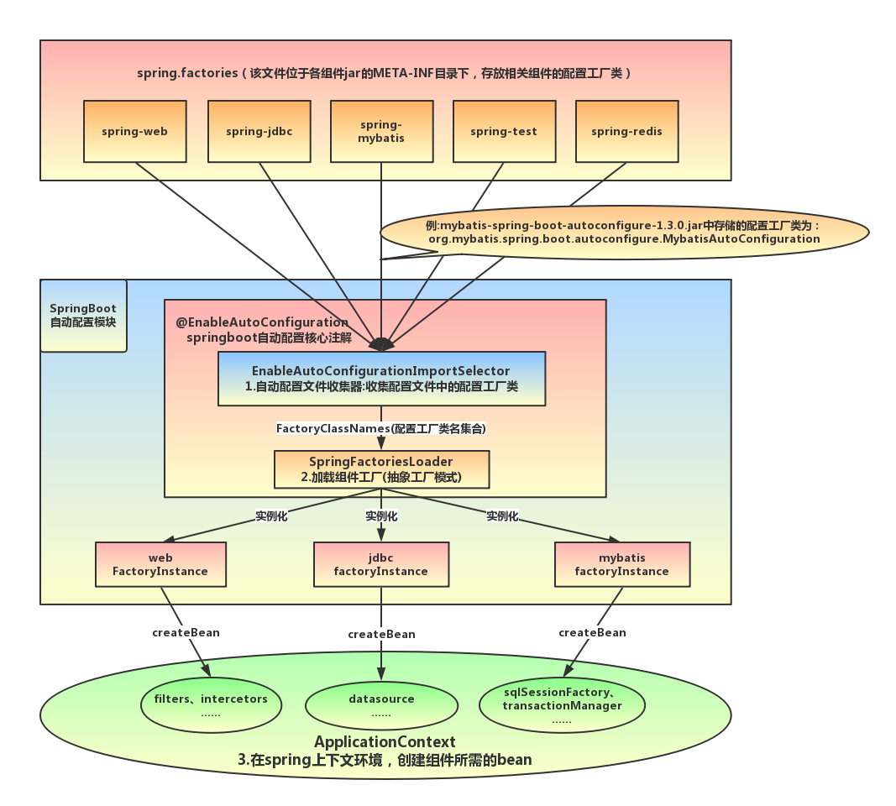
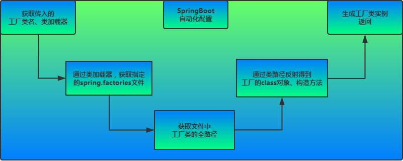
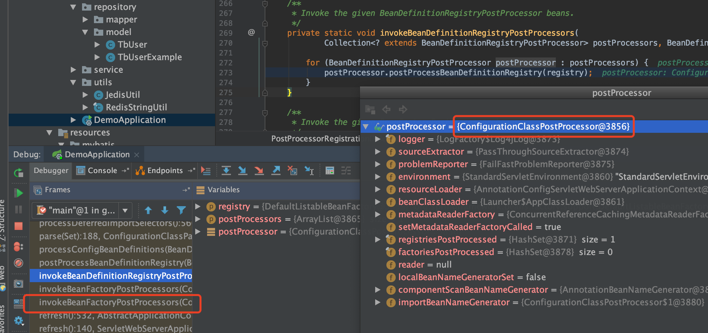
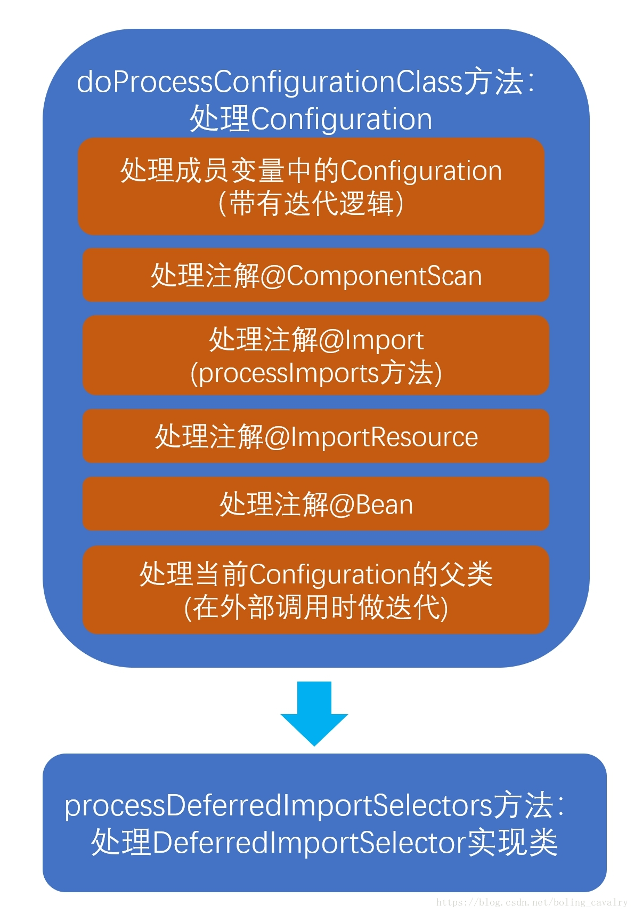
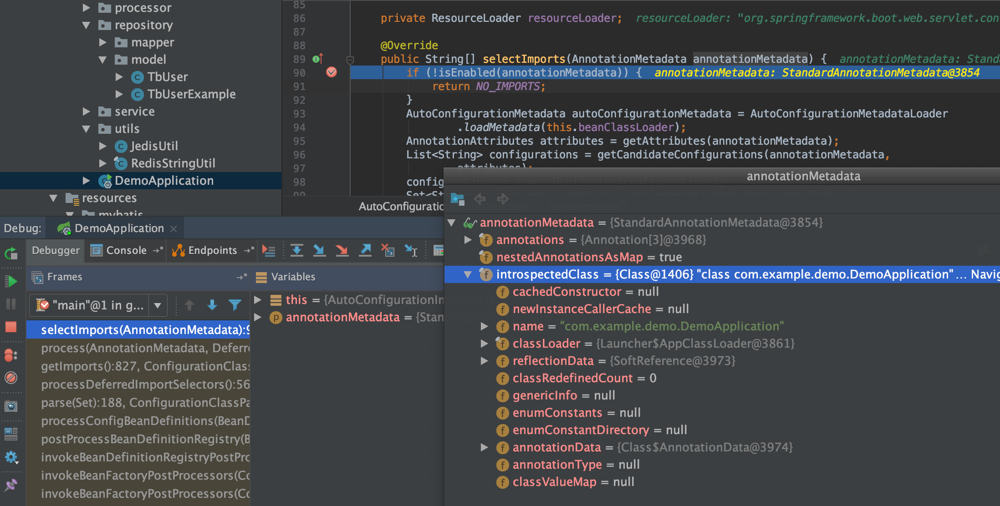
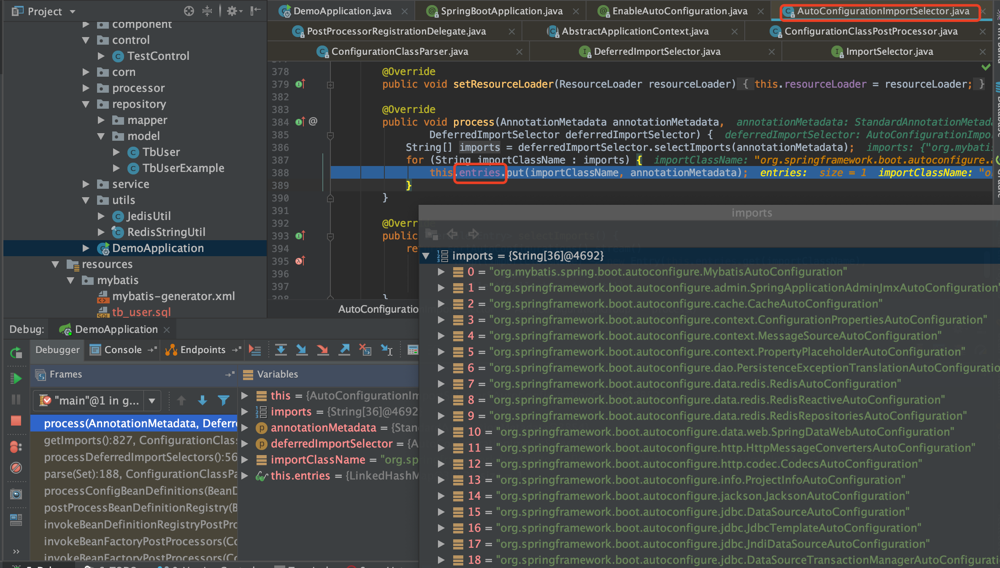
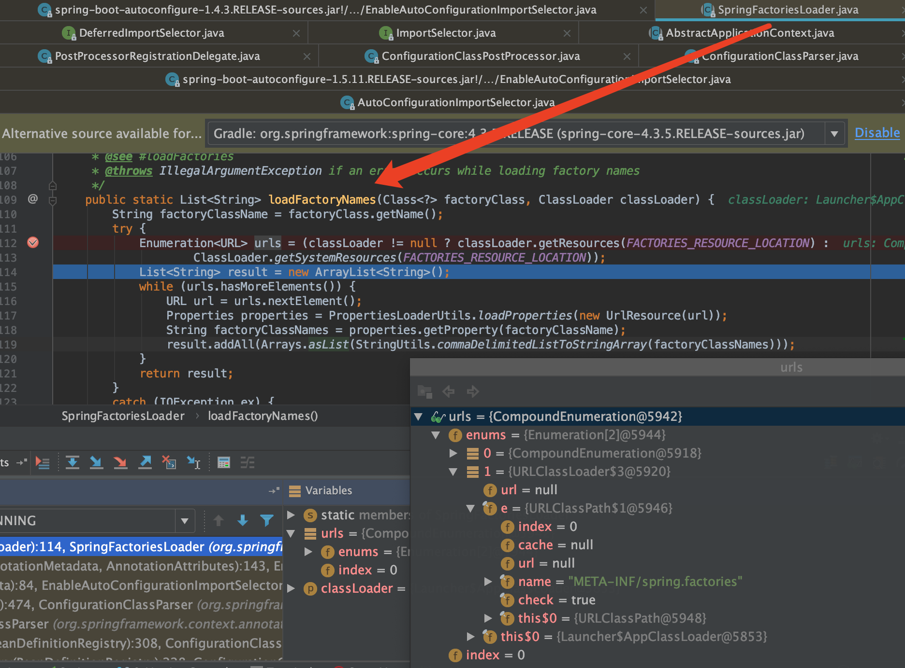
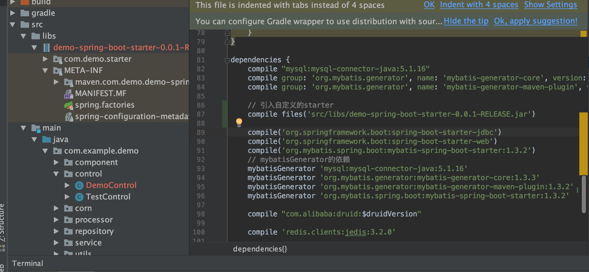

# SpringBoot 启动原理

```java
@SpringBootApplication
@MapperScan("com.example.demo.repository")
@EnableScheduling
public class DemoApplication {

    public static void main(String[] args) {
        SpringApplication.run(DemoApplication.class, args);
    }

}
```

## @SpringBootApplication 注解

* @SpringBootApplication

```java
@Target(ElementType.TYPE)
@Retention(RetentionPolicy.RUNTIME)
@Documented
@Inherited
@SpringBootConfiguration
@EnableAutoConfiguration
@ComponentScan(excludeFilters = {
		@Filter(type = FilterType.CUSTOM, classes = TypeExcludeFilter.class),
		@Filter(type = FilterType.CUSTOM, classes = AutoConfigurationExcludeFilter.class) })
public @interface SpringBootApplication {
```

* @SpringBootConfiguration

```java
@Target(ElementType.TYPE)
@Retention(RetentionPolicy.RUNTIME)
@Documented
@Configuration
public @interface SpringBootConfiguration {

}
```

* @EnableAutoConfiguration

```java
@Target(ElementType.TYPE)
@Retention(RetentionPolicy.RUNTIME)
@Documented
@Inherited
@AutoConfigurationPackage
@Import(AutoConfigurationImportSelector.class)
public @interface EnableAutoConfiguration {
```



`mybatis-spring-boot-starter`、`spring-boot-starter-web`等组件的META-INF文件下均含有`spring.factories`文件，自动配置模块中，SpringFactoriesLoader收集到文件中的类全名并返回一个类全名的数组，返回的类全名通过反射被实例化，就形成了具体的工厂实例，工厂实例来生成组件具体需要的bean。

## 初始化SpringApplication类

1. 加载所有META-INF/spring.factories中的Initializer
2. 加载所有META-INF/spring.factories中的Listener

```java
private void initialize(Object[] sources) {
    if (sources != null && sources.length > 0) {
        this.sources.addAll(Arrays.asList(sources));
    }
    // 根据标志类javax.servlet.Servlet,org.springframework.web.context.ConfigurableWebApplicationContext是否存在，判断是否是web环境
    this.webEnvironment = deduceWebEnvironment();
    // 通过SpringFactoriesLoader，获取到所有META-INF/spring.factories中的ApplicationContextInitializer，并实例化
    setInitializers((Collection) getSpringFactoriesInstances(
            ApplicationContextInitializer.class));
    // 通过SpringFactoriesLoader，获取到所有META-INF/spring.factories中的ApplicationListener，并实例化
    setListeners((Collection) getSpringFactoriesInstances(ApplicationListener.class));
    // 获取执行当前main方法的类，也就是启动类
    this.mainApplicationClass = deduceMainApplicationClass();
}
```



## SpringApplication类的run方法

```java
public ConfigurableApplicationContext run(String... args) {
    // 启动任务执行的时间监听器
    StopWatch stopWatch = new StopWatch();
    stopWatch.start();
    
    ConfigurableApplicationContext context = null;
    FailureAnalyzers analyzers = null;
    // 设置系统java.awt.headless属性，确定是否开启headless模式(默认开启headless模式)
    configureHeadlessProperty();
    // 通过SpringFactoriesLoader，获取到所有META-INF/spring.factories下的SpringApplicationRunListeners并实例化
    SpringApplicationRunListeners listeners = getRunListeners(args);
    // 开始广播启动
    listeners.started();
    try {
        // 创建SpringBoot默认启动参数对象
        ApplicationArguments applicationArguments = new DefaultApplicationArguments(args);
        // 根据启动参数创建并配置Environment(所有有效的配置，如Profile)，并遍历所有的listeners，广播启动环境已准备
        ConfigurableEnvironment environment = prepareEnvironment(listeners,applicationArguments);
        // 打印启动图案
        Banner printedBanner = printBanner(environment);
        // 根据标志类(上面有提到过)，创建对应类型的ApplicationContext
        context = createApplicationContext();
        // 创建异常解析器(当启动失败时，由此解析器处理失败结果)
        analyzers = new FailureAnalyzers(context);
        // 准备Spring上下文环境
        // 在这个方法中，主要完成了以下几件事：
        //  1、设置SpringBoot的环境配置(Environment)
        //  2、注册Spring Bean名称的序列化器BeanNameGenerator，并设置资源加载器ResourceLoader
        //  3、加载ApplicationContextInitializer初始化器，并进行初始化
        //  4、统一将上面的Environment、BeanNameGenerator、ResourceLoader使用默认的Bean注册器进行注册
        prepareContext(context, environment, listeners, applicationArguments,printedBanner);
        // 注册一个关闭Spring容器的钩子
        refreshContext(context);
        // 获取当前所有ApplicationRunner和CommandLineRunner接口的实现类，执行其run方法
        // ApplicationRunner和CommandLineRunner功能基本一样，在Spring容器启动完成时执行，唯一不同的是ApplicationRunner的run方法入参是ApplicationArguments，而CommandLineRunner是String数组
        afterRefresh(context, applicationArguments);
        // 通知所有listener，Spring容器启动完成
        listeners.finished(context, null);
        // 停止时间监听器
        stopWatch.stop();
        if (this.logStartupInfo) {
            new StartupInfoLogger(this.mainApplicationClass).logStarted(getApplicationLog(), stopWatch);
        }
        return context;
    } catch (Throwable ex) {
        // 启动有异常时，调用异常解析器解析异常信息，根据异常级别，判断是否退出Spring容器
        handleRunFailure(context, listeners, analyzers, ex);
        throw new IllegalStateException(ex);
    }
}
```

1. 首先遍历执行所有通过SpringFactoriesLoader，在当前classpath下的META-INF/spring.factories中查找所有可用的SpringApplicationRunListeners并实例化。调用它们的starting()方法，通知这些监听器SpringBoot应用启动。

2. 创建并配置当前SpringBoot应用将要使用的Environment，包括当前有效的PropertySource以及Profile。

3. 遍历调用所有的SpringApplicationRunListeners的environmentPrepared()的方法，通知这些监听器SpringBoot应用的Environment已经完成初始化。

4. 打印SpringBoot应用的banner，SpringApplication的showBanner属性为true时，如果classpath下存在banner.txt文件，则打印其内容，否则打印默认banner。

5. 根据启动时设置的applicationContextClass和在initialize方法设置的webEnvironment，创建对应的applicationContext。

6. 创建异常解析器，用在启动中发生异常的时候进行异常处理(包括记录日志、释放资源等)。

7. 设置SpringBoot的Environment，注册Spring Bean名称的序列化器BeanNameGenerator，并设置资源加载器ResourceLoader，通过SpringFactoriesLoader加载ApplicationContextInitializer初始化器，调用initialize方法，对创建的ApplicationContext进一步初始化。

8. 调用所有的SpringApplicationRunListeners的contextPrepared方法，通知这些Listener当前ApplicationContext已经创建完毕。

9. 最核心的一步，将之前通过@EnableAutoConfiguration获取的所有配置以及其他形式的IoC容器配置加载到已经准备完毕的ApplicationContext。

10. 调用所有的SpringApplicationRunListener的contextLoaded方法，加载准备完毕的ApplicationContext。

11. 调用refreshContext，注册一个关闭Spring容器的钩子ShutdownHook，当程序在停止的时候释放资源（包括：销毁Bean，关闭SpringBean的创建工厂等）
注： 钩子可以在以下几种场景中被调用：
1）程序正常退出
2）使用System.exit()
3）终端使用Ctrl+C触发的中断
4）系统关闭
5）使用Kill pid命令杀死进程

获取当前所有ApplicationRunner和CommandLineRunner接口的实现类，执行其run方法
遍历所有的SpringApplicationRunListener的finished()方法，完成SpringBoot的启动。

## @EnableAutoConfiguration

EnableAutoConfiguration是一个组合注解，用Import把`AutoConfigurationImportSelector`导入容器中，SpringBoot启动的时候会加载所有的selector并执行`selectImports`方法，这个方法会加载META-INF/spring.factories中配置的EnableAutoConfiguration，从而实现加载自动配置

* @EnableAutoConfiguration

```java
@Target(ElementType.TYPE)
@Retention(RetentionPolicy.RUNTIME)
@Documented
@Inherited
@AutoConfigurationPackage
@Import(AutoConfigurationImportSelector.class)
public @interface EnableAutoConfiguration {
```

* AutoConfigurationPackage：内部是采用了@Import，来给容器导入一个Registrar组件

```java
@Target(ElementType.TYPE)
@Retention(RetentionPolicy.RUNTIME)
@Documented
@Inherited
@Import(AutoConfigurationPackages.Registrar.class)
public @interface AutoConfigurationPackage {

}
```

* @AutoConfigurationImportSelector

```java
public class AutoConfigurationImportSelector
		implements DeferredImportSelector, BeanClassLoaderAware, ResourceLoaderAware,
		BeanFactoryAware, EnvironmentAware, Ordered {
```

`AutoConfigurationImportSelector`实现了`ImportSelector`(选择器)和`BeanClassLoaderAware`(bean类加载器中间件)

### ImportSelector

在使用@Import注解来注册bean的时候，Import注解的值可以是ImportSelector或者DeferredImportSelector的实现类，spring容器会实例化这个实现类，并执行其selectImports方法

spring refresh 12 个方法中的`invokeBeanFactoryPostProcessors(beanFactory);`会执行`ConfigurationClassPostProcessor`的`processConfigBeanDefinitions`方法



@Configguration对@ImportResource、@Bean等注解处理之后，会走到`selectImports`方法处理



## ImportSelector 的 selectImports 方法



其中`List<String> configurations = this.getCandidateConfigurations(annotationMetadata, attributes);`

```java
/**
 * Return the auto-configuration class names that should be considered. By default
 * this method will load candidates using {@link SpringFactoriesLoader} with
 * {@link #getSpringFactoriesLoaderFactoryClass()}.
 * @param metadata the source metadata
 * @param attributes the {@link #getAttributes(AnnotationMetadata) annotation
 * attributes}
 * @return a list of candidate configurations
 */
protected List<String> getCandidateConfigurations(AnnotationMetadata metadata,
        AnnotationAttributes attributes) {
    List<String> configurations = SpringFactoriesLoader.loadFactoryNames(
            getSpringFactoriesLoaderFactoryClass(), getBeanClassLoader());
    Assert.notEmpty(configurations,
            "No auto configuration classes found in META-INF/spring.factories. If you "
                    + "are using a custom packaging, make sure that file is correct.");
    return configurations;
}
```

使用SpringFactoryLoader，读取`META-INF/spring.factories`文件里所配置的EnableAutoConfiguration。经过exclude和filter等操作，最终确定要装配的类

```java
/**
 * Load the fully qualified class names of factory implementations of the
 * given type from {@value #FACTORIES_RESOURCE_LOCATION}, using the given
 * class loader.
 * @param factoryClass the interface or abstract class representing the factory
 * @param classLoader the ClassLoader to use for loading resources; can be
 * {@code null} to use the default
 * @see #loadFactories
 * @throws IllegalArgumentException if an error occurs while loading factory names
 */
public static List<String> loadFactoryNames(Class<?> factoryClass, @Nullable ClassLoader classLoader) {
    String factoryClassName = factoryClass.getName();
    return loadSpringFactories(classLoader).getOrDefault(factoryClassName, Collections.emptyList());
}

private static Map<String, List<String>> loadSpringFactories(@Nullable ClassLoader classLoader) {
    MultiValueMap<String, String> result = cache.get(classLoader);
    if (result != null) {
        return result;
    }

    try {
        Enumeration<URL> urls = (classLoader != null ?
                classLoader.getResources(FACTORIES_RESOURCE_LOCATION) :
                ClassLoader.getSystemResources(FACTORIES_RESOURCE_LOCATION));
        result = new LinkedMultiValueMap<>();
        while (urls.hasMoreElements()) {
            URL url = urls.nextElement();
            UrlResource resource = new UrlResource(url);
            Properties properties = PropertiesLoaderUtils.loadProperties(resource);
            for (Map.Entry<?, ?> entry : properties.entrySet()) {
                List<String> factoryClassNames = Arrays.asList(
                        StringUtils.commaDelimitedListToStringArray((String) entry.getValue()));
                result.addAll((String) entry.getKey(), factoryClassNames);
            }
        }
        cache.put(classLoader, result);
        return result;
    }
    catch (IOException ex) {
        throw new IllegalArgumentException("Unable to load factories from location [" +
                FACTORIES_RESOURCE_LOCATION + "]", ex);
    }
}
```



### 执行调用栈 & SpringFactoriesLoader

```java
selectImports(AnnotationMetadata):79, EnableAutoConfigurationImportSelector (org.springframework.boot.autoconfigure), EnableAutoConfigurationImportSelector.java
processDeferredImportSelectors():474, ConfigurationClassParser (org.springframework.context.annotation), ConfigurationClassParser.java
parse(Set):184, ConfigurationClassParser (org.springframework.context.annotation), ConfigurationClassParser.java
processConfigBeanDefinitions(BeanDefinitionRegistry):308, ConfigurationClassPostProcessor (org.springframework.context.annotation), ConfigurationClassPostProcessor.java
postProcessBeanDefinitionRegistry(BeanDefinitionRegistry):228, ConfigurationClassPostProcessor (org.springframework.context.annotation), ConfigurationClassPostProcessor.java
invokeBeanDefinitionRegistryPostProcessors(Collection, BeanDefinitionRegistry):270, PostProcessorRegistrationDelegate (org.springframework.context.support), PostProcessorRegistrationDelegate.java
invokeBeanFactoryPostProcessors(ConfigurableListableBeanFactory, List):93, PostProcessorRegistrationDelegate (org.springframework.context.support), PostProcessorRegistrationDelegate.java
invokeBeanFactoryPostProcessors(ConfigurableListableBeanFactory):686, AbstractApplicationContext (org.springframework.context.support), AbstractApplicationContext.java
refresh():524, AbstractApplicationContext (org.springframework.context.support), AbstractApplicationContext.java
refresh():122, EmbeddedWebApplicationContext (org.springframework.boot.context.embedded), EmbeddedWebApplicationContext.java
refresh(ApplicationContext):761, SpringApplication (org.springframework.boot), SpringApplication.java
refreshContext(ConfigurableApplicationContext):371, SpringApplication (org.springframework.boot), SpringApplication.java
run(String[]):315, SpringApplication (org.springframework.boot), SpringApplication.java
run(Object[], String[]):1186, SpringApplication (org.springframework.boot), SpringApplication.java
run(Object, String[]):1175, SpringApplication (org.springframework.boot), SpringApplication.java
main(String[]):32, DruidManagerApplication (com.pinduoduo.bigdata.druid.manager.api), DruidManagerApplication.java
```

Spring应用启动过程中会执行`ConfigurationClassPostProcessor`,在使用`ConfigurationClassParser`分析配置类时，如果发现注解中存在`@Import(ImportSelector)`的情况，就会创建一个相应的ImportSelector对象， 并调用其方法`public String[] selectImports(AnnotationMetadata annotationMetadata)`。

使用`SpringFactoriesLoader`从`META-INF/spring.factories`提取要加载的Bean



Spring的SpringFactoriesLoader工厂的加载机制类似java提供的SPI机制一样，是Spring提供的一种加载方式。只需要在classpath路径下新建一个文件META-INF/spring.factories，并在里面按照properties格式填写好接口和实现类即可通过SpringFactoriesLoader来实例化相应的Bean。其中key可以是接口、注解、或者抽象类的全名。value为相应的实现类，当存在多个实现类时，用","进行分割。

## starter

SpringBoot将所有的常见开发功能，分成了一个个场景启动器（starter），这样我们需要开发什么功能，就导入什么场景启动器依赖即可，eg：

* 需要开发web的功能，那么引入spring-boot-starter-web
* 需要开发模板页的功能，那么引入spring-boot-starter-thymeleaf
* 需要整合redis，那么引入spring-boot-starter-data-redis
* 需要整合amqp，实现异步消息通信机制，那么引入spring-boot-starter-amqp

### 自定义starter



* /META-INF/spring.factories

```java
#-------starter自动装配---------
org.springframework.boot.autoconfigure.EnableAutoConfiguration=com.demo.starter.config.DemoConfig
```

```java
@RestController
public class DemoControl {

    @Resource(name = "demo")
    private DemoService demoService;

    @GetMapping("/say")
    public String sayWhat() {
        return demoService.say();
    }

}
```


