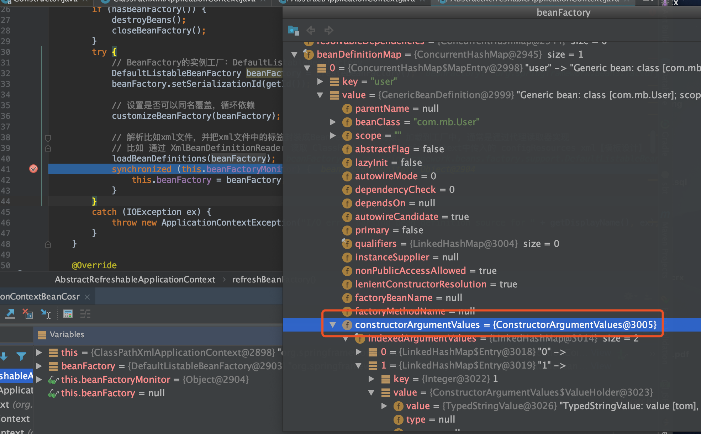
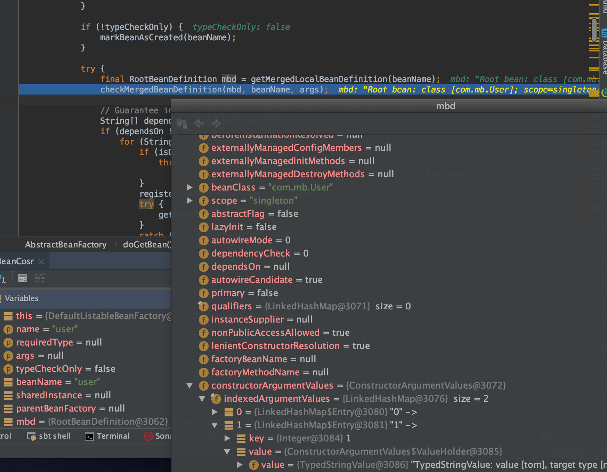
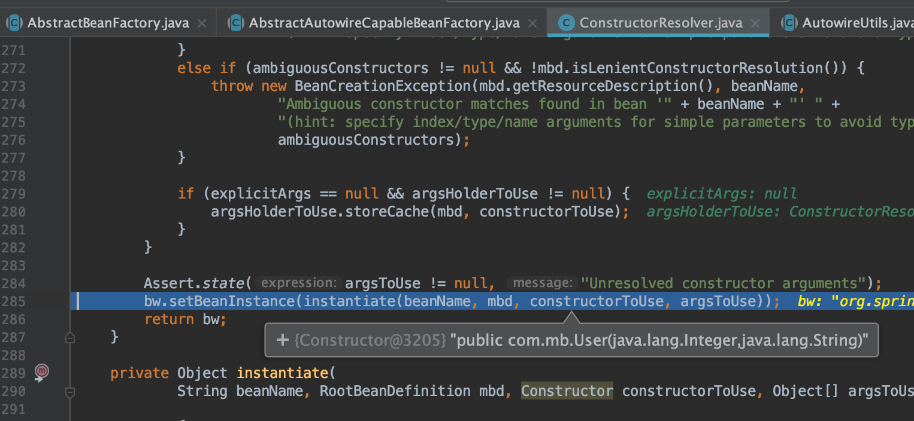
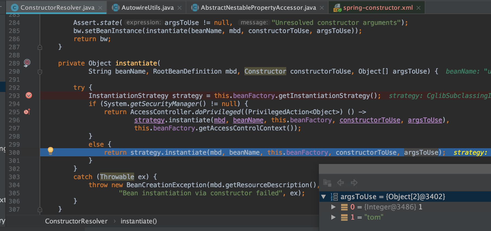
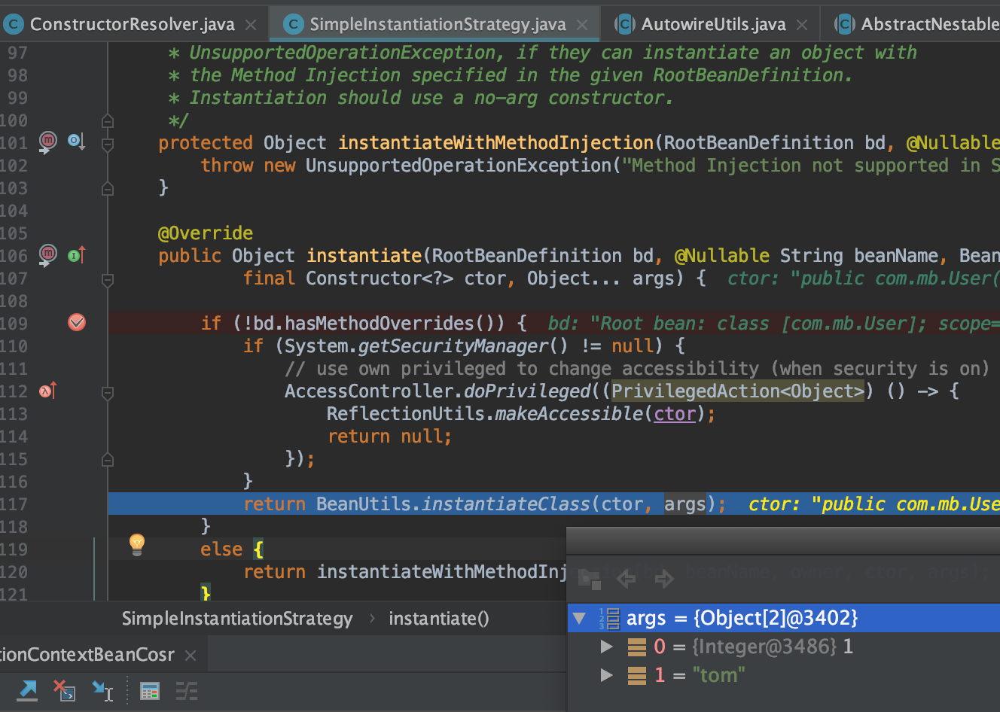

# bean & `constructor-arg`

* 主要说下跟默认构造函数构造bean的区别之处

## 测试代码&xml

* code

见：`spring-framework-5.1.3.RELEASE/spring-context/src/test/java/test/com/mb/BeanTest.java`

```java
@Test
public void testClassPathXmlApplicationContextBean() {
	ClassPathXmlApplicationContext applicationContext =
			new ClassPathXmlApplicationContext("spring.xml");
	User user = (User) applicationContext.getBean("user");
	Assert.assertTrue(user != null);
	Assert.assertTrue(user.getTestStr().equals("testStr"));
}
```

* spring.xml

```xml
<?xml version="1.0" encoding="UTF-8"?>
<beans xmlns="http://www.springframework.org/schema/beans"
	   xmlns:xsi="http://www.w3.org/2001/XMLSchema-instance"
	   xsi:schemaLocation="http://www.springframework.org/schema/beans https://www.springframework.org/schema/beans/spring-beans-3.0.xsd">

	<bean id="user" class="com.mb.User">
		<constructor-arg index="0" value="1"/>
		<constructor-arg index="1" value="tom"/>
	</bean>

</beans>
```

## 流程关键点说明

### 构造BeanFactory(`loadBeanDefinitions(beanFactory)`会加载好构造参数)



### `doGetBean`方法读取`BeanDefinition`会读取到构造参数



### 在构造的时候会根据beanDefinition选择构造方法



### 最后使用`BeanUtils`实例化的时候会带上参数



