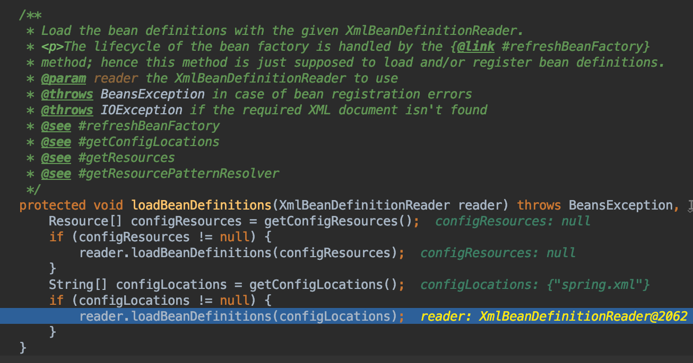
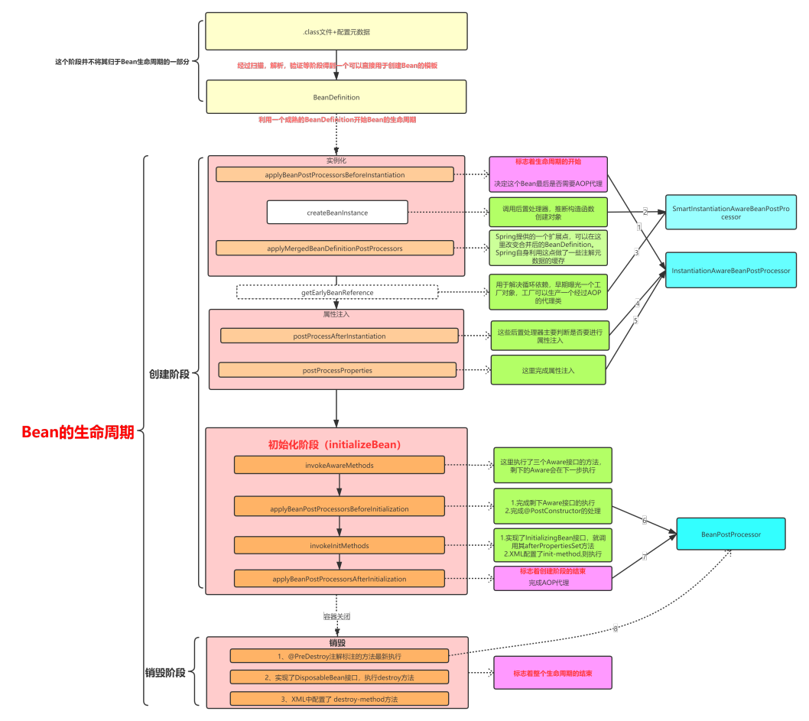

# `ClassPathXmlApplicationContext` & `getBean`

##  ClassPathXmlApplicationContext构造函数执行

附`ClassPathXmlApplicationContext`类的UML


* 测试例子使用的构造函数

```java
public ClassPathXmlApplicationContext(
		String[] configLocations, boolean refresh, @Nullable ApplicationContext parent)
		throws BeansException {

	super(parent);
	// 设置`this.configLocations`
	setConfigLocations(configLocations);
	if (refresh) {
		// 这里refresh为true（重点方法）
		// 这里使用了父类`AbstractApplicationContext`的`refresh`方法
		refresh();
	}
}
```

### 设置`Environment`环境变量和`configLocations`


### `AbstractApplicationContext`的`refresh`方法

* refresh方法概述了Ioc容器的处理流程

```java
@Override
public void refresh() throws BeansException, IllegalStateException {
	synchronized (this.startupShutdownMonitor) {
		// Prepare this context for refreshing.
		prepareRefresh();

        // 从配置文件就会解析成一个个 Bean 定义，注册到 BeanFactory 中，
        // 当然，这里说的 Bean 还没有初始化，只是配置信息都提取出来了，
        // 注册也只是将这些信息都保存到了注册中心(说到底核心是一个 beanName-> beanDefinition 的 map)
		// Tell the subclass to refresh the internal bean factory.
		ConfigurableListableBeanFactory beanFactory = obtainFreshBeanFactory();

		// Prepare the bean factory for use in this context.
		prepareBeanFactory(beanFactory);

		// 先看try里面做了哪些事情(读别的源码也一样，先主后次)
		try {
			// Allows post-processing of the bean factory in context subclasses.
			postProcessBeanFactory(beanFactory);

			// 执行程序员提供的BeanFactoryPostProcessor
			// 扫描类（当然@Configuration全注解类是直接先注册的，再根据这个@Configuration类完成扫描）
			// 此方法执行完成后，beanDefinitionMap就有了
			// Invoke factory processors registered as beans in the context.
			invokeBeanFactoryPostProcessors(beanFactory);

			// Register bean processors that intercept bean creation.
			registerBeanPostProcessors(beanFactory);

			// Initialize message source for this context.
			initMessageSource();

			// Initialize event multicaster for this context.
			initApplicationEventMulticaster();

			// Initialize other special beans in specific context subclasses.
			onRefresh();

			// Check for listener beans and register them.
			registerListeners();

			// Instantiate all remaining (non-lazy-init) singletons.
			// 单例bean的实例化（走单例bean的生命周期）
			finishBeanFactoryInitialization(beanFactory);

			// Last step: publish corresponding event.
			finishRefresh();
		}

		catch (BeansException ex) {
			if (logger.isWarnEnabled()) {
				logger.warn("Exception encountered during context initialization - " +
						"cancelling refresh attempt: " + ex);
			}

			// Destroy already created singletons to avoid dangling resources.
			destroyBeans();

			// Reset 'active' flag.
			cancelRefresh(ex);

			// Propagate exception to caller.
			throw ex;
		}

		finally {
			// Reset common introspection caches in Spring's core, since we
			// might not ever need metadata for singleton beans anymore...
			resetCommonCaches();
		}
	}
}
```

#### prepareRefresh()先跳过

#### BeanFactory构造

构造生成`ConfigurableListableBeanFactory`类型的`BeanFactory`

refresh方法中构造beanFactory具体是`DefaultListableBeanFactory`(即注解方式所谓的BeanFactory就是`DefaultListableBeanFactory`)，调用了抽象类`AbstractRefreshableApplicationContext`的`refreshBeanFactory`方法

```java
@Override
protected final void refreshBeanFactory() throws BeansException {
    // 如果BeanFactory不为空，则清除BeanFactory里面的实例，并销毁BeanFactory
    if (hasBeanFactory()) {
        destroyBeans();
        closeBeanFactory();
    }
    try {
        // BeanFactory的实例工厂：DefaultListableBeanFactory
        DefaultListableBeanFactory beanFactory = createBeanFactory();
        beanFactory.setSerializationId(getId());

        // 设置是否可以同名覆盖，循环依赖
        customizeBeanFactory(beanFactory);

        // 解析比如xml文件，并把xml文件中的标签封装成BeanDefinition对象，加载到工厂中, 通常是通过代理读取器实现
        // 比如 通过 XmlBeanDefinitionReader 读取 ClassPathXmlApplicationContext中传入的 configResources xml【模板设计】
        loadBeanDefinitions(beanFactory);
        synchronized (this.beanFactoryMonitor) {
            this.beanFactory = beanFactory;
        }
    }
    catch (IOException ex) {
        throw new ApplicationContextException("I/O error parsing bean definition source for " + getDisplayName(), ex);
    }
}
```

##### 抽象类`AbstractXmlApplicationContext`的`loadBeanDefinitions`方法

BeanFactory实例工厂完成解析xml文件中的Bean并封装成`BeanDefinition`加载到工厂中



* `DefaultListableBeanFactory`存储了BeanDefinition

```java
/** Map of bean definition objects, keyed by bean name. */
	private final Map<String, BeanDefinition> beanDefinitionMap = new ConcurrentHashMap<>(256);
```


* 附`DefaultListableBeanFactory`UML（`DefaultListableBeanFactory`就是一个独立的Ioc容器）


* 有了beanFactory,要使用之，还要做各种工作，回到refresh方法


##### prepareBeanFactory(beanFactory)

```java
/**
	* Configure the factory's standard context characteristics,
	* such as the context's ClassLoader and post-processors.
	* @param beanFactory the BeanFactory to configure
	*/
protected void prepareBeanFactory(ConfigurableListableBeanFactory beanFactory) {
	// 设置类加载器（要实例化bean,就需要类加载器）
	// Tell the internal bean factory to use the context's class loader etc.
	beanFactory.setBeanClassLoader(getClassLoader());
	// 设置EL表达式解析器（Bean初始化完成后填充属性时会用到）
	beanFactory.setBeanExpressionResolver(new StandardBeanExpressionResolver(beanFactory.getBeanClassLoader()));
	// 设置属性注册解析器PropertyEditor
	beanFactory.addPropertyEditorRegistrar(new ResourceEditorRegistrar(this, getEnvironment()));

	// Configure the bean factory with context callbacks.
	beanFactory.addBeanPostProcessor(new ApplicationContextAwareProcessor(this));
	beanFactory.ignoreDependencyInterface(EnvironmentAware.class);
	beanFactory.ignoreDependencyInterface(EmbeddedValueResolverAware.class);
	beanFactory.ignoreDependencyInterface(ResourceLoaderAware.class);
	beanFactory.ignoreDependencyInterface(ApplicationEventPublisherAware.class);
	beanFactory.ignoreDependencyInterface(MessageSourceAware.class);
	beanFactory.ignoreDependencyInterface(ApplicationContextAware.class);

	// BeanFactory interface not registered as resolvable type in a plain factory.
	// MessageSource registered (and found for autowiring) as a bean.
	beanFactory.registerResolvableDependency(BeanFactory.class, beanFactory);
	beanFactory.registerResolvableDependency(ResourceLoader.class, this);
	beanFactory.registerResolvableDependency(ApplicationEventPublisher.class, this);
	beanFactory.registerResolvableDependency(ApplicationContext.class, this);

	// Register early post-processor for detecting inner beans as ApplicationListeners.
	beanFactory.addBeanPostProcessor(new ApplicationListenerDetector(this));

	// Detect a LoadTimeWeaver and prepare for weaving, if found.
	if (beanFactory.containsBean(LOAD_TIME_WEAVER_BEAN_NAME)) {
		beanFactory.addBeanPostProcessor(new LoadTimeWeaverAwareProcessor(beanFactory));
		// Set a temporary ClassLoader for type matching.
		beanFactory.setTempClassLoader(new ContextTypeMatchClassLoader(beanFactory.getBeanClassLoader()));
	}

	// 注册各种系统环境的bean组件（environment，systemProperties，systemEnvironment）
	// Register default environment beans.
	if (!beanFactory.containsLocalBean(ENVIRONMENT_BEAN_NAME)) {
		beanFactory.registerSingleton(ENVIRONMENT_BEAN_NAME, getEnvironment());
	}
	if (!beanFactory.containsLocalBean(SYSTEM_PROPERTIES_BEAN_NAME)) {
		beanFactory.registerSingleton(SYSTEM_PROPERTIES_BEAN_NAME, getEnvironment().getSystemProperties());
	}
	if (!beanFactory.containsLocalBean(SYSTEM_ENVIRONMENT_BEAN_NAME)) {
		beanFactory.registerSingleton(SYSTEM_ENVIRONMENT_BEAN_NAME, getEnvironment().getSystemEnvironment());
	}
}
```

##### postProcessBeanFactory(beanFactory的postProcessor)

在所有的BeanDefinition加载完成之后，bean实例化之前执行

```java
/**
* Modify the application context's internal bean factory after its standard
* initialization. All bean definitions will have been loaded, but no beans
* will have been instantiated yet. This allows for registering special
* BeanPostProcessors etc in certain ApplicationContext implementations.
* @param beanFactory the bean factory used by the application context
*/
protected void postProcessBeanFactory(ConfigurableListableBeanFactory beanFactory) {
}
```

// TODO 测试

* `invokeBeanFactoryPostProcessors(beanFactory)`

```java
/**
	* Instantiate and invoke all registered BeanFactoryPostProcessor beans,
	* respecting explicit order if given.
	* <p>Must be called before singleton instantiation.
	*/
protected void invokeBeanFactoryPostProcessors(ConfigurableListableBeanFactory beanFactory) {
	// 1.getBeanFactoryPostProcessors(): 拿到当前应用上下文beanFactoryPostProcessors变量中的值
	// 2.invokeBeanFactoryPostProcessors: 实例化并调用所有已注册的BeanFactoryPostProcessor
	PostProcessorRegistrationDelegate.invokeBeanFactoryPostProcessors(beanFactory, getBeanFactoryPostProcessors());

	// Detect a LoadTimeWeaver and prepare for weaving, if found in the meantime
	// (e.g. through an @Bean method registered by ConfigurationClassPostProcessor)
	if (beanFactory.getTempClassLoader() == null && beanFactory.containsBean(LOAD_TIME_WEAVER_BEAN_NAME)) {
		beanFactory.addBeanPostProcessor(new LoadTimeWeaverAwareProcessor(beanFactory));
		beanFactory.setTempClassLoader(new ContextTypeMatchClassLoader(beanFactory.getBeanClassLoader()));
	}
}
```

#### registerBeanPostProcessors((bean的postProcessor))

```java
/**
	* Instantiate and invoke all registered BeanPostProcessor beans,
	* respecting explicit order if given.
	* <p>Must be called before any instantiation of application beans.
	*/
protected void registerBeanPostProcessors(ConfigurableListableBeanFactory beanFactory) {
	PostProcessorRegistrationDelegate.registerBeanPostProcessors(beanFactory, this);
}
```

注册前的`BeanPostProcessor`:
* ApplicationContextAwareProcessor
* ApplicationListenerDetector

且之前已经将所有BeanDefinition加入到BeanDefinitionMap中了(之前已经应用了`BeanDefinitionRegistryPostProcessor`和`BeanFactoryPostProcessor`了)

BeanPostProcessor是可以有优先级顺序的，注册的时候也是按照顺序；没有顺序，就是常规的`BeanPostProcessor`

```java
// Now, register all regular BeanPostProcessors.
List<BeanPostProcessor> nonOrderedPostProcessors = new ArrayList<>();
for (String ppName : nonOrderedPostProcessorNames) {
    BeanPostProcessor pp = beanFactory.getBean(ppName, BeanPostProcessor.class);
    nonOrderedPostProcessors.add(pp);
    if (pp instanceof MergedBeanDefinitionPostProcessor) {
        internalPostProcessors.add(pp);
    }
}
registerBeanPostProcessors(beanFactory, nonOrderedPostProcessors);
```

可以看到是直接`beanFactory.getBean`将这些BeanPostProcessor给实例化出来，注册后

```java
FullLifeInstantiationAwareBeanPostProcessor implements InstantiationAwareBeanPostProcessor
FullLifeBeanPostProcessor implements BeanPostProcessor
FullLifeMergedBeanDefinitionPostProcessor implements MergedBeanDefinitionPostProcessor 
```

#### initMessageSource & initApplicationEventMulticaster(消息和广播初始化)

```java
// Initialize message source for this context.
initMessageSource();

// Initialize event multicaster for this context.
initApplicationEventMulticaster();
```

消息处理 & 事件监听

* Initialize other special beans in specific context subclasses. `onRefresh()`

```java
/**
* Template method which can be overridden to add context-specific refresh work.
* Called on initialization of special beans, before instantiation of singletons.
* <p>This implementation is empty.
* @throws BeansException in case of errors
* @see #refresh()
*/
protected void onRefresh() throws BeansException {
	// For subclasses: do nothing by default.
}
```

#### `registerListeners()`（注册监听器）

```java
/**
	* Add beans that implement ApplicationListener as listeners.
	* Doesn't affect other listeners, which can be added without being beans.
	*/
protected void registerListeners() {
	// 注册特殊的监听器
	// Register statically specified listeners first.
	for (ApplicationListener<?> listener : getApplicationListeners()) {
		getApplicationEventMulticaster().addApplicationListener(listener);
	}

	// 取到所有监听器的名称，设置到上文初始化的广播器
	// Do not initialize FactoryBeans here: We need to leave all regular beans
	// uninitialized to let post-processors apply to them!
	String[] listenerBeanNames = getBeanNamesForType(ApplicationListener.class, true, false);
	for (String listenerBeanName : listenerBeanNames) {
		getApplicationEventMulticaster().addApplicationListenerBean(listenerBeanName);
	}

	// 如果存在早期应用事件，发布
	// Publish early application events now that we finally have a multicaster...
	Set<ApplicationEvent> earlyEventsToProcess = this.earlyApplicationEvents;
	this.earlyApplicationEvents = null;
	if (earlyEventsToProcess != null) {
		for (ApplicationEvent earlyEvent : earlyEventsToProcess) {
			getApplicationEventMulticaster().multicastEvent(earlyEvent);
		}
	}
}
```

#### `finishBeanFactoryInitialization(beanFactory)`（实例化操作）

创建所有非懒加载的单例类（并invoke BeanPostProcessors）

Bean循环依赖，AOP，生命周期回调等

##### 抽象类`AbstractAutowireCapableBeanFactory`的`doCreateBean`方法

```java
/**
 * Actually create the specified bean. Pre-creation processing has already happened
 * at this point, e.g. checking {@code postProcessBeforeInstantiation} callbacks.
 * <p>Differentiates between default bean instantiation, use of a
 * factory method, and autowiring a constructor.
 * @param beanName the name of the bean
 * @param mbd the merged bean definition for the bean
 * @param args explicit arguments to use for constructor or factory method invocation
 * @return a new instance of the bean
 * @throws BeanCreationException if the bean could not be created
 * @see #instantiateBean
 * @see #instantiateUsingFactoryMethod
 * @see #autowireConstructor
 */
protected Object doCreateBean(final String beanName, final RootBeanDefinition mbd, final @Nullable Object[] args)
        throws BeanCreationException {
```


##### 抽象类`AbstractAutowireCapableBeanFactory`的`createBeanInstance`方法

```java
/**
 * Create a new instance for the specified bean, using an appropriate instantiation strategy:
 * factory method, constructor autowiring, or simple instantiation.
 * @param beanName the name of the bean
 * @param mbd the bean definition for the bean
 * @param args explicit arguments to use for constructor or factory method invocation
 * @return a BeanWrapper for the new instance
 * @see #obtainFromSupplier
 * @see #instantiateUsingFactoryMethod
 * @see #autowireConstructor
 * @see #instantiateBean
 */
protected BeanWrapper createBeanInstance(String beanName, RootBeanDefinition mbd, @Nullable Object[] args) {
```

###### 本例使用了无参的构造器`return instantiateBean(beanName, mbd);`


```java
/**
 * Instantiate the given bean using its default constructor.
 * @param beanName the name of the bean
 * @param mbd the bean definition for the bean
 * @return a BeanWrapper for the new instance
 */
protected BeanWrapper instantiateBean(final String beanName, final RootBeanDefinition mbd) {
    try {
        Object beanInstance;
        final BeanFactory parent = this;
        if (System.getSecurityManager() != null) {
            beanInstance = AccessController.doPrivileged((PrivilegedAction<Object>) () ->
                    getInstantiationStrategy().instantiate(mbd, beanName, parent),
                    getAccessControlContext());
        }
        else {
            beanInstance = getInstantiationStrategy().instantiate(mbd, beanName, parent);
        }
        BeanWrapper bw = new BeanWrapperImpl(beanInstance);
        initBeanWrapper(bw);
        return bw;
    }
    catch (Throwable ex) {
        throw new BeanCreationException(
                mbd.getResourceDescription(), beanName, "Instantiation of bean failed", ex);
    }
}
```

###### BeanUtils的`instantiateClass(Constructor<T> ctor, Object... args)`方法

```java
/**
 * Convenience method to instantiate a class using the given constructor.
 * <p>Note that this method tries to set the constructor accessible if given a
 * non-accessible (that is, non-public) constructor, and supports Kotlin classes
 * with optional parameters and default values.
 * @param ctor the constructor to instantiate
 * @param args the constructor arguments to apply (use {@code null} for an unspecified
 * parameter if needed for Kotlin classes with optional parameters and default values)
 * @return the new instance
 * @throws BeanInstantiationException if the bean cannot be instantiated
 * @see Constructor#newInstance
 */
public static <T> T instantiateClass(Constructor<T> ctor, Object... args) throws BeanInstantiationException {
    Assert.notNull(ctor, "Constructor must not be null");
    try {
        ReflectionUtils.makeAccessible(ctor);
        return (KotlinDetector.isKotlinReflectPresent() && KotlinDetector.isKotlinType(ctor.getDeclaringClass()) ?
                KotlinDelegate.instantiateClass(ctor, args) : ctor.newInstance(args));
    }
    catch (InstantiationException ex) {
        throw new BeanInstantiationException(ctor, "Is it an abstract class?", ex);
    }
    catch (IllegalAccessException ex) {
        throw new BeanInstantiationException(ctor, "Is the constructor accessible?", ex);
    }
    catch (IllegalArgumentException ex) {
        throw new BeanInstantiationException(ctor, "Illegal arguments for constructor", ex);
    }
    catch (InvocationTargetException ex) {
        throw new BeanInstantiationException(ctor, "Constructor threw exception", ex.getTargetException());
    }
}
```

###### 反射:`ctor.newInstance(args)`

实例通过反射new出来了；反射相关知识参考：<a href="https://doctording.github.io/sword_at_offer/java_utils/reflect.html">Java反射机制</a>

#### `finishRefresh()`

```java
/**
	* Finish the refresh of this context, invoking the LifecycleProcessor's
	* onRefresh() method and publishing the
	* {@link org.springframework.context.event.ContextRefreshedEvent}.
	*/
protected void finishRefresh() {
	// Clear context-level resource caches (such as ASM metadata from scanning).
	clearResourceCaches();

	// Initialize lifecycle processor for this context.
	initLifecycleProcessor();

	// Propagate refresh to lifecycle processor first.
	getLifecycleProcessor().onRefresh();

	// Publish the final event.
	publishEvent(new ContextRefreshedEvent(this));

	// Participate in LiveBeansView MBean, if active.
	LiveBeansView.registerApplicationContext(this);
}
```


### `User user = (User) applicationContext.getBean("user");`

`AbstractBeanFactory`的`doGetBean`方法

```java
protected <T> T doGetBean(final String name, @Nullable final Class<T> requiredType,
			@Nullable final Object[] args, boolean typeCheckOnly) throws BeansException {
```


doGetBean走到`org.springframework.beans.factory.support.AbstractAutowireCapableBeanFactory#doCreateBean`

第一步是创建`BeanWrapper`： 推断构造方法，然后反射实例化出来
* 这里要应用`SmartInstantiationAwareBeanPostProcessor`，比如`AutowiredAnnotationBeanPostProcessor`就是一个具体实现类

接着会对BeanWrapper执行`applyMergedBeanDefinitionPostProcessors`
* 显然，这里要应用`MergedBeanDefinitionPostProcessor`

然后是判断是否能循环依赖，有循环依赖需要暴露工厂

```java
// Eagerly cache singletons to be able to resolve circular references
// even when triggered by lifecycle interfaces like BeanFactoryAware.
// 判断是否允许循环依赖
boolean earlySingletonExposure = (mbd.isSingleton() && this.allowCircularReferences &&
        isSingletonCurrentlyInCreation(beanName));
if (earlySingletonExposure) {
    if (logger.isTraceEnabled()) {
        logger.trace("Eagerly caching bean '" + beanName +
                "' to allow for resolving potential circular references");
    }
    // 即添加缓存<bean，lambda(bean)>
    // BeanPostProcessor判断是否AOP（第4次调用BeanPostProcessor）
    // 提前暴露一个bean工厂
    addSingletonFactory(beanName, () -> getEarlyBeanReference(beanName, mbd, bean));
}
```

* 这里getEarlyBeanReference要应用`SmartInstantiationAwareBeanPostProcessor`，比如抽象类`AbstractAutoProxyCreator`（其实现类：`AnnotationAwareAspectJAutoProxyCreator`,`AspectJAwareAdvisorAutoProxyCreator`等）

接着是`populateBean(beanName, mbd, instanceWrapper);`
* 这里会应用`InstantiationAwareBeanPostProcessor`(先调用`postProcessAfterInstantiation`，然后`postProcessProperties`), 字段自动注入也在这里实现

最后是`initializeBean(beanName, exposedObject, mbd);`
* initializeBean首先是`invokeAwareMethods`（BeanNameAware，BeanClassLoaderAware，BeanFactoryAware）
* 然后`applyBeanPostProcessorsBeforeInitialization`,应用所有BeanPostProcessor的`postProcessBeforeInitialization`方法
* 接着`invokeInitMethods(beanName, wrappedBean, mbd);`（生命周期初始化方法）
* 最后`applyBeanPostProcessorsAfterInitialization(wrappedBean, beanName);`,即应用所有BeanPostProcessor的`postProcessAfterInitialization`,支持完成AOP，得到最后的"成品"bean

至此完成doCreate方法，将"成品"bean加入单例池


