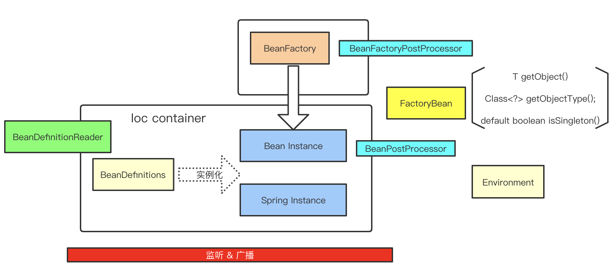

# 测试代码执行流程

## 测试代码&xml

* code

见：`spring-framework-5.1.3.RELEASE/spring-context/src/test/java/test/com/mb/BeanTest.java`

```java
@Test
public void testClassPathXmlApplicationContextBeanCosr() {
    ApplicationContext applicationContext =
            new ClassPathXmlApplicationContext("spring-constructor.xml");
    User user = (User) applicationContext.getBean("user");
    Assert.assertTrue(user != null);
    Assert.assertTrue(user.getTestStr().equals("testStr"));
    Assert.assertTrue(user.getId().equals(1));
    Assert.assertTrue(user.getName().equals("tom"));
}
```

* spring-constructor.xml

```xml

```

## 简要流程图



## 具体代码执行的流程图


